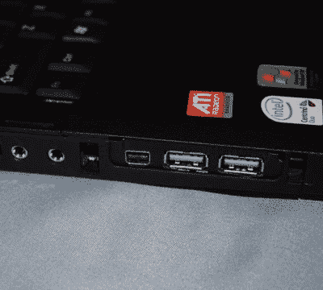
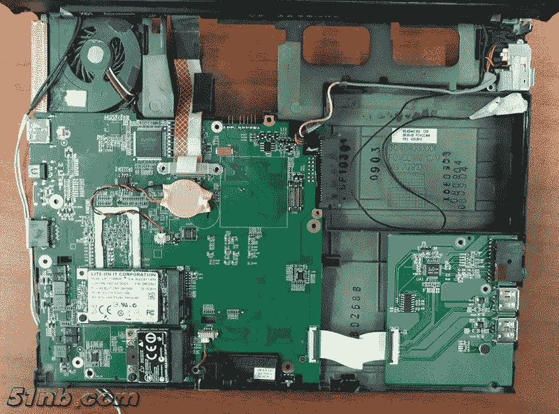

# 新的 ThinkPad Guts 将英特尔酷睿 I、DDR4、USB 3 带到了狂热的笔记本电脑上

> 原文：<https://hackaday.com/2018/03/12/new-guts-make-old-thinkpads-new/>

我们经常看到人们将他们的热情投入到让心爱的设备在制造商的意图之外继续运行。这些替换 Thinkpad 主板 ( [翻译](https://translate.google.com/translate?sl=auto&tl=en&js=y&prev=_t&hl=en&ie=UTF-8&u=https%3A%2F%2Fforum.51nb.com%2Fforum.php%3Fmod%3Dviewthread%26tid%3D1811153%26extra%3Dpage%3D1&edit-text=))给旧的(然而是心爱的)Thinkpad 带来了渴望已久的处理器升级。这是发烧友论坛 51nb 上的用户【希望】的作品。这次黑客事件说明了当对传奇设备的热情与深厚的电气专业知识和可用的制造技术相碰撞时会发生什么。这不是你的常规笔记本电脑翻新，[希望]是建立一些新的东西。

ThinkPads 以其狂热的追随者而闻名(正如我们的[Brian Benchoff]去年强调的那样)。联想带领这个古老的品牌走向未来，而笔记本电脑市场却越来越深地陷入以用户修改为代价的紧密集成的荒野。在这个过程中，4:3 的屏幕被媒体友好的 16:9 所取代，跟踪点被触摸板所取代，[经典的 ThinkLight](https://en.wikipedia.org/wiki/IBM_ThinkPad_ThinkLight) 被真正的键盘背光所取代。这些进步让一群人数不断减少但声音响亮的老派 Thinkpad 爱好者——Thinkpad 的狂热崇拜者——紧紧抓住 2007 年 X61 和 T60 等心爱的设备不放，被不断变化的市场所忽视。

令人震惊的是，[希望]通过完全更换主板，重新激活了这些经典的 ThinkPads。不仅仅是一个特定的型号，至少有 3 个系列的电脑可供选择。IBM 或联想从未使用过的型号来指代新设备；[X60/61 主板做一个 X62](https://forum.51nb.com/forum.php?mod=viewthread&tid=1650395&extra=page=1) ，[X200/201 主板做一个 X210](https://forum.51nb.com/forum.php?mod=viewthread&tid=1810987&extra=page=1) ， [T60 主板做一个 T70](https://forum.51nb.com/forum.php?mod=viewthread&tid=1718306&extra=page=1) 。根据客户的偏好，可以选择裸主板或完全组装的单元。

Classic stickers with non-classic ports

根据具体的型号，这些主板可以直接插入原始机箱，但会添加最新一代的英特尔酷睿 I 处理器、DDR4、USB 3.0/3.1、雷电 3 等。他们经常重复使用原来的散热器和风扇，并通过原来主板使用的相同机箱孔暴露这些端口。考虑到这些机器比它们内部的硬件要老 10 年，其集成度确实令人印象深刻。最终结果看起来像是春节前从联想的一家工厂出来的。如果您仔细观察本文顶部的图片，您可能会注意到它们甚至在掌托上包括了一个改进的“Intel Inside”标签，并且在显示屏的左下角有一个型号标签！

这里有一个隐含的经济观点值得提出来。比基本微控制器更重要的主板是一项极其复杂的技术。当标杆从“小型 ARM 处理器”上升到“现代 x86 系统”时，这就要额外计算。它们不仅在电气上复杂，而且物理上制造它们所需的制造工艺也与你在最喜欢的廉价 PCB 工厂里找到的工艺相差无几。我们谈论的是镶嵌着大约 1100 个引脚的 CPU、DDR4 和 PCI-E，它们具有极其严格的电气时序要求，驱动着复杂的电路板布局，以及过多的板外外围部件。除了这些限制之外，主板本身必须足够小，以便能够放入其中，这不是一个专门建造的外壳，而是一个现有的笔记本电脑机身，带有联想决定的安装支架和连接器位置的任何组合。一个业余爱好者(我们假设)可以在这个范围内制作自己的设备，并以 500-700 美元的价格出售，这是令人震惊的。

Fresh replacements being installed

这应该是不可能的。更准确地说，这是可能的，因为有其他驱动因素使得 PCB 制造和组装成本比以往任何时候都更低、更容易实现。当然是技术的大发展，但也许是移动设备的出现以及修理和改进它们的愿望。毕竟，如果传言可信的话，任何能找到合适的华强北摊位的人都可以在他们的 iPhone 中更换 NAND，这个曾经复杂的过程变得简单了。

很难跟踪每个模型的进展，因为它们主要是在 [51nb 论坛](https://forum.51nb.com/forum-x62-1.html)上报道的(一个名为[【LCD fans】](https://www.facebook.com/lcdfans/)的脸书页面提供了一些英文信息)。然而，你也可以在 Reddit 上找到类似[koobear]的[评论这样的实用信息。](https://www.reddit.com/r/thinkpad/comments/809p2s/brief_review_of_the_x210_from_51nblcdfans/)