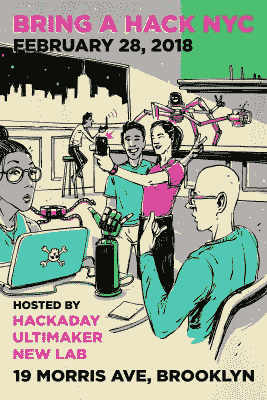

# 下周:在纽约带一个黑客

> 原文：<https://hackaday.com/2018/02/23/next-week-bring-a-hack-in-nyc/>

Hackaday 与 Ultimaker 和 New Lab 一起，将于下周在纽约举办一场超级黑客盛会。拿起你正在做的项目，2 月 28 日星期三在布鲁克林加入我们。

 这是所有关于展示由制造者、黑客、艺术家和工程师正在工作的最酷、最新的东西。准备好谈论硬件，盯着太多的 led，享受饮料和友情。该活动由 New Lab 主办，我们将与 Ultimaker 合作，为您带来一个充满乐趣和焊烟的夜晚。我们已经安排了优秀的演讲者，我们也预留了一些时间进行闪电演讲，所以[如果你感兴趣，请填写这张表格](https://docs.google.com/forms/d/e/1FAIpQLSfLZd59_364b-qDTGJU3moXFGQMakJx78bCrAZpAQRmcgfpGQ/viewform)。

### 支持 KiCad 项目

本次聚会的 RSVPs 为 5 美元，所有收益将通过 CERN 捐赠给 KiCad 项目。

发送一些资金来支持这个开源 EDA 项目是一件很棒的事情。如果这笔费用对你来说不可行，我们也在为这个活动寻找一些志愿者。如果你想帮忙跳过那个 5 美元的封面，[请在 Hackaday.io](https://hackaday.io/event/51774-bring-a-hack-nyc-w-hackaday-ultimaker-new-lab) 上给我们发一条消息。