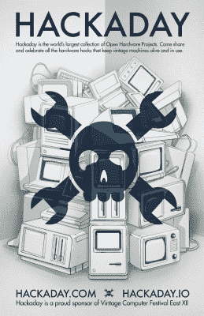

# 下周末:东部老式电脑节

> 原文：<https://hackaday.com/2017/03/28/next-weekend-the-vintage-computer-festival-east/>

下周末是新泽西州沃尔市的东复古电脑节。我们要走了，你也应该去。

 东 VCF 是东海岸逆向计算爱好者最大的聚会。这是为期三天的会谈、展览、跳蚤市场，以及埋葬在过时技术下的最伟大的头脑的一次聚会。不，没有几次会谈，VCF 是不完整的，今年会变得很棒。主题演讲将包括[比雅尼·斯特劳斯特鲁普]，C++的设计者/实现者/发明者。计算机历史学家[比尔·德格南]将对 40 年来的“应用计算机”做一个回顾，[汤姆·佩雷拉]博士将做一个关于英格玛机的演讲。

VCF 的展品总是展览的明星，今年的[也不例外](http://vcfed.org/wp/festivals/vintage-computer-festival-east/vcf-east-exhibits/)。亮点包括机械计算机，最好的硅图形，以及微软发布的 Unix 版本。个人展览总是很棒；去年[世界上第一台数码相机](http://hackaday.com/2016/04/17/building-the-first-digital-camera/)亮相。如果您在该地区，这是一个不容错过的活动。VCF 将在[信息时代](http://infoage.org/)参观，这是一个位于前埃文斯营的科学中心——一个最好被描述为“二战前的国防高级研究计划局”的军事设施。

Hackaday 很荣幸再次赞助东 VCF。这种情况已经持续了几年，我们的艺术总监乔·金(Joe Kim)创作了一些令人难以置信的艺术作品，作为赞助的一部分。点击今年艺术的缩略图来 embiggen。去年的 VCF 西部艺术是对麦金塔电脑的惊人挑战，去年的 T2 VCF 东部艺术反映了我们赞助的复古黑客马拉松。