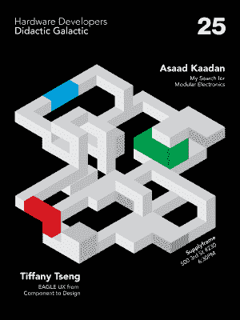

# 下周的湾区聚会

> 原文：<https://hackaday.com/2017/11/30/next-weeks-bay-area-meetups/>

下周，我们将在海湾地区参加一些很棒的硬件聚会，我们希望你能来加入我们。

 第一次聚会将是在桑尼维尔的邪恶疯狂科学家商店举行的[硅谷硬件聚会](https://www.meetup.com/Silicon-Valley-Hardware-Meetup/events/245142952/)。12 月 6 日星期三，从 6:30 到 9:30。至少有一些 Hackaday/Tindie/Supplyframe 的工作人员会在那里，这个夜晚将充满闪电谈话、演示和你认识并喜欢的酷硬件人。

这次聚会的发言人将包括[米奇·奥特曼]，杰出的黑客，拥有太多太多电视遥控器的人。他将谈论自己业务中硬件的成功和失败。Kickstarter 的[Clarissa Redwine]也将成为此次活动的主角。她会谈论众筹硬件，以及制造一千件东西比制造一件东西难一百万倍的事实。

第二天，也就是 12 月 7 日，我们还将在旧金山 Supplyframe 办公室开门迎客，举办[硬件开发者讲座银河](https://www.meetup.com/Hardware-Developers-Didactic-Galactic/events/245467037/)。这些说教很好玩，也很受欢迎，不需要去南湾。会提供食物和饮料，街对面的小巷里有一幅甜蜜的里克和莫蒂壁画。

本月的主讲人是欧特克首席 UX 设计师[Tiffany Tseng]。她的工作包括创建和实施进入 Eagle CAD 的设计决策。如果你想知道为什么图标在几年前改变了，她不是一个可以交谈的人；这发生在欧特克母舰收购 Eagle 之前。如果你想知道这种令人敬畏的推推式路由实际上是如何工作的，那么【蒂芙尼】*就是*要找的人。

同样出席讲座的还有[Asaad Kaadan]。他是一名机器人工程师，日常工作是制作电影工具，目前正在探索一个非常非常酷的模块化电子项目，名为 Hexabitz。他将谈论 Hexabitz 和模块化电子设计。