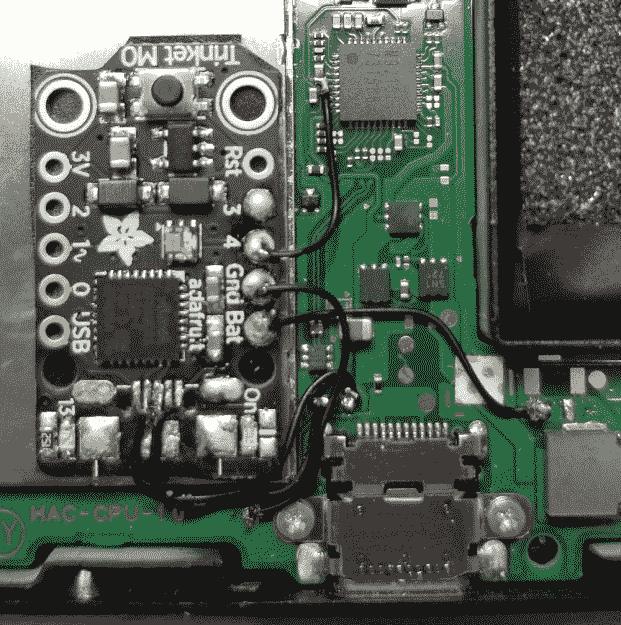

# 任天堂 Switch 得到内部饰品哈蒙德

> 原文：<https://hackaday.com/2018/07/01/nintendo-switch-gets-internal-trinket-hardmod/>

如果你没有关注任天堂 Switch 黑客事件，简短的故事是，发现了一个漏洞，允许在所有版本的交换机硬件和操作系统上执行代码。事实上，人们认为阻止这个漏洞被利用的唯一方法是任天堂发布一个新的硬件版本。想必现在在马里奥的房子里有很多悲伤的面孔，但对于我们这些梦想着实际控制我们购买的设备的人来说，这是一个好消息。

 要在任天堂最新最棒的游戏上运行自己的代码，你必须首先通过短路控制器连接器中的两个引脚将其置于恢复模式，然后使用连接到系统 USB 端口的计算机或微控制器来执行漏洞利用并执行二进制有效载荷。这相对来说很容易，但这是你每次关闭系统时都需要做的事情。[但是如果你愿意在你的任天堂 Switch](https://github.com/Quantum-cross/sam-fusee-launcher-internal/) 里安装一个水果饰品 M0，你可以让事情变得简单一点。

源于[atlas44]和[noemu]的工作，这个模型的最终迭代是由[Quantum-cross]创建的。总体思路是通过移除 USB 端口和几个电容器，将小饰品 M0 板拆得尽可能小，然后将其安装在交换机的外壳内。通过将它连接到电源、USB-C 连接器的背面和控制器连接器，小饰品可以与利用中涉及的所有关键组件进行交互。

你甚至可以使用交换机的 USB 端口来更新饰品上的固件，以加载不同的有效载荷，尽管在休息后的演示视频中，[xboxexpert]提到，随着交换机上的自制软件环境成熟，最终这将不再是必要的。事实上，几乎肯定会有一天，在系统每次启动时执行这种利用将变得没有必要，从而使这种修改变得过时。但在那之前，这是一种让你涉足交换机黑客世界的非常巧妙的方式。

大约六个月前，我们读到了在任天堂 Switch 上运行任意代码的第一步[，而就在几个月前，我们看到人们在用微控制器](https://hackaday.com/2017/12/29/34c3-hacking-the-nintendo-switch/)对[控制系统进行实验。](https://hackaday.com/2017/10/25/teensy-script-plays-nintendo-switch-strikes-out/)

 [https://www.youtube.com/embed/ru94K7MUf0c?version=3&rel=1&showsearch=0&showinfo=1&iv_load_policy=1&fs=1&hl=en-US&autohide=2&wmode=transparent](https://www.youtube.com/embed/ru94K7MUf0c?version=3&rel=1&showsearch=0&showinfo=1&iv_load_policy=1&fs=1&hl=en-US&autohide=2&wmode=transparent)

