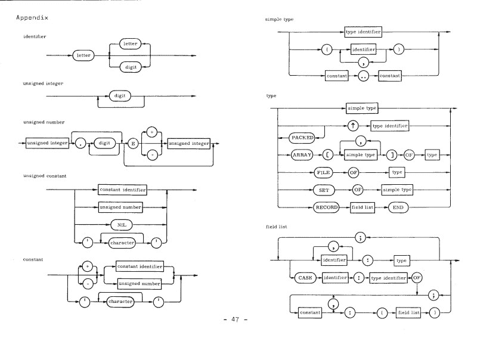
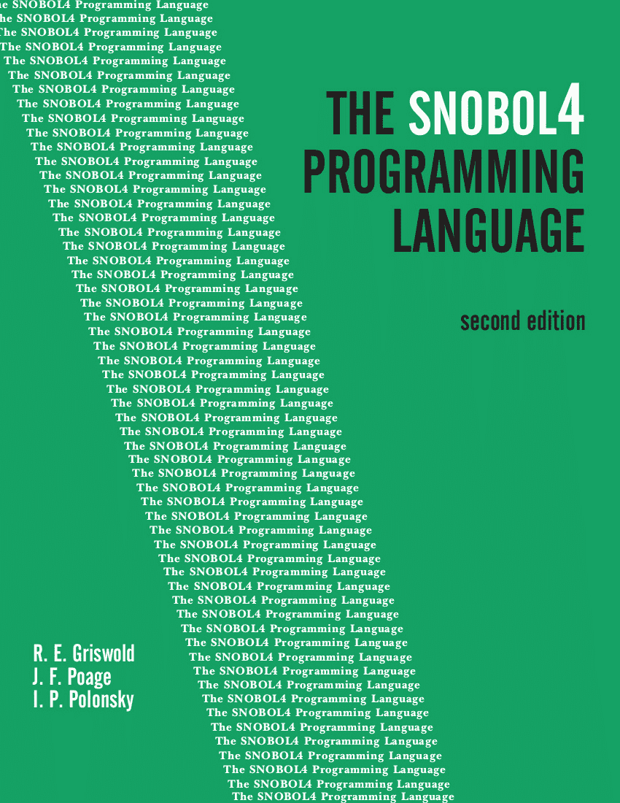

# 没有帕斯卡，一点机会也没有。往前走！

> 原文：<https://hackaday.com/2015/11/03/no-pascal-not-a-snobols-chance-go-forth/>

我关于 Fortran 的文章， *[这不是你父亲的 FORTRAN](http://hackaday.com/2015/10/26/this-is-not-your-fathers-fortran/)* ，带回了很多关于语言的回忆。这也让我想起了我在大学期间以及之后不久，比如说 1978 年之前的其他语言。

那时有三种最初的语言——FORTRAN、LISP 和 COBOL。尽管没有一种语言被列入流行语言的名单，但这些原始语言仍在使用。我从来没用过 COBOL，但用过那个时代的 Pascal、Forth 和 SNOBOL。其中，斯诺鲍很快就消失了，但其他人仍然存在。SNOBOL 是一种文本处理语言，基本上输给了 AWK、PERL 和*正则表达式。*鉴于正则表达式是如此神秘，令人惊讶的是，当时的另一种语言 APL——一种编程语言——没有幸存下来。APL 被称为“只写语言”,因为简单地重写一段代码比调试它更容易。

另一种值得一提的语言是 Algol，仅仅是因为 Pascal 和许多现代语言都是它的后代。Algol 在美国之外总是更受欢迎，可能是因为那里的每个人都坚持使用 FORTRAN。

那时候，某些书有着标志性的地位，就像麦克拉肯的《黑色 FORTRAN IV》。在 70 年代早期，提到[Nicolas Wirth]或黄皮书就让我想起了 Pascal。同样，[Griswold，(R. E.)]是 SNOBOL 和一本绿皮书。出于某种原因，[Griswold]的两位合著者从未被提及，不像后来的[Kernighan] & [Ritchie]二人组，他们的白色*“C 编程语言”。*多年后，当我在一位意大利同事的书架上看到那本翻译成意大利语的书时，我的脑海里出现了一丝困惑。和我一起走一走让我们的编程世界走到今天这一步的记忆之路。

## 帕

帕斯卡的创造者[ [尼古拉斯·沃思](https://en.wikipedia.org/wiki/Niklaus_Wirth) ]是他那个时代的一个反传统者。Pascal 是对 Algol 60 的反叛，他觉得 Algol 60 过于复杂，对实际工作没有用处。我很想听听他对 Java 和 C++的看法。在没有标准委员会约束的情况下，他将 Algol 精简到骨子里，创造了 Pascal。

[沃思]本质上是一个黑客:

> 每一个项目主要是一个学习实验。一个人在发明时学得最好。只有实际做一个开发项目，才能对内在的困难有足够的熟悉，对内在的细节有足够的把握。–*从程序语言设计到计算机构造*，尼古拉斯·沃斯 1984 年 ACM A.M .图灵奖获得者讲座。

这种语言如此简洁，以至于在一本 58 页的书中被完整地描述和定义，几乎是一本小册子。这包括以巴科斯诺尔形式展示它，以及一种被称为铁路图的新颖的图形表示。由于是视觉导向的，我真的很喜欢这种表现。

[](https://hackaday.com/wp-content/uploads/2015/10/pascal-rr-diagram.jpg)

一个有趣的特点是 Pascal 是自举产生的。自举语言的编译器是自己编写的，尽可能使用最小的子集。然后用另一种语言手工编写编译器，在那个时间段可能是 Fortran。一旦手写的编译器工作了，你就可以把用新语言编写的编译器代码输入到它的可执行文件中。一个可执行文件出来了，它现在可以自我编译了。从那里，您可以用语言本身编写额外的特性。自举对计算机科学的学生来说是一个福音，因为它为他们提供了一个可以扩展和破解的工作编译器，但仍然小到足以理解。

Pascal 是一个单程编译器，而几乎所有其他语言都需要多次通过代码或中间输出。这使得编译速度很快。缺点是它没有提供太多的优化。

一些 Pascal 代码:

```

program ArithFunc;
  const
    Sentinel =0.0;
  var
    X:Real;
begin    
   writeln('After each line enter a real number or 0.0 to stop');
   writeln;
   writeln('X', 'Trunc(x)' :16, 'Round(X)' :10, 'Abs(X)' :10,
           'Sqr(X)' :10, 'Sqrt(Abs(X))' :15); 
   readln (X);
   while X &lt;&gt; Sentinel do
     begin
       writeln (Trunc(X) :17, Round(X) :10, Abs(X) :10:2, 
                 Sqr(x) :10:2, Sqrt(Abs(X)) :10:2);
       readln(X);
     end
end.

```

您可以看到 Pascal 与当前语言(如 C、C++和 Java)的关系，这些语言都是由 Algol 版本衍生而来的。对 Pascal 的一大抱怨是它没有足够地使用分号。您可以在示例中看到，在最后的*结束*之前没有分号。另一个特征是用关键字*开始*和*结束*标记的代码块，在今天的语言中我们使用大括号。

随着个人电脑的出现，Pascal 语言得到了广泛的普及，现在仍在使用。第一个 PC 编译器使用 UCSD Pascal P-code，这是一个很像今天的 Java 的解释器引擎。开发 P-code 是为了让这种语言能够容易地移植到新机器上，虚拟机比编译器更容易编写。

Pascal 在 PC 上的大繁荣是 1983 年 Borland 的 Turbo Pascal (TP)的发布。它很便宜，所以黑客买得起，而且它有一个集成的编程工具包，我们今天称之为 IDE。

我声称即使不是第一次，也是很早就将 TP 用于工业用途。我领导的一个团队为基于英特尔 8088 的流量计算机开发了软件，即用于测量气体或液体管道流量的嵌入式系统。我使用 TP 开发了一个 IDE，生成下载到流计算机的字节码。团队的其他成员开发了流计算机软件，其中包括字节码的解释器。该系统基本上是 Lotus 1-2-3——适合年轻人——用于管道，因为最终用户可以开发自己的代码。

Turbo Pascal 在 90 年代增加了面向对象的特性，最终演变成了 Delphi。

## 面向字符串的符号语言

[ ](https://hackaday.com/wp-content/uploads/2015/10/snobol-cover.jpg) SNOBOL 被用来处理文字和符号。这个名字真的没有什么意义，尽管有些人试图把缩写和组合词硬塞进去。Griswold 和其他人坐在一起谈论这个名字，拍摄橡皮筋，当他们决定“…没有任何机会找到一个名字。”他们将“snow”缩写成“BOL”，这是当时许多语言的结尾。

(橡皮筋被用在卡牌上，所以拍摄它们是当时书呆子最喜欢的消遣。我曾经用橡皮筋从一个年轻女士的嘴唇里射出一根香烟。我很棒！)

下面是一些代码，让您对这种语言有所了解:

```

           OUTPUT = &quot;What is your name?&quot;
           Username = INPUT
           Username &quot;J&quot;                                             :S(LOVE)
           Username &quot;K&quot;                                             :S(HATE)
 MEH       OUTPUT = &quot;Hi, &quot; Username                                 :(END)
 LOVE      OUTPUT = &quot;How nice to meet you, &quot; Username               :(END)
 HATE      OUTPUT = &quot;Oh. It's you, &quot; Username
 END

```

像当时的许多语言一样，SNOBOL 使用单行卡片格式，带有特殊的标志字符，允许延续到其他卡片上。第一个字段是目的地标签。中间区域包含编程语句。跟在':'后面的最右边的字段是测试和跳转。

输出和输入行相当明显，就像赋值一样。在赋值之后是两行执行模式匹配，以查看字母“J”或“K”是否在*用户名中。*如果字母出现，则该行成功。成功时，在测试字段用“ **S** 标记，跳转到目的标签。你也可以'**F**ail，两者都做，或者只是跳转，如代码中跳转到结尾所示。

SNOBOL 完成了所有你能想到的文本操作:连接、替换、提取等等。它也做通常的数学运算。

这是一种有趣的语言。非常容易理解和使用。

## 向外

Forth 在许多方面都是一种有趣的语言。它既不是来自计算机行业，也不是来自学术界。[Chuck Moore]在许多工作中开发了它，但在国家射电天文台为 Kitt Peak 天文台开发嵌入式系统时取得了成果。从一开始，Forth 就应该是便携的。当[查克]换工作时，他想带上他的工具包。

Forth 是一种线程语言。在我们更传统的语言中，代码被翻译成一系列真实或虚拟的机器操作码。然后机器逐步通过操作码。在线程语言中，只有原语操作被编码为操作码。在 Forth 中，这些原语是语言的基本单词。所有其他*定义的*单词都是建立在原语之上的。

线程语言存储的不是操作码，而是字的地址。一个*内部*解释器第四步遍历这个地址列表。如果地址是基本字的地址，则执行操作码。当它是一个已定义的单词时，内部解释器跳转到该序列，并开始遍历它的地址列表。序列末尾的单词导致返回到先前的单词定义。这个过程简单明了，而且出奇的快。这也使得线程语言非常具有可移植性。一旦创建了原语和内部解释器，Forth 就基本上可以运行了。语言的其余部分都是基于已定义的词。

一个*外部*解释器提供用户界面。你只需输入单词，它们就会被执行。有些词允许你定义新词，这些词被添加到*词典*中。在用户界面工作时修改代码很容易:您只需再次输入单词定义。新定义会覆盖旧定义。

编译过程遍历字典，只选择其他单词实际使用的单词，去掉交互处理所需的所有部分，并创建包含所需原语和定义单词的“二进制”。这和执行速度一样，是一种令人惊讶的紧凑表示，通常比标准编译代码要小。

Forth 就像一个来自惠普的巨型手持计算器:它使用一个堆栈和[反向波兰符号](https://en.wikipedia.org/wiki/Reverse_Polish_notation) (RPN)。要将两个数字相加，你需要输入:*2 ^ 3+*。这将把 2 和 3 推到一个堆栈上。 *+* 将弹出它们并将它们相加，在堆栈上留下结果 5。虽然您可以定义变量，但大多数操作都是使用堆栈来完成的。

下面是第四个词的定义和平方一个数的用法示例:

>:sqr dup *；
> 2 sqr。
4
3 sqr。
9

一个词的定义以冒号开始。之后的第一个标记是名称。它可以是任何东西！Forth 经常将一些数字定义为单词，因为从单词中加载值实际上比转换它更快。如果你想让某人发疯，你可以通过输入“*:21；”将 2 定义为 1。*

继续这个例子，字 *dup* 创建栈顶的副本，并且*' * "*将前两个值相乘，将结果留在栈上。在使用了 *sqr* 的行中，使用了*’*打印堆栈顶部并删除值。

你可以尝试使用[一个在线解释器](https://repl.it/languages/forth)。

回到计算机使用 CPM 作为操作系统的时代，我用 Forth 编写了一个文本编辑器。编辑器允许使用光标键，删除，插入等。只用了一个小时。我第一次接触 Forth 是在罗切斯特大学激光能量学实验室。Forth 用于开发他们正在进行的大型激光聚变实验的控制系统。我甚至去了加州的曼哈顿海滩，在福斯公司的办公室接受培训。世界上第二个程序员，伊丽莎白·拉瑟，是我的老师。

Forth 仍在航空航天和商业应用中使用。

我在 Fortran 文章中建议创建一个 FortDuino。我不能对第四个[提出同样的建议，因为它已经在多个版本中存在](http://playground.arduino.cc/CommonTopics/ForthOnArduino)。此外，那会相当容易。这是第四代的使命。更大的挑战是 PiForth，或 ForthPi，作为从 SD 卡加载的操作系统运行。[我们已经看过 Lisp 版本](http://hackaday.com/2015/09/23/old-lisp-languaged-used-for-new-raspberry-pi-os/)那么 Forth 怎么样？这会很有趣。

## 包裹

我希望您喜欢这两篇文章，它们从我的个人经历出发，讲述了一些编程语言的历史。通过在网上搜索来找回记忆和更新细节是很有趣的。语言之间的关系令人着迷，这让我想起了最后一个故事。

由于某种原因，罗切斯特大学的计算机中心位于校园内一家假日酒店的地下室。Jean Sammet，计算机历史上另一位著名的女士，住在酒店参加 ACM 会议。她评论说，她的睡眠受到了干扰，因为出于某种奇怪的原因，她一直梦见行式打印机。没有人忍心告诉她它们可能就在她的房间下面。我之所以回忆起这个故事，是因为 Jean 的一本书包括了一张编程语言祖先的图表，与上面链接中的图表相似。