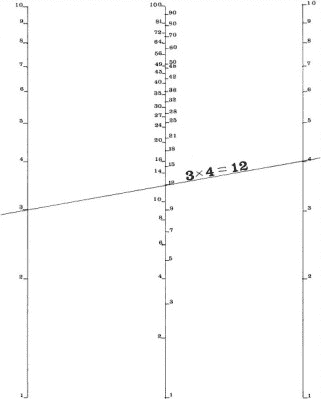
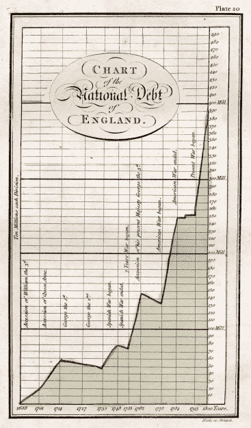
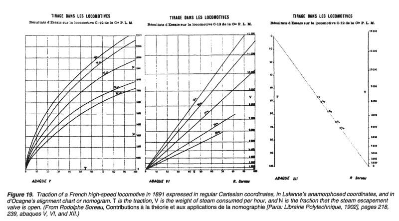
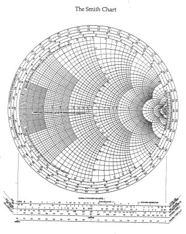
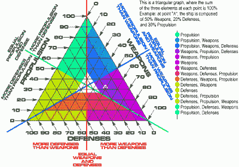

# 诺谟图:复杂的模拟计算器对每个人都很简单

> 原文：<https://hackaday.com/2015/10/21/nomograms-complex-analog-calculators-simple-for-everyone/>

19 世纪晚期，一位名叫 Philbert Maurice d'Ocagne 的铁路工程师是一群面临扩大法国铁路系统任务的人的一部分。在铺设一条铁轨之前，必须先规划好预定的道路，并平整好地形。这种类型的工程涉及大量的挖方和填方计算，这些计算决定了必须在哪里添加或清除污物。土方工程的目标是创造一个平缓的坡度，并尽量减少筑堤所需的工作量。

在项目过程中，d'Ocagne 提出了一个优雅的、可重复使用的解决方案来快速解决这些关键计算。最令人印象深刻的是，他只用了一支笔、几张纸和一把直尺就完成了这项工作。通过开发和使用一种他称之为列线图的方法，d'Ocagne 能够进行所有必要的计算，使得法国铁路的平缓曲线和坡度成为可能。

### 交互式图表

术语*诺模图*经常与*诺模图*和*列线图*互换。诺谟图是一种图表，因为它是数据的直观表示。但与图表不同的是，诺谟图是一种获得解决方案或其他未知数据的手段。答案不会简单地出现在图表上。诺谟图是一种交互式工具。

诺谟图的功能有点像计算尺，因为它们使用刻度来进行计算。它们的工作原理也是一样的——操纵输入标度，在输出标度上找到未知变量。但与计算尺不同的是，没有标准的通用诺谟图。它们中的每一个都是为表示一个特定的想法、数据集或数据集的交集而专门构建的。计算尺使用对数刻度，诺谟图可以使用线性或对数刻度，这取决于方程的要求。

作为解决问题的工具，诺谟图的真正魅力在于它的设计。如果许多设计者被要求为同一个方程创建一个列线图，他们的结果可能看起来非常不同。只要秤的结构合理，每一个秤都有其独特的风格。

在其全盛时期，诺谟图是建立在大张纸上的，这样小刻度可以很容易地阅读。诺模图根据所代表的方程呈现不同的形状。它们可以非常简单明了，只有两个输入尺度和一个输出尺度，或者它们可以是弯曲的和复杂的，用于复合问题解决。

A nomogram for simple multiplication. Image source: [Blood, Dirt, and Nomograms: A Particular History of Graphs](http://www.jstor.org/stable/237474)

### 诺谟图是如何工作的？

如右图所示的简单排列诺模图使用一个刻度代表每个已知变量，另一个刻度代表未知变量。为了使用任何诺模图，每个已知变量的值必须位于各自的刻度上。使用这些点作为指导，直尺或线放置在它们之间。直尺与未知变量的刻度相交的点给出了方程的解。在已知值标度上的两点之间画一条线称为指数线或等值线。

也许诺谟图的最大优点是外行人可以用它来解方程或进行转换，而不需要什么指导。当使用一个时，用户没有必要理解甚至意识到这个等式。对于喜欢直观教具和动手操作的学生来说，诺谟图是一种很好的数学教具。

似乎不值得费心去创建列线图。毕竟，它们不是通用计算器，也不能提供当今数字计算机的精确解。但是这个不起眼的诺谟图可以重复用于常见问题，比如从华氏温度转换到摄氏温度，或者决定给服务员多少小费。列线图可用于任何已知和未知变量可用刻度表示的情况。

William Playfair’s graph of England’s national debt. Image source: [Princeton](http://libweb5.princeton.edu/visual_materials/maps/websites/thematic-maps/quantitative/sociology-economics/sociology-economics.html)

### 法国铁路工程

图解计算并不是从 d'Ocagne 的诺谟图开始的。以图形方式表示数据的想法始于 18 世纪 70 年代末，比 d'Ocagne 出版他的列线图论文早了一百多年。被认为是图表统计学之父的苏格兰工程师威廉·普莱费尔绘制了一张图表，来说明 18 世纪英格兰国家债务的增长。公平竞赛会继续发明条形图和饼图，并从事多种职业。

其中一项职业是与詹姆斯·瓦特一起工作，他是一位苏格兰发明家和工程师，因发明了改进的蒸汽机而闻名。瓦特的蒸汽机建于 18 世纪 70 年代初，其特点是有一个指示器，可以绘制出发动机运行时内部蒸汽的压力-体积图。

18 世纪末，由于推动转换为公制，图表开始在法国出现。一家名为 Louis-ézéchiel pouch et 的棉花制造商响应号召，创建了一些图表，帮助普通公民轻松地进行转换，而无需进行任何计算。他提交的一个更晚的版本包括毕达哥拉斯乘法表的图形表示，它使用沿刻度绘制的值之间的曲线插值来估计数学乘积。

法国工程师加斯帕德-古斯塔夫·德·科里奥利设计了数值表，可用于任何给定剖面和坡度的挖方和填方计算。古斯塔夫的桌子很有创意，但也很笨重，而且有局限性。每张表只描述了铁路路基的一小部分。法国工程师莱昂·拉兰对这些表格进行了改进，他创建了对数图表，可重复用于几种类型的铁路路基剖面。拉兰内的表格提供了更快的解决方案。

d'Ocagne 将 Lalanne 的对数图从笛卡儿坐标系中分离出来，更进了一步。他从射影平面几何中借用了对偶的概念，射影平面几何将透视的概念强加于一组平行线上。例如，如果你站在火车轨道的直线部分的铁轨之间，两条铁轨在远处看起来会会聚。在几何射影平面中，它们实际上确实收敛于无穷远附近的一点。图形的演变可以在下面的进程中看到；同一个方程从左到右用笛卡儿图表示，然后是拉兰内的对数坐标，最后是德奥卡尼的平行坐标系。

Image source: [Blood, Dirt, and Nomograms](http://jstor.org/stable/237474)

A Smith chart for RF engineering. Image source: [Antenna Theory](http://www.antenna-theory.com/tutorial/smith/chart.php)

### 可能性高得惊人

诺谟图在 20 世纪 70 年代之前一直被广泛使用。它们从民用和军用工程扩展到航空学和其他科学。尽管在普遍存在的问题解决工具方面，诺谟图学已经走上了计算尺的道路，但是仍然有一些领域很好地利用了它们。列线图广泛用于医学领域的简单事物，如体重指数图表和儿科剂量计算器，以及更复杂的情况，如个体化男性和女性髋部骨折风险。

所有的火腿可能都看过史密斯图表。这是一个由 Philip H. Smith 设计的复合诺模图，他是贝尔实验室的一名工程师。史密斯圆图在射频工程中用于解决问题和可视化交互。左图为完整的史密斯圆图。在实际应用中，它们经常被分解成不同的等级。史密斯圆图的典型应用包括阻抗匹配和可视化传输线路中电抗与电阻相遇的点。

Nomogram for war games. Image source: [Project Rho](http://www.projectrho.com/nomogram/index.html)

列线图对 RPG 和战争游戏玩家也很有用。右边的彩色图片展示了给定船只的各种可能的武器、防御和投射物的分布。几年前，一个有进取心的克巴尔太空计划玩家创造了一些[列线图来帮助火箭设计](http://imgur.com/a/uJsXF)。

### 永久列线图

要不要自己做诺谟图？查看维基上的 [PyNomo](http://pynomo.org) ，它听起来就像是:基于 Python 的 nomogram 生成软件。即使您对生成诺谟图不感兴趣，也有很多关于它们的历史、构造和使用的深入信息。

即使在今天，诺谟图仍然非常有用。虽然它们不是求解方程的最精确的方法，但是它们速度很快，并且提供了很好的视觉洞察力。每个诺模图都是完全可定制的模拟计算机。作为一个类别，它们是一个有用的工具，值得广泛复兴。

主要图片来源:[安托万·博维安](https://unsplash.com/antoinebeauvillain)

缩略图来源:[我的计算](http://www.myreckonings.com/modernnomograms/)