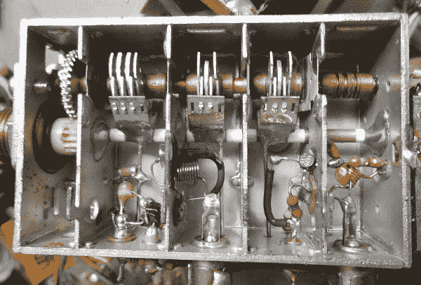
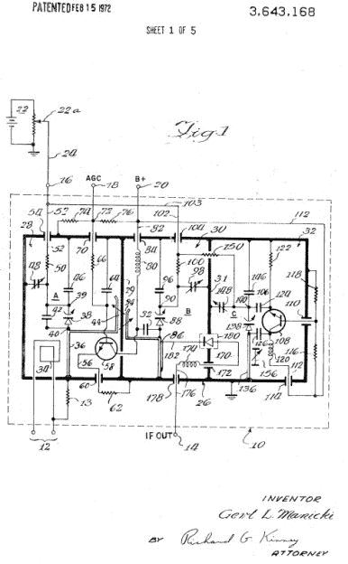

# 对于模拟超高频电视调谐器来说，还没有 101 种用途

> 原文：<https://hackaday.com/2016/07/11/not-quite-101-uses-for-an-analog-uhf-tv-tuner/>

今天的年轻电子黑客非常幸运，他们成长在一个有着大量功能强大的设备来激发他们想象力的时代，并且可以廉价而方便地获得这些设备。不到一个汉堡餐的价格就可以让你获得一个像 Raspberry Pi Zero 这样的 Linux 计算平台，而且传感器和外围设备的大量选择只需要一个隔夜的邮资信封。

追溯到几十年前的 20 世纪 80 年代，对于倾向于电子产品的年轻人来说，情况有些不同。我们有第一代 8 位微型计算机，但它们很贵，除非你有富裕的父母准备给你买一个高端型号，否则它们可能很难连接。其他电子零件要贵得多，邮购可能需要几周时间才能交货。

对我们中的一些人来说，这不是问题。我们只是四处寻找零件的其他来源，最方便的来源之一是在电子回收之前的那些日子里，你几乎可以在每个垃圾箱里找到的废弃 CRT 电视。如果你可以用 20 世纪 70 年代的消费级分立元件来制造它，我们可能已经仔细研究了一堆大型 PCB 来寻找正确的元件值。良好的训练，你最终肯定会通过视觉知道电阻颜色代码。

### 在模拟广播的时代

作为一名年轻的无线电爱好者，我个人的一个爱好是在这些电视机中找到的模拟调谐器。这是 RF 前端，将来自天线的信号转换为 36MHz 中频，供电视机解调和显示。这些调谐器是足够简单的设备，通常只有几个晶体管、一个 RF 放大器和一个振荡器和二极管混频器或一个组合混频器/振荡器。

我在英国长大，他们都是 UHF 电视频段(约 470 至 860 MHz)，他们要么是通过可变电容和空腔谐振器进行机械调谐，要么是通过 PCB 上的变容二极管和带状线谐振器进行电子调谐。它们是设备中的独立模块，通常在一个大约一副扑克牌大小的放映罐中。它们的独立性质意味着一旦从设备中移除，它们提供了相当大的修改和重新用于其他 UHF 用途的潜力，并且是学习 UHF 构造的绳索的容易获得的方法。

因此，这篇文章在某种程度上可以说是我在 1987 年写的一个系列的浓缩版，或者甚至是一个薄薄的平装本，如果我能找到一个足够轻信的出版商接受一个未经证实的青少年的实验性电子冥想。把它想成是对一种现在已经过去的技术的致敬，这种技术不太适合我们的 retrotechtacular 系列，如果你的兴趣在那个方向，并且你有几台旧电视，也许你可以从中获得一些灵感。

### 基础知识

[![TV tuner front end block diagram. Derived from Chetvorno (Own work) [CC0], via Wikimedia Commons](img/35f97d30cab36725e3003924d78c2715.png)](https://hackaday.com/wp-content/uploads/2016/07/rf-front-end.jpg) 

电视调谐器前端框图。源自 Chetvorno(自己的作品)[CC0]，via [Wikimedia Commons](https://commons.wikimedia.org/wiki/File:Superheterodyne_receiver_block_diagram_2.svg) 。无论工作频率如何，大多数模拟无线电接收机的前端都有三个部分。您想要接收的射频信号从天线进入射频放大器，放大器对其进行滤波和放大。然后它被馈送到混频器，在那里它与来自本地振荡器的信号结合，以产生两个频率的和以及两个频率之间的差。混频器的输出有一个滤波器来选择差信号，该差信号作为中频被馈送到接收机电路的其余部分。在模拟 UHF 电视调谐器的情况下，如果您的电视台在 600MHz，本地振荡器将被调谐到 564MHz，两者之间的差值 36MHz 将被馈送到电视机进行解调。

无论在模拟时代的哪个年代，电视调谐器前端都紧跟这一模式。20 世纪 50 年代和 60 年代初的例子会有几个三极管管，到 70 年代你会发现双极晶体管，最近他们会有 MOSFETs 甚至 GaAsFETs。最近，本地振荡器可能是一个频率合成器，但在我们讨论的时代，它可能是一个自由运行的振荡器，只不过是由一个简单的自动频率控制电路来控制。

### 典型设备

Inside a typical Japanese mechanical tuner.

在我工作间的边缘，我在半被遗忘的电子垃圾中挖掘，找到了一台普通的 12 英寸便携式电脑，配有当时典型的日本超高频调谐器。一点螺丝刀的工作已经关闭了盖子，你可以看到左边的内部。

调谐器采用一系列耦合腔谐振器的形式，在顶部具有一组链接的可变电容器。底部左边是天线输入，右边是调谐机构的齿轮。RF 放大器晶体管位于最右边两个腔的边界上，而用作混频器的锗二极管被绿色漆覆盖，并连接左边的两个腔。中频从中间空腔的底部出来，最左边的空腔容纳振荡器。很快你就可以看到有足够的空间来修改电路，把它变成一个超高频黑客的游乐场。

A varicap TV tuner circuit, from US patent 3643168 filed in July 1969.

这种调谐器的原理图没有太大的变化。我们从美国专利 3643168 中找到了一个变容二极管调谐的例子，它使用了如上所示的二极管混频器，尽管你也可能看到调谐器使用振荡器晶体管作为组合混频器。

这条赛道和其他类似赛道最引人注目的地方是它们的简单。这些调谐器的性能不是来自于巧妙的电路，而是来自于其腔体滤波器的高度选择性设计。这张与上图略有不同，它有一个输入腔，混频器与放大器输出共用一个腔，但除此之外，以及使用变容二极管而不是空气间隔电容，它们非常相似。

### 大量射频放大器和发射器

如果你是一个 80 年代的青少年，有这些源源不断的东西，那就有足够的实验空间。最简单的方法是通过移除混频二极管，仅向 RF 放大器供电，并将 UHF 大小的耦合环路焊接到 IF 连接器，将其转变为 UHF RF 输出，从而将一个放大器转变为超选择性天线放大器。把它放在天线引线上，仔细调谐，你会突然看到别的地方的本地新闻，画面上没有雪。回到 80 年代，你必须把你的兴奋带到你能得到的地方。

年轻的无线电爱好者更感兴趣的是振荡器腔。一个精心安装的耦合环可以吸收几毫瓦的射频，足以制造一个小型发射机。通过缓冲器将视频信号注入振荡器晶体管，它就成为了一个覆盖整个超高频波段的合理的视频发送器，这肯定是非法的，但幸运的是，它没有强大到足以让当局对一名年轻的实验者采取行动。

通过一些仔细的焊接，可以将每个腔体中的带状线替换为折叠起来以适应空间的更长带状线，并将所有腔体向下拖动以在 430MHz (70cm)的业余波段中工作。然后，通过在相同的腔中用调谐和调制的 PA 代替 RF 放大器，就有可能制造 70cm ATV 接收机或更有用的 70cm ATV 发射机。不过，我赶紧补充一句，我用这种方式制造的发射器，没有一个能在工作室或无线电俱乐部会议之外实现真实世界的接触。

### 英国唯一一个有频谱分析仪的孩子

我的电视调谐器黑客攻击的阻力来自一套完全模块化的小信号部分。两个屏蔽罐，其中一个是变容二极管电视调谐器，另一个大约两倍大小，是一个完整的中频带和解调器。只需少量的布线，它就可以成为一个完整的电视接收机，具有视频和声音输出，尽管这不是我的用途。变容二极管调谐器的调谐电压为 0 至 33 伏，因此给定一个 0 至 33 伏的锯齿波发生器和一个示波器，我就有了一个简单但功能正常的频谱分析仪。

可悲的是，建立在一块从咖啡罐中回收的马口铁上的频谱分析仪，几十年来都没有存活下来。我记得它通过一个双晶体管多谐振荡器从 12V 电源产生 33V 电压，馈入二极管乘法器，锯齿波发生器是一个特别讨厌的晶闸管张弛振荡器。稍微调整一下中频带以缩小带宽，但它在示波器上给出了超高频电视频带的良好图像，通过它，你可以看到所有四个本地电视频道和来自更远地方的较小频谱。事后来看，老实说，除了允许我说我的测试套件中有一个频谱分析仪之外，它是相当无用的，但是嘿！我是英国唯一一个可以说他们造出了频谱分析仪的孩子。

为上面的照片找到一个调音师是一件相当困难的工作，这些天他们已经从电子垃圾的背景噪音中消失了。我找到的便携式电视是我以前改装的视频显示器，这可能是我一直留着它的原因。它们可能是很久以前的技术了，但是我仍然对这些调谐器情有独钟，因为正是通过它们我学会了如何处理复杂的超高频结构。我经常听到有人说 RF 设计是某种黑色艺术，对此我的回答是，如果是这样的话，那你只能通过经验来了解。也许我很幸运，被赋予了在每一个垃圾箱里获得这种体验的方法。