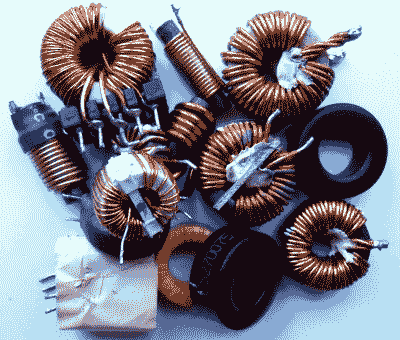
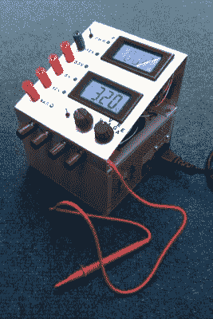

# 不完全是 ATX 电源的 101 个用途

> 原文：<https://hackaday.com/2016/10/28/not-quite-101-uses-for-an-atx-power-supply/>

在过去的几十年里，PC 电源一直是垃圾盒的标准，并且在可预见的未来可能会继续如此。这种产品通常是按照很高的标准制造的，可以提供多年的可靠服务，但是当它作为其中一部分的 PC 变得过时时，它的寿命只有几年。几十年来，它从最初的 PC 和 AT 发展成为 ATX，以不断增加的功率水平提供不断扩大的电压轨范围。多年来， [ATX 电源](https://en.wikipedia.org/wiki/ATX#Power_supply)标准有过多次不同的修订，但它们都拥有相同的基本外形。

因此，一堆 ATX 用品可能会出现在相当多读者的生活中。它们中的大多数可能是对今天的主板没什么用的旧的和过时的版本，所以它们就在那里。还没小到可以忽略，但*好到不能扔掉*。我们将看一看它们，尝试找出它们包含哪些有用的部分，并查看一些使用它们的项目。如果你是一群寻找目标的读者中的一员，这也许会给你一些启发。

## 盒子里面是什么？

[![A typical ATX PSU schematic using a TL494\. Dianyuan.com forum [Public domain], via Wikimedia Commons.](img/dd528d681e5fd28fb3822b3f055cc104.png)](https://hackaday.com/wp-content/uploads/2016/10/1280px-tl494_atx_power_supply_schematic.gif) 

典型的 ATX PSU 原理图用的是 TL494。Dianyuan.com 论坛[公共领域]，通过[维基共享](https://commons.wikimedia.org/wiki/File:Tl494_ATX_Power_Supply_Schematic.gif)。

ATX 的电源遵循严格定义的标准，因此，即使来自不同的制造商，许多电源内部的电路也非常相似，这一点也不足为奇。你会发现有各种各样的集成电路，其数据手册通常会为你提供完整的 ATX 电源原理图，但由于它们的电路往往非常相似，我们将向你展示最常见的一种。

[TL494](http://www.ti.com/product/TL494) 是一款开关模式电源控制器，设计用于多种配置，由多家半导体公司制造。

开关模式电源的[基本操作相当简单，ATX 电源很少偏离标准。有一个电源整流器和滤波器，一对高压功率晶体管将几十 kHz 的 DC 转换成铁氧体磁芯变压器，其输出整流为低压 DC。TL494 对输出电压进行采样，并产生 PWM 开关信号，该信号通过驱动变压器馈入功率晶体管的基极或栅极。还将有一个使用另一个小变压器的备用 5V 电源，以及一个“电源良好”电路来告诉主板 PSU 准备好了，并激活外部输入上的电源。](https://en.wikipedia.org/wiki/Switched-mode_power_supply#Theory_of_operation)

[![A typical ATX PSU interior. Alan Liefting (Own work) [Public domain], via Wikimedia Commons.](img/f9697ecfb23ec6902bf0872a86967b33.png)](https://hackaday.com/wp-content/uploads/2016/10/782px-atx_power_supply_interior.jpg)

### 典型的 ATX PSU 内部

图例:

**A:桥式整流器**

**B:B 和 C 之间的输入滤波电容器——高压晶体管的散热器**

**C:变压器，位于 C 和 D 之间——低压整流器的散热器**

**D:输出滤波线圈**

**E:输出滤波电容**

Alan Liefting [PD]，通过[维基媒体共享](https://commons.wikimedia.org/wiki/File:ATX_power_supply_interior.jpg)。

这些电源在表面贴装元件时代略有不同，因为它们中的大多数仍具有通孔结构。这使得它们成为电子清道夫的合适目标，因为零件更容易完好无损地被回收。值得花点时间看看您将找到的组件，并建议它们的一些用途。

## 零件，零件，零件

拆卸其中一个盒子时，最明显的是金属外壳、IEC 连接器、电源开关和风扇。你不需要解释这些是如何重复使用的，如果你不介意一点钢钻和你的项目案例显然是一个电脑电源，那么他们是非常强大的外壳。主板和磁盘电源连接器的布线机也是如此，这是一种方便的中型连接线来源。

看看 PCB 上的元件，许多都是标准分立器件。是的，我们都在某个时候扫掠过 10K 电阻，但一般来说，除了几个高压电容之外，它们没什么值得兴奋的。那么棋盘上有什么值得举起来的呢？

Just a selection of ATX power supply magnetics and cores.

一件事是在 ATX PSU 董事会丰富的是磁性。用于滤波器和各种铁氧体磁芯变压器的环形扼流圈和铁氧体线轴。变压器是为特定目的缠绕的，所以除非你有耐心倒带，否则它们可能没什么用，但扼流圈有更多的用途。这些不是奇特的射频铁氧体，而是更实用的铁粉芯，尽管它们仍然可以在需要扼流圈的地方找到很多用途。我甚至将它们用作同轴巴伦的内核，当它们的目的只是阻止 RF 泄漏到馈线时，它们较差的 RF 性能是一种优势。从 RF 角度来看，同样值得注意的是，这些扼流圈也是为其它电感提供大量大规格漆包铜线的便利来源。

ATX PSU 中的半导体包括一些特殊元件，但它们仍有其他用途。在高压端是一系列高压二极管和开关晶体管，如果你要组装高压逆变器，所有这些都是丰富的器件来源。在低压侧，除了 TL494 或其他控制器芯片之外，您还会发现一些大电流整流器和一个以上的三端 78XX 系列稳压器(如果幸运的话)，以及许多情况下的 [TL431](http://www.ti.com/product/TL431) 可调基准电压源。您可能还会发现各种散热器在其他项目中也很有用。

## 用它，不要弄坏它！

如你所见，ATX·PSU 能产生一些有用的成分。但是因为它们的供应几乎是无限的，所以除非你需要零件，否则不值得弄坏一个，所以你能用一个完整的做什么呢？

A rather nicely built bench PSU project [we covered back in 2010](http://hackaday.com/2010/12/09/atx-psu-turned-into-an-adjustable-voltage-bench-supply/).

答案很简单:把它作为台式电源怎么样？这些电源在电气方面并不是世界上最安静或调节最好的，但它们确实具有优势，可以在大电流水平下提供多个有用的电压轨。以这种方式使用需要一个小的修改，其中一条线是保持高电平的使能线。将引脚 16 拉低(通常为绿色导线)，电源将启动。Hackaday.io 上有许多项目展示了其他人是如何做到这一点的，快速搜索奥什公园会发现一系列像这样的[突破 PCBs】。](https://oshpark.com/shared_projects/KB0VPOhd)

如果固定电压还不够，那么已经有许多 ATX PSU 项目，如图所示，在 12V 线路上安装了 [LM317](http://www.ti.com/product/LM317) 可变调节器，以提供可调输出。这并不是实现这一点的唯一方法，TL494 可以很容易地[通过简单的修改](http://danyk.cz/at_atx_en.html)变成一个可变调节器。[标准警告和免责声明适用于](http://hackaday.com/2016/05/11/looking-mains-voltage-in-the-eye-and-surviving-part-1/)在干线和高压设备上工作的危险，如果你遵循这条路线。

当然，将电源用作电源非常有用，但这很难称得上是开创性的，即使它有时确实涉及一些硬件黑客。一个的其他用途呢？能够产生大电流的电源可能适合的一个领域例如是焊接。重要的是要指出，我们所说的焊接并不是指你用来制造船只甚至汽车的那种焊接，但这并不是你能找到焊工的唯一地方(这个[点焊机只使用 ATX 电源](http://mdiy.pl/polautomatyczna-zgrzewarka-punktowa-26v-1ka/?lang=en)的情况是一个很好的项目，但在这种情况下不太算数)。例如，去年我们报道了[一家 ATX 供应商使用石墨电极焊接热电偶](http://hackaday.com/2015/07/31/hacker-creates-thermal-probes-by-welding-with-a-pc-power-supply/)，与商业替代品相比节省了大量成本。ATX 供应的金属加工潜力还不止于此，你会发现人们在模型制作社区使用它们进行[电阻焊接](http://www.guitargear.net.au/discussion/index.php?topic=39678.0)。

所以，你仍然有那堆来自你身边所有旧电脑的金属砖，但如果幸运的话，读完这篇文章后，你会有一点灵感，也许能让你用它们做点什么。无论你做了什么，一定要在 [Hackaday.io](https://hackaday.io/) 上与我们分享，别忘了[给我们发送链接](https://hackaday.com/submit-a-tip/)！