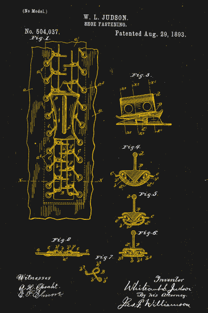
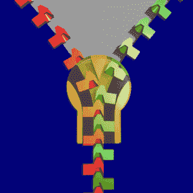
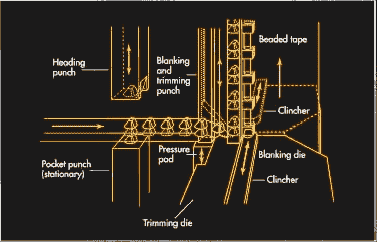

# 机制:拉链颂

> 原文：<https://hackaday.com/2018/01/26/ode-to-the-zipper/>

现在环顾四周，很有可能你会很快发现一条拉链。拉链是令人难以置信的普通人工制品，是一种大量生产的日用品，我们很少去想它，直到它坏了或者卡住了。但拉链是一种相当现代的便利，他们发明的故事表明，即使是最好的想法也会因过于复杂的设计和缺乏实用的制造方法而被推迟。

### 试了又试

US Patent #504,307\. One of the many iterations of Judson’s design. Like the others, it didn’t work.

自 19 世纪中期以来，用扣件取代纽扣和鞋带的想法就一直存在。缝纫机的发明者伊莱亚斯·豪获得了第一个类似拉链的紧固件专利。尽管豪在设计复杂的机械装置方面并不逊色，但他从未能使他的“自动、连续的服装闭合”成为可行的产品，于是豪将他的发明精力转移到了其他项目上。

当芝加哥出生的发明家惠特科姆·贾德森(Whitcomb Judson)开始研究“锁扣或解锁器”时，世界又等了 40 年，以进一步开发无钩紧固件 Judson 的设备是为鞋子和靴子市场设计的，它拥有现代拉链的所有可识别部件——一排排互锁的齿，带有滑动机构来啮合和分离两边。该设备于 1893 年在芝加哥世界博览会上首次亮相，几乎没有引起任何商业兴趣。

贾德森为他的扣锁经历了几次设计迭代，寻找正确的想法组合，以产生一种可行的紧固件，这种紧固件足够容易制造并有利可图。他找到了支持者，成立了一家公司，并销售了各种版本的改良产品。但他尝试的一切似乎都有一个或多个严重的缺点。当他的扣件被用在鞋上时，意外的失败仅仅是一个不便。如果一位女士衣服上的一个扣子意外打开，这可能是一场社会灾难。再加上高昂的价格，无法支付组装它们所需的手工劳动，几乎贾德森发明的每个版本都失败了。

Zipping up. Source: [Dominique Toussaint (Wikipedia)](https://en.wikipedia.org/wiki/Zipper)

又过了十年，公司更名，跨国搬迁，雇佣一个聪明的年轻工程师，世界才有了我们公认的第一条现代拉链。1901 年，贾德森雇用了吉德昂·逊德巴克，到 1913 年，他已经是紧固件制造和机器公司的首席设计师，在新泽西的霍博肯停留后，该公司刚刚搬迁到宾夕法尼亚州的米德维尔。Sundback 的设计要求一排排相同的齿，齿杯在下面，齿尖在上面，固定在织物带上。一个带有 Y 形通道的滑块弯曲带子，打开牙齿之间的缝隙，使杯子嵌套在笔尖上，使牙齿牢固地啮合在一起。

桑德巴克的设计比贾德森的任何尝试都有明显的优势。首先，它奏效了，而且足够可靠，除了最初的市场营销，它开始迅速进入时尚服装领域，转向更实用的产品，如烟袋。其次，也许更重要的是，Sundback 发明了一种机器，可以在一天内制造数百英尺的紧固件。这给了这项发明一个 Judson 的紧固件无法达到的规模经济。

### 用牙齿咬它

Continuous process for forming metal zippers. Source: [How Products Are Made](http://www.madehow.com/Volume-1/Zipper.html)

自 20 世纪初以来，桑德巴克发明的制造“可分离拉链”的机器已经有了很大的改进，但目前的工艺看起来仍然相似，至少对金属拉链来说是这样。桁条是带有齿的织物带，通过多步冲压和卷曲机在连续过程中形成。对于金属纵梁，一卷扁平金属被送入冲头和模具中形成空心勺。然后再次冲压该条，以在勺子周围形成 Y 形，并将其从卷筒纸上切下。Y 形的腿跨在织物带的边缘上，然后一组模具将腿压接到带上。一台现代拉链机能以每分钟 2000 齿的速度制造链条。

塑料拉链现在也很普遍，制造方法因拉链的样式而异。一种方法是将织物带挤压在模具的两半之间，同时围绕带注射成型齿以形成两个平行的纵梁。通过齿连接纵梁的注入口在模制后脱离，并且完成的纵梁随后被组装。

 [https://www.youtube.com/embed/OG2C2KgtRRU?version=3&rel=1&showsearch=0&showinfo=1&iv_load_policy=1&fs=1&hl=en-US&autohide=2&wmode=transparent](https://www.youtube.com/embed/OG2C2KgtRRU?version=3&rel=1&showsearch=0&showinfo=1&iv_load_policy=1&fs=1&hl=en-US&autohide=2&wmode=transparent)

自从 Sundback 的第一个成功设计以来，拉链已经走过了漫长的道路，制造工艺的改进消除了许多曾经需要的手工操作。专门的拉链已经从海洋深处到达了月球表面，如果我们到达火星，无论如何，拉链都将与我们同行。