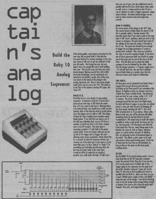
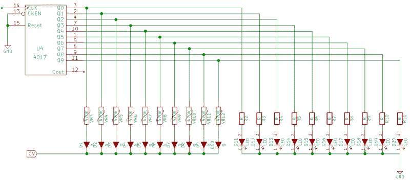
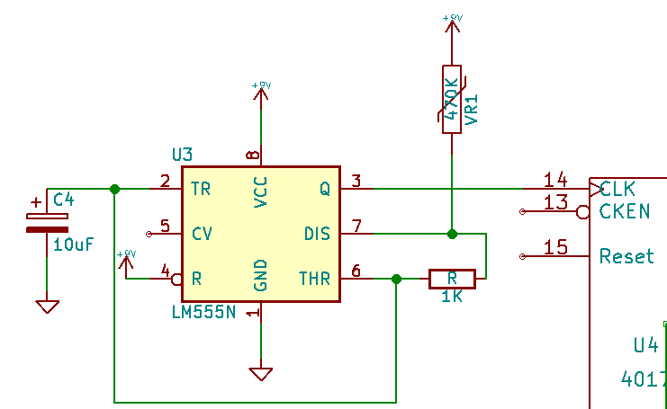
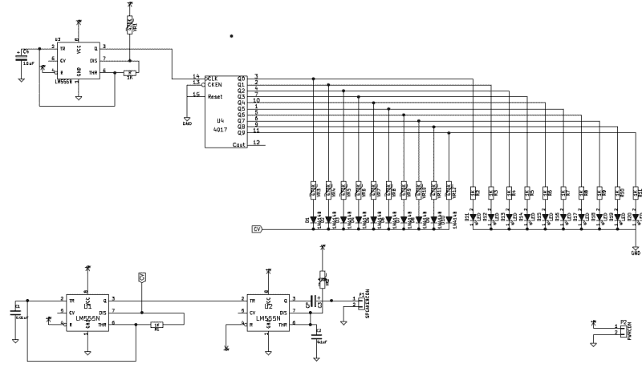
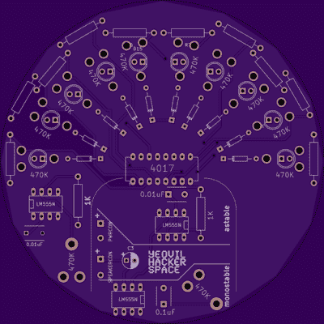

# 哦，宝贝，宝贝 10-建立一个经典的模拟音乐音序器

> 原文：<https://hackaday.com/2016/01/14/oh-baby-baby10-build-a-classic-analog-music-sequencer/>

最近，我学习了更多关于经典模拟音乐合成器和音序器的知识。这让我想到了 Baby10，一种经典而简单的模拟序列器设计。在这篇文章中，我将介绍它的基本操作，以及一些令人敬畏的黑客基于这种设计的构建。

序列发生器产生一系列变化的电压。这些控制电压(CV)然后可以用于控制其他部件。通常这是一个简单的音调发生器。虽然这个概念很简单，但它可以产生惊人的效果:

 [https://www.youtube.com/embed/Xcmk_gZiU6g?version=3&rel=1&showsearch=0&showinfo=1&iv_load_policy=1&fs=1&hl=en-US&autohide=2&wmode=transparent](https://www.youtube.com/embed/Xcmk_gZiU6g?version=3&rel=1&showsearch=0&showinfo=1&iv_load_policy=1&fs=1&hl=en-US&autohide=2&wmode=transparent)

一个基本的音序器是一个伟大的初学者项目。很容易理解电路的基本操作，并产生令人满意的娱乐效果。[宝宝 10](http://www.midiwall.com/gear/babyseq/) 最初发表在一个名为“船长的模拟”的专栏中，但现在已经在网上广泛分享。

The original Baby10 article.

该电路使用简单的 CMOS 十进制计数器 [4017](https://en.wikipedia.org/wiki/4000_series#4017_decade_counter) 。4017 接收输入时钟信号，然后在 10 个输出引脚上依次输出高电平脉冲。因此，4017 在单个 IC 中几乎可以满足我们对序列器的所有需求！然而，我们希望我们的音序器输出一个变化的电压，然后我们可以用它来产生不同的音调。

为了实现这一点，每个输出引脚都连接了可变电阻。与可变电阻串联的二极管阻止了输出之间的竞争(通俗地说)。

为了使序列器在视觉上更具吸引力(并提供一些反馈)，led 通常也添加到 4017 的输出中。一个完整的婴儿 10 序列显示在下面的示意图。原始电路使用 1N917s，这些器件已不再提供，但该器件已被 1N4148 取代。

The basic Baby 10 schematic.

虽然这样就完成了基本的序列器，但还需要几个其他组件来产生一个真正有用的系统。我们需要一个时钟输入来驱动序列器，还需要一些东西来在输出端产生音调。为了这两个目的，我们可以使用无处不在的 555！

对于时钟，我们可以使用一个简单的 555 非稳态振荡器。下面的原理图应该产生一个具有适当可变范围(从大约 70Hz 到 0.3Hz)的时钟。这对于听觉范围来说是正确的，但如果你有兴趣改变这一点，有一些很棒的 [555 值计算器](http://www.ohmslawcalculator.com/555-astable-calculator)可以让这个过程变得容易。

A simple 555 based clock.

现在音序器正在发出定时的、变化的控制电压，它们需要被转换成音调来产生声音。许多商业合成器提供 CV 输入。因此，基本序列器已经很有用了:

 [https://www.youtube.com/embed/KpHKe3sDDAk?version=3&rel=1&showsearch=0&showinfo=1&iv_load_policy=1&fs=1&hl=en-US&autohide=2&start=60&wmode=transparent](https://www.youtube.com/embed/KpHKe3sDDAk?version=3&rel=1&showsearch=0&showinfo=1&iv_load_policy=1&fs=1&hl=en-US&autohide=2&start=60&wmode=transparent)

但是如果你是从零开始构建你的系统，你需要自己添加一个音调发生器。您可以使用另一个 555 非稳态振荡器(使用与时钟相同的电路，但改变值)。但一个常见的选择是使用无稳态和单稳态 555 作为雅达利朋克控制台(我们有一篇关于[朋克控制台](http://hackaday.com/2015/09/17/the-ubiquitous-atari-punk-console/)的详细文章，描述了它的工作原理)。

 [https://www.youtube.com/embed/Qe1ButmzNWY?version=3&rel=1&showsearch=0&showinfo=1&iv_load_policy=1&fs=1&hl=en-US&autohide=2&wmode=transparent](https://www.youtube.com/embed/Qe1ButmzNWY?version=3&rel=1&showsearch=0&showinfo=1&iv_load_policy=1&fs=1&hl=en-US&autohide=2&wmode=transparent)

完整的 Baby10/Atarti 朋克控制台电路看起来像这样:

A complete Baby10+Atari Punk Console Schematic

The Yeovil Hackerspace layout

将这个项目放在一块试验板上非常容易，而且组件只需要几美元。但是我也希望把 PCB 放在一起，这样我们就可以在我们的[本地黑客空间](http://www.yeovilhackers.com)举办研讨会(如果你喜欢 gerbers，请在下面评论！).

4017 驱动 Baby10 步将序列器限制为 10 步。然而，对于大多数音乐应用来说，10 步听起来非常奇怪，通过将其中一个输出循环到 reset 引脚，可以限制步数。大多数黑客选择使用 Baby10 作为 8 步序列器(Baby8)，但是在改变步数方面有很大的余地。

以 Baby10 为基础，你可以用各种方式修改设计，以产生更有趣的声音，许多黑客已经基于这种设计制作了独特的音序器。例如，通过组合 2 个 4017，您可以构建一个 16 步序列器:

 [https://www.youtube.com/embed/UUso4S8PsJM?version=3&rel=1&showsearch=0&showinfo=1&iv_load_policy=1&fs=1&hl=en-US&autohide=2&start=106&wmode=transparent](https://www.youtube.com/embed/UUso4S8PsJM?version=3&rel=1&showsearch=0&showinfo=1&iv_load_policy=1&fs=1&hl=en-US&autohide=2&start=106&wmode=transparent)

如果你想变得更加雄心勃勃，你可以组合多个 Baby8s(或者多个 Baby16s，如果你喜欢的话！)来产生有趣的效果:

 [https://www.youtube.com/embed/a552QV1Zdpc?version=3&rel=1&showsearch=0&showinfo=1&iv_load_policy=1&fs=1&hl=en-US&autohide=2&wmode=transparent](https://www.youtube.com/embed/a552QV1Zdpc?version=3&rel=1&showsearch=0&showinfo=1&iv_load_policy=1&fs=1&hl=en-US&autohide=2&wmode=transparent)

还有许多其他的可能性，例如使用不规则的时钟输入，将多个序列器连接在一起，以及用不同的合成器进行实验。所有这些实验使 Baby10 成为一个有趣的项目，它可以从简单开始，逐渐变得更加复杂——它激励我建立自己的设计套件版本。希望它也足够简单，初学者可以掌握基本概念，并从项目中学到一些东西。如果你想深入了解 synth 的更多核心概念，可以看看【埃利奥特·威廉姆斯】 [*逻辑噪声*系列](http://hackaday.com/tag/logic-noise/)。特别是，[他报道了 4017](http://hackaday.com/2015/04/24/logic-noise-sequencing-in-silicon/) ，正是这个婴儿激发了他的这篇文章。在任何情况下，使用这些设计，你最终会得到一些有趣而独特的音乐。