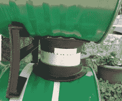
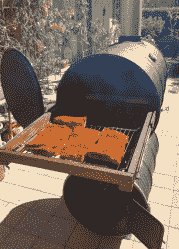

# 油桶吸烟者

> 原文：<https://hackaday.com/2017/12/04/oil-barrel-smoker/>

如果有一对油桶和对美食的渴望，你会怎么做？像任何正常人一样，redditor [Kilgore_nrw]做了一个合乎逻辑的选择，造了一个吸烟者。

为了使建造更容易，他拿起一个双桶炉灶套件，里面有门、铰链、腿  和烟道连接器。在按计划安装炉腿和炉门的时候——炉门的高度足以容纳火桶中的一层砖——他不得不临时安装烟道。它最终与烟道连接器的直径完全相同，但开槽足以滑动到位，形成了令人满意的密封。

他不喜欢将烟囱放在吸烟者“前面”的样子，于是将它安装在后面的烟道上方，并在吸烟室内增加了两块砂岩板，以均匀分布热量。最后的润色包括烹饪架的重型抽屉滑轨——确保容易获得美味——以及煞费苦心地磨掉旧油漆以涂上新的耐热涂层。对于任何粉丝来说，[完成的图片](https://imgur.com/gallery/9V5rR)都是值得一看的。

 在当今这个科技无处不在的时代，很自然有人会竭尽全力把一个便宜的吸烟者变成一个[自动烹饪机](https://hackaday.com/2016/09/24/see-a-cheap-meat-smoker-get-an-automation-power-up/)，或者让它[在烹饪完毕后给你发短信](https://hackaday.com/2010/09/02/meat-smoker-texts-you-when-it-is-done/)。如果看完这些你还没有满足你的胃口，这里有更多[几](https://hackaday.com/2011/02/03/pid-controlled-smoker/)美味 美食来诱惑你。

[通过 [/r/DIY](https://www.reddit.com/r/DIY/comments/7fctz7/diy_smoker_construction_photos/)