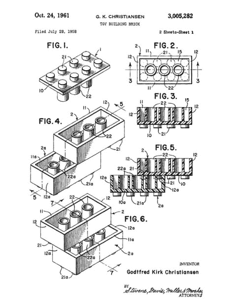
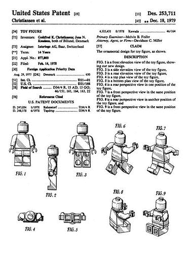

# 乐高:克里斯蒂安森·乐高西

> 原文：<https://hackaday.com/2018/06/26/ole-kirk-kristiansen-and-the-lego-frontier/>

无论你是年轻的，年老的，还是时间旅行的瓦肯人，有一样东西将我们全球团结在一起:天真的乐高积木，它鼓励创造力，而不是填鸭式的娱乐。你有没有注意到最近过多的僵尸儿童和成人对着他们的集体屏幕流口水？回到古代，一个孩子需要创造几个小时的欢乐时光，只需要塑料联锁砖和一个让父母绊倒他们的地方。乐高集团承载着我们童年时代发明创造的灵感，如果没有创始人 Ole Kirk Kristiansen ( [或 Christiansen](https://www.lego.com/en-us/legohistory/kristiansen-or-christiansen) )的帮助，这一切都不可能实现。这位来自丹麦的卑微木匠一砖一瓦地在这个小小的斯堪的纳维亚国家留下了自己的印记。

好吧，也许一开始不会。你看我们都知道并且喜爱的塑料乐高积木最初是由木头制成的。它们也不是真正的砖块。

## 历史课

那是 1932 年，大萧条对世界上大多数居民造成了伤害。失业后，奥立·柯克做了任何一个处于这种情况下的正常人都会做的事情——开始了他的木制玩具生意。最初，由于不幸的环境，他的企业很难赚钱。考虑到成本效益的设计，他把精力集中在简单的木块、鸭子和拖拉机上。

随后，情况有所好转，丹麦经济缓慢但稳步反弹。孩子们非常喜欢克里斯蒂安森的木制玩具，因此他的生意开始兴隆起来。后来他的儿子戈德弗雷德加入了公司。[后来几家木材厂发生火灾](https://www.history.com/news/the-disastrous-backstory-behind-the-invention-of-lego-bricks)，他们在 1947 年收购了一台塑料注射成型机，开辟了新的材料选择。几年后，我们看到不可避免的 ***系统*** 开始出现。[乐高系统](https://www.lego.com/en-us/legohistory/system-of-play)需要大小和形状完美的积木，它们组合在一起创造出一个理想的世界。该系统在乐高设计中仍然非常活跃，并且将持续到时间的尽头。然而，奥尔柯克的时代结束得太快了。他留给儿子的是一个玩具帝国的开端。

## 专利时间到了

Interlocking LEGO Patent

最初，出来的塑料乐高积木不是环环相扣的。你能想象今天的乐高积木没有扣在一起吗？永远不会有微小的扁平碎片永远扣在一起的问题。唉，很快就发现他们需要设计一个更坚固的设计，这样积木作品就不会那么容易被兄弟姐妹破坏。1958 年，也就是乐高之父去世的那一年，他们提交了互锁塑料乐高积木的[专利。三年后，它被批准，他们已经起飞。又过了三年，手册开始出现在乐高套件中。这些工具变得越来越复杂，以至于孩子们在没有说明书的情况下很难弄清楚如何建造这个该死的东西。这种特定装备难度的增加也许增加了装备完成后的乐趣；众所周知，一件事越难做，你做的时候越有满足感。砖块中添加的互锁功能确实是玩具的转折点。](https://patents.google.com/patent/US3005282A/en)

Minifigure LEGO Patent

70 年代初，戈德弗雷德的儿子克尔德加入了家族企业。他创建了一个研发中心，随着时间的推移，该中心对更新乐高套件至关重要。套件的设计不断发展，研究表明需要创造额外的部件来使套件更加生动。乐高玩具的下一个革命性产品是迷你人偶，如左图所示。这些可爱的微笑的数字真实地把乐高场景带到了生活中，这就是这家公司的全部意义。

## 句法和语义

我相信大多数乐高迷已经知道，“乐高”这个词来自丹麦语单词 *leg* 和 *godt* ，字面意思是“玩得好”。这句话几乎和他们的官方口号一样概括了该公司，“只有最好的才是最好的”。但是它是如何工作的呢？是乐高吗？乐高？Eggo？如何正确书写单词 LEGO——单数和复数——的语法混乱让相当多的人感到沮丧。似乎乐高当局希望形容词 to [的形式永远是单数，大写](https://twitter.com/lego_group/status/842115345280294912?lang=en)。另一方面，许多美国公民似乎喜欢练习他们的英语言论自由，并且[使用非大写单词](https://english.stackexchange.com/questions/10839/what-is-the-correct-plural-form-of-lego-lego-or-legos)的复数形式。出于某种原因，关于如何显示单词的争论似乎永无止境。可能只是因为人们喜欢为了争论而争论吧(*我们在看你们，评论者*)。

## 作为一个十亿美元玩具帝国生存的关键

乐高有一套迎合顾客的方法。如果你现在没有在你的咖啡桌上自豪地组装的 4016 块乐高死星，那么你真的能称自己是一个真正的星战迷吗？乐高集团过去如此成功，现在仍然如此，原因之一是他们知道如何随着时代的变化而发展。他们的核心起点非常简单，但随着玩具业务变得越来越复杂，他们的营销策略也变得越来越复杂。你们中有多少人家里有乐高千年隼？乐高印第安纳琼斯庙逃生套装？乐高捉鬼敢死队消防队总部呢？我敢打赌，我们的读者中至少有一个人拥有这些。如果我错了，请在评论中告诉我。或者，有没有任何古董乐高航天飞机？也许是一套经典的城堡？这是有史以来最具标志性的两个乐高套装，该公司承认经常回到这些面包和黄油包来保持稳定性。乐高集团做得很好，将这两个组件整合到他们的模型中，以确保公司在能够承担风险的同时继续发展。

1998 年的乐高头脑风暴系列是有史以来最畅销的乐高系列。这种特定产品的大部分购买者不是卖给孩子，而是想和他们打交道的博士生和专业程序员，至少在一开始是这样。然而，随着时间的推移，这已经成为学生和成人的宝贵学习工具。自制界面和设计被创造出来，物理修改被做出，砖块被“砌砖”。我们之前有一篇关于[乐高外骨骼控制使用乐高 Mindstorms NXT 系统](https://hackaday.com/2015/08/09/lego-exoskeleton-controls-pacific-rim-robot/)的机器人的文章。在那天晚上之前，[第一届乐高联盟](http://www.firstlegoleague.org/)成立了。它吸引学生来破解思维风暴，并对硬件/软件更加熟悉。第一次学习机器人/计算机科学可能会令人生畏，但当使用你熟悉的东西时，就会容易得多。谁不喜欢乐高？

乐高集团有效地让世界各地的人都知道了它的存在，但如果没有 Kjeld、他的父亲 Godtfred 和他父亲的父亲 Ole Kirk Kristiansen 的独创性和真诚，这一切都是不可能的。他们的目标是让每个孩子都有机会拥有一个有意义的游戏时间，这个目标正在由他们从头开始建立的公司每天都在实现。

现在，坐下来，用这个经典的太空乐高玩具汇编来怀念过去的美好时光:

 [https://www.youtube.com/embed/yENfmYYKDpE?version=3&rel=1&showsearch=0&showinfo=1&iv_load_policy=1&fs=1&hl=en-US&autohide=2&wmode=transparent](https://www.youtube.com/embed/yENfmYYKDpE?version=3&rel=1&showsearch=0&showinfo=1&iv_load_policy=1&fs=1&hl=en-US&autohide=2&wmode=transparent)

