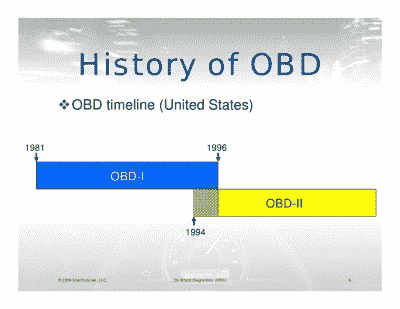

# 维护、排放和隐私:OBD 的故事

> 原文：<https://hackaday.com/2017/01/04/on-board-diagnostics/>

90 年代是世界历史上的关键时刻，1996 年也不例外。你可能花了一年时间粘在电视上玩《超级马里奥 64》，或者你正忙于为比尔·克林顿或鲍勃·多尔竞选，或者你对戴安娜王妃和查尔斯王子离婚感到非常沮丧，以至于你一整年都被锁在自己的房间里，成为自己存在主义虚无主义的囚犯。然而，无论你做了什么，很可能有一个重大事件与你擦肩而过:车载诊断的标准化(在美国)，也称为 OBD-II。

在 20 世纪 70 年代，车辆(至少在一些西方国家)受到越来越多的排放限制。大多数公司开始从化油器转向高效燃油喷射系统，但即使这样也不足以满足新标准。汽车开始携带基本的计算机系统来管理和控制阀门、仪表和传感器的流入，这成为了新的规范。而且，正如人们所猜测的那样，每个汽车公司都有自己管理和监控这些计算机系统的标准。最终他们会选择我们今天使用的 OBD 系统。

## 突变

不过，首先，我们应该回到过去，看看是什么导致了汽车行业的巨变。一开始，诊断汽车问题的唯一方法是直接调查异常噪音、性能问题或其他问题。这可能是特别麻烦的电气问题，因为他们的无形的性质。迟早有人会找到一种方法来简化故障排除过程。这就是为什么第一个大规模生产的车辆诊断系统几乎与排放无关，主要集中在帮助机械师识别常见问题上。

这些系统中的第一个于 60 年代末在一些大众汽车上上线。(这一点在作者的《甲壳虫》中有所体现。)安装在这些汽车上的专有测试端口使机械师可以通过一台“小型”计算机轻松访问电气系统，该计算机可以测试汽车的多个不同方面。从那里，他们可以知道灯是否熄灭，点火系统的一些信息，以及(对于燃油喷射汽车)燃油输送系统的一些信息。尽管 20 世纪 70 年代的大众汽车在旧大众汽车的竞争中相当晚(第一个车型年是 1938 年)，但它对该行业来说仍然是早期的，并在故障排除方面给了大众汽车机械师一条腿。

下一个尝试车辆诊断系统的汽车公司是日产公司的 280Z 跑车。与大众不同，该系统旨在帮助管理后 EPA 时代对燃油喷射系统日益增长的需求。更不用说 280Z 是一款开创性的高性能汽车，任何通过使用计算机微调发动机而获得的收益都是受欢迎的。

在大众汽车和日产汽车取得成功后，其他汽车公司看到了拥有诊断系统的额外好处，机械师可以轻松地插入该系统，以确定车辆的问题。通用汽车公司在 80 年代创造了自己的专有系统，帮助工厂工人在汽车下线时识别汽车的问题。虽然你需要专门为全新的汽车设计诊断工具(毕竟你最后一次在路上看到凯迪拉克 Cimarron 是什么时候？)，GM 诊断系统确实在一段时间内发现了一些与机械有关的效用。

## 一致

(Slide from [this talk on OBD-II](http://www.slideshare.net/mp3Car/what-is-obd-scan-tool-presentation-mp3-car-afk-fest-2009))

在这一点上，许多不同的汽车公司在与车载诊断系统的交互方面具有同样不同的标准。这是美国联邦政府介入的地方，要求所有汽车在某个日期前都要有标准的 OBD 系统。因此，诊断系统开始将几乎所有的注意力集中在排放系统上。第一个标准被称为 OBD-I，并在 80 年代末和 90 年代初逐渐生效。与它的继任者 OBD-II 相比，这个系统是原始的，OBD-II 是自 1996 年以来在美国销售的所有汽车的当前标准。大多数其他第一世界国家也在这个时候采用了这个(或类似的)标准。

当前的 OBD-II 标准规定了用于监控汽车中许多传感器的协议，如果其中任何一个传感器工作不正常，就可以提醒驾驶员。根据这一标准制造的大多数汽车都增加了氧传感器的数量，控制空气质量流量传感器和燃料喷射器，以及汽车的许多其他方面。所有这些都意味着道路上有更高效的发动机，所有这些发动机都以一种方式进行通信，这使得很容易告诉你为什么仪表板上的检查发动机灯亮了。如果你住在一个要求你的汽车通过排放测试的地方，机械师也可以很容易地测试汽车的排放。对于符合 OBD-II 标准的汽车，机械师所要做的就是将插头插入 OBD 端口，并在另一个显示器上查看输出，而不是忙不迭地将传感器连接到排气系统，并通过一系列测试来运行汽车。

另一方面，在人们听说 Super Smash Bros 之前几年设计的系统还有很多值得期待的地方。有人谈到了新的 OBD-III 标准，该标准将允许汽车利用不断增长的无线网络，本质上是将“所有新车”添加到物联网设备的列表中。届时，汽车将有可能向监管机构报告自己的情况，如果汽车违反了任何排放法律，汽车将被远程关闭。虽然这可能被认为是环境的胜利，但在任何实质性的东西进入市场之前，肯定需要解决对政府过度干预和老大哥的担忧。例如，这可能会使大众汽车更难在排放测试结果中作弊，但这样做的好处可能不会超过意想不到的后果。无论新的 OBD 标准将包括什么，对于 OBD-II 中的老化系统来说，这将是一个受欢迎的改进。