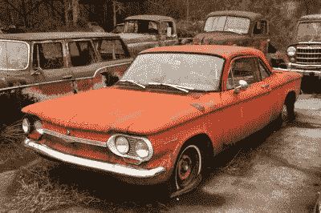
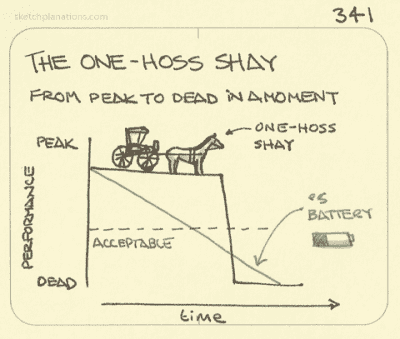
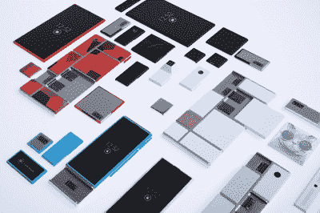

# 霍斯·谢和我们的废弃社会

> 原文：<https://hackaday.com/2016/02/01/one-hoss-shay-and-our-society-of-obsolescence/>

传说亨利·福特会派工程师到美国各地的垃圾场寻找福特。他们应该研究他们发现的每一个零件，并记下任何没有失效的零件。但这并不是为了让他能让所有这些部分变得更强。相反，福特据称使用这些数据来确定他在未来的生产运行中可以在哪里偷工减料，以便不浪费金钱，使任何部分比任何其他部分持续更长时间。

大多数事情倾向于崩溃，而不是完全放弃。通常只有一两个组件停止工作，其余的仍然可用。这是一件好事。它让我们修理多氯联苯或从它们身上清除零件，让我们的汽车开得更久，并通过器官捐赠项目帮助拯救彼此的生命。你能想象如果每件事情的每个部分同时失败，生活会有多么不同吗？

Where cars go to rest in pieces. Image via [Sometimes Interesting](http://sometimes-interesting.com/2014/04/23/worlds-largest-old-car-junkyard-old-car-city-u-s-a/).

### 计划报废

我们穿的衣服和鞋子，我们住的房子，以及我们每天接触的工具和物品都不是为了持久而建造的。有些人会告诉你，没有什么是像过去那样制造的。不管那是真的还是假的，过去的事情最终还是失败了。

无论如何，建造持久的东西并不是真正有效的商业模式。例如，汽车制造商必须让他们的汽车安全可靠，但他们也需要让顾客回头客。因此，年复一年，他们推出更时尚、更安全、功能更酷的新机型。

人类所能制造的几乎任何东西的强度都取决于它的最弱点。对于那些移动的东西来说尤其如此，比如汽车。在汽车出现之前，是由马驱动的各种大小不同的马车，包括由一匹马驱动的小型马车。坐在其中一辆车上，默认情况下颠簸得令人不安。

### 为两个人建造的马车

在统计学和经济学领域，有一种东西叫做折旧模型。其中一种被称为灯泡模型，指的是一种商品在其整个生命周期中提供相同水平的服务。换句话说，一个东西实际上是磨损了，而不是坏了。我们买灯泡，希望开关一按就亮。总有一天他们会死去。真的没有修灯泡的，而且它们也没有报废价值。

Ye olde one hoss shay. Image via [Wikipedia](https://en.wikipedia.org/wiki/One-horse_shay#/media/File:Old_One_Horse_Shay.jpg)

这个突然全面贬值的例子也被称为霍斯谢模型。这个名字来源于美国非正式的说法，意为“一匹马拉的马车”，一种由一匹马拉的足以容纳两个人的马车。一个霍斯·谢伊被奥利佛·文德尔·霍马斯在他的诗[“执事的杰作，或者精彩的一个霍斯·谢伊:一个合乎逻辑的故事”](http://www.eldritchpress.org/owh/shay.html)中永垂不朽。

在这首诗中，一个执事哀叹这样一个事实，即由于一个地方或另一个地方的弱点，马车坏了。忘掉装配线和残酷的商业行为吧——这些通常是由有事业心的村民在当地建造的。执事推断，如果他要建立一个霍斯谢伊使用最好的材料

The lifespan of the one hoss shay. Image via [Sketchplanations](http://www.sketchplanations.com/post/80117003391/the-one-hoss-shay-refers-to-a-poem-about-a-cart)

从上到下，它没有弱点，因此会永远存在。所以执事决定建立最可靠的一个霍斯谢有可能在逻辑上，根据清教徒的原则，那个时代的批评家认为奥利佛·文德尔·霍马斯是讽刺。

他确实建造了它。它的每一部分都和其他部分一样坚固。这个逻辑结构的奇迹持续了几十年，持续了几十年，一直提供完美的服务。但正如霍姆斯所说，逻辑就是逻辑，最终它会赶上谢伊。到执事完成它的那一天正好 100 年，整个事情在一堆微粒中崩溃，导致当前的执事尴尬和疼痛。

### 模块化设计的未来

对于今天的战车来说，这种贬值模式的终结意味着的不仅仅是满是灰尘的裤子和受伤的自尊。无论什么东西坏了还是完全磨损了，对用户来说通常都不方便。对于像智能手机这样的东西来说尤其如此。当它们发生故障时，通常必须全部更换。像 Fairphone 和 T2 谷歌 T3 这样的公司正在努力为模块化手机创建架构。有了这种互换性，你可以很容易地更换，比如说，你手机里的相机模块，不管它坏了还是你只是想要一个更好的。

Google’s modular phone, known as Project Ara. Image via [Wikipedia](https://en.wikipedia.org/wiki/Project_Ara#/media/File:Project_Ara_scattered_parts.png)

模块化智能手机的优势远不止交换相机模块和最大化内存。广泛采用这种范式转变的最大问题是首先让人们感兴趣。提供其他手机没有的特殊功能是一个很好的开始。

具有可回收部件的模块化系统可能是我们未来能够做到的降低浪费和价格的最佳选择。你会做些什么来减轻计划淘汰带来的痛苦？