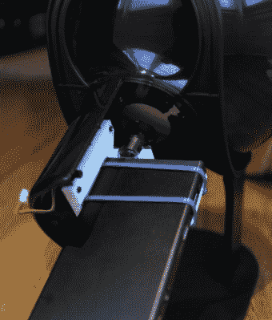

# 一个人对桌面球形显示器的追求

> 原文：<https://hackaday.com/2018/03/05/one-mans-quest-for-a-desktop-spherical-display/>

[尼拉夫·帕特尔]是一个肩负使命的人。自 2011 年以来，他一直痴迷于拥有一个球形显示器，就是你在博物馆和科学中心看到的那种东西，但只是在桌面上。对他来说不幸的是，到目前为止，还没有人对这种东西有太多的商业兴趣。到目前为止，他一直被迫破解自己的梦想展示版本。

 那是直到他从日本听说了 Gakken Worldeye。这个装置有望成为他这些年来一直在寻找的东西，他很快就抢购了两台:一台可以使用，一台可以拆卸。我们喜欢这家伙的风格。但正如廉价海外进口产品经常出现的情况一样，这款设备并没有完全达到他的预期。[【Nirav】没有被 Worldeye 的开箱即用表现所吓倒，他开始记录他改进产品的尝试。](https://eclecti.cc/computergraphics/snow-globe-redux-gakken-worldeye-projector-upgrade)

这些显示器通过在毛玻璃或塑料球体内部投影图像来工作，并且[Nirav]指出，Worldeye 上的投影球体实际上相当不错。问题是电子设备，即贫血的 VGA 分辨率投影仪，它被光学系统进一步裁剪为 480 像素的圆形。结合压缩 HDMI 输入的低质量下采样，Worldeye 上的最终图像至少可以说是令人印象深刻的。

[Nirav]决定将原来的投影仪从 Worldeye 上拆下来，换上一台索尼 MP-CL1 型号的投影仪，其分辨率为 1280×720。他想出了一个 3D 打印的支架来固定 MP-CL1，并已经将文件上传到 Thingiverse 上，供任何想在家一起玩的人使用。结果更好，但不幸的是仍然不是很大。[Nirav]认为球体物理上太小，无法支持 MP-CL1 的更高分辨率，加上光学系统本来就不是最高质量的。但是他很高兴他不用从头开始建造这个。

回到 2012 年我们第一次报道他的 DIY 球形展示，我们不得不说他最早的尝试仍然令人印象深刻。看起来这是一个商业市场努力跟上独立黑客工作的案例。