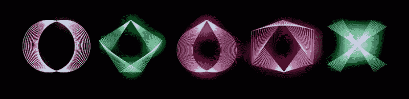

# Hackaday 奖的荣誉又多了一天

> 原文：<https://hackaday.com/2017/10/15/one-more-day-for-hackaday-prize-glory/>

这是您进入 [2017 Hackaday 奖](https://hackaday.io/prize)的最后一天。主题是建立一些重要的东西，所以不要袖手旁观。

你有改变世界的巨大力量。把你的思想放在一个你认为值得解决的问题上，用你的建设来激励我们。无论是交钥匙解决方案还是启发你周围人的种子想法，让我们一起努力，让世界变得更美好。周一早上之前把所有的东西都登记好。

### 随着参赛作品的结束，决赛选手会润色他们的项目

Hackaday 奖已经进行了五轮挑战，我们已经看到了超过 1000 份参赛作品。从每一轮中，选出 20 名决赛选手，每人获得 1000 美元，但我们才刚刚开始。总额为 75，000 美元的前五名奖金仍然存在。

一个奇妙的 Hackaday 奖评委小组将于 10 月 21 日开始审查最后一轮项目。决赛选手在被选中后继续完善他们的项目，添加项目日志、材料清单、设计文件和项目视频。所有这些都导致了 11 月 11 日星期六在 [Hackaday 超级大会](https://www.eventbrite.com/e/hackaday-superconference-2017-tickets-35735832838)上大奖的颁发。

The [HackadayPrize2017](https://hackaday.io/prize) is Sponsored by:   