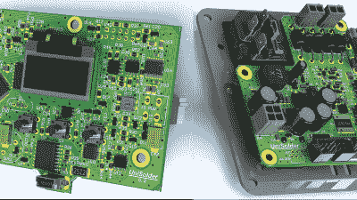

# 一个焊接控制器来管理它们

> 原文：<https://hackaday.com/2017/03/08/one-soldering-controller-to-rule-them-all/>

如果你最喜欢的编程语言是 solder，那么你肯定已经经历了一大堆黑客的考验。也有可能你选不到一个最喜欢的，结果你的桌子上堆满了一堆。用一个控制器来管理它们会很方便。这正是[sparkybg]通过构建他的[真正通用的焊接控制器](http://dangerousprototypes.com/forum/viewtopic.php?f=56&t=7218)所要做的。他的目的是设计一种控制器，能够驱动任何类型的低压烙铁，该烙铁使用在线或单独的温度传感器(热电偶或电阻 PTC)。

这个项目真的很受欢迎。大约两年前[sparkybg]宣布了他的构建，从那时起，许多其他人开始发布他们自己的 Unisolder 5.2 构建的细节。[zed65]构建了[右边的版本](http://dangerousprototypes.com/forum/viewtopic.php?f=56&t=7218&start=810#p65839)和[SZ64][组装了本文顶部显示的](http://dangerousprototypes.com/forum/viewtopic.php?f=56&t=7218&start=150#p62034)的板。

该控制器已被证明能够成功地与 Hakko、Pace、JBC、Weller、Ersa 以及几个中国品牌的铁把手配合使用。让控制器识别受支持的 625 种铁型材之一，包括在 9 针外壳连接器的相关针上连接两个紧公差电阻。这是一个出色的解决方案，有助于用简单的硬件识别各种不同类型的熨斗。在不太可能的情况下，您有一个非常模糊的、不受支持的模型，那么创建您自己的定制概要文件是非常简单的。该设计高度分立，全模拟前端和 PIC32 完成所有数字重任。

为了了解他的任务的复杂性，下面是[sparkybg]需要做的事情:

> “我有大约 200 微秒的时间来停止供电，等待 TC 电压达到其真实值，将放大器连接到该电压，等待放大器将其输出设置为我想要读取的值，从 ADC 进行测量，断开放大器与 TC 的连接，运行 PID，最终重新通电。毫伏到温度的计算使用 10 元多项式。它使用 32 位尾数浮点数进行计算，并在大约 20 微秒内完成。整个波形整形、温度计算、PID 等在 50-60 微秒左右完成。均方根电流、电压和功率的计算大约在 100 微秒内完成。所有这些都是在电源电压的半周期之间完成的，此时电压低于 3 伏左右。”

该论坛已经有超过 800 篇帖子，但您可以从第一篇帖子中方便链接的所有重要的原理图 PDF、Gerbers、BoM 和固件文件开始，构建自己的 Unisolder5.2 控制器。这种通用控制器是他早期项目的后续项目，Hakko T12/T15 专用控制器给了他很多设计通用版本的见解。

[sparkybg]已经发布了几个视频，展示了 UniSolder5.2 控制几种类型的熨斗。在休息后的视频中，他演示了如何控制一台 Weller WSP80。

 [https://www.youtube.com/embed/gd_8w7l8_Bo?version=3&rel=1&showsearch=0&showinfo=1&iv_load_policy=1&fs=1&hl=en-US&autohide=2&wmode=transparent](https://www.youtube.com/embed/gd_8w7l8_Bo?version=3&rel=1&showsearch=0&showinfo=1&iv_load_policy=1&fs=1&hl=en-US&autohide=2&wmode=transparent)

