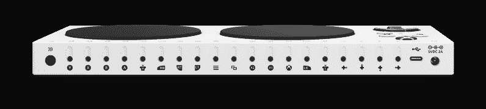

# 开放游戏给每一个有被黑客攻击的控制器的人

> 原文：<https://hackaday.com/2018/05/17/open-gaming-to-everyone-with-a-controller-meant-to-be-hacked/>

游戏控制器已经从 Atari 2600 的单按钮和数字操纵杆走了很长的路。随着游戏变得越来越复杂，控制器也是如此。这种发展有其黑暗的一面——控制者日益复杂，使得不同能力的人越来越难以凑热闹。微软通过他们即将发布的 [Xbox Adaptive Controller](https://news.microsoft.com/stories/xbox-adaptive-controller/) 向这些观众发出了邀请。

有创造力的头脑已经在这个问题上努力了一段时间，建立了一个控制器黑客的生态系统，让更多的人进入游戏。这些项目需要解决两大类问题:第一类是与符合特定用户需求的输入设备接口，第二类是集成到目标游戏设备的控制基础设施中。

XAC 的价值在于消除了第二类工作并使其可靠:它负责创建定制 Xbox 控制器的所有日常开销，从电源管理到无线通信。至于输入设备接口，在 Xbox 上玩游戏所需的每个控件都被单独映射到一个标准的 3.5 毫米插孔。有些是纯数字端口，有些可以传输模拟值。3.5 毫米插头是一种成熟的消费者友好型接口，任何想拿起烙铁的人都可以轻松使用，这使这一系列插孔成为通向无限可能性的敞开大门。3.5 毫米插孔便于构建特定的配置，也便于技术水平较低的人针对不同的玩家或不同的游戏进行重新配置。

我们喜欢看到我们的黑客创意被用来帮助人们过上正常的生活。让定制游戏控制器变得容易可能不是什么惊天动地的事情，但不要低估让人们感到融入其中的重要性。它确实改变了生活，一次一个人。另外，它看起来很好玩。

 [https://www.youtube.com/embed/9fcK19CAjWM?version=3&rel=1&showsearch=0&showinfo=1&iv_load_policy=1&fs=1&hl=en-US&autohide=2&wmode=transparent](https://www.youtube.com/embed/9fcK19CAjWM?version=3&rel=1&showsearch=0&showinfo=1&iv_load_policy=1&fs=1&hl=en-US&autohide=2&wmode=transparent)

[via [Ars Technica](https://arstechnica.com/gaming/2018/05/xbox-adaptive-controller-a-bold-answer-to-the-tricky-world-of-accessible-gaming/)