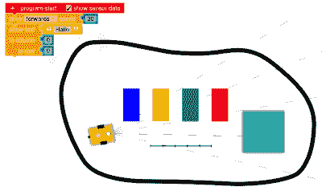

# 带开放式 Roberta 的开放式机器人

> 原文：<https://hackaday.com/2016/05/11/open-robots-with-open-roberta/>

孩子们和黑客编辑喜欢机器人！Open Roberta 项目利用这一点来教孩子们编程。虽然主要重点是构建一种适用于小学和高中学生教学的机器人编程语言，但它也是一个大型开源机器人生态系统的一部分，它带来的东西比你想象的要多得多。我们与项目发起人之一谷歌的一些人讨论了这个项目的位置和发展方向。

制造一个机器人可能非常简单——组装预先配置好的部件，或者制造一些小巧、快速、可爱的东西——也可能是一项需要多年汗水和泪水的努力。无论哪种方式，建造“机器人”所涉及的技能不一定与编写驱动它的固件所需的技能相同，最终也不一定与编写使其功能强大、易于驱动的高级软件所需的技能相同。

或者，作为一个教育项目，让孩子们开始编程机器人变得非常非常容易，但随着用户变得更有经验，它可以扩展。由于一切都是开源的，它是整个生态系统的一部分，这使得它更有价值。我们认为，如果你正在研究机器人技术，这是值得一看的(还有一些更复杂的东西，如 [ROS](http://www.ros.org/) )。

## 系统结构

Open Roberta 是一系列软件和固件中面向用户的中间件，使机器人能够在教室环境中工作。对于学生来说，一切都在浏览器中运行。或者提供网络服务器、机器人编程接口和语言，然后将学生程序的输出转换成可以与机器人固件一起使用的东西。教室里使用的机器人大多基于乐高头脑风暴 EV3 平台，因为它很容易在短时间内将一些东西组装起来。(但是如果你没有 EV3，不要绝望，继续读下去！)

重点是让学生和指导班级的教师容易进入。所有东西都在浏览器中运行，所以客户端不需要安装任何东西。学生们连接到一个指导机器人的服务器，与机器人自己的操作系统通信，并上传学生的程序。

### NEPO

为了在浏览器中编写机器人程序，所有的东西都是用一种图形编程语言写的，NEPO ，这很巧妙。(也是反过来拼的“开”。叹气。)它基于谷歌的[块状](https://github.com/google/blockly)可视化编程编辑器。你可以拖动与传感器、回路或测试条件相对应的模块，无需输入一个字的代码就可以组装相当复杂的程序。这意味着它将年轻人从“真正”编程的陷阱中解放出来，比如忘记分号或不匹配的括号。相反，他们得到了抽象，而没有语法上的麻烦。

积木被分成初级积木，这使得模拟的(和真实的)机器人实质上变成了一只标志海龟，尽管它有一个像样的传感器阵列。打开“专家”模块的盒子带来了标准的编程结构，如函数、列表和消息，使机器人能够相互交谈。最后，它是一个相当丰富的编程环境，但也是一个门槛非常低的环境。

块本身的设计是对系统易用性的主要贡献。例如，不是直接控制车轮电机，而是电机块获取机器人车轮直径和轨道宽度的信息，这使得机器人可以轻松地转动 90 度。

服务器还运行机器人的[模拟，完成障碍物和彩色瓷砖的感知，因此学生们可以在模拟器上尝试他们的代码，然后将其发送到实际的物理机器人上执行，在那里它将像在模拟中一样运行。(否则学生们将会学到宝贵的一课。)这种模拟环境和机器人代码的统一是全新的，出现在 Open Roberta Lab 的最新修订版中。](https://lab.open-roberta.org)

当然，如果你是一个单独的用户，你也可以[在你自己的笔记本电脑](https://github.com/OpenRoberta/robertalab)上安装或服务器，并在本地使用，你的浏览器连接到运行在同一台机器上的网络服务器。或者[用覆盆子酱](https://mp-devel.iais.fraunhofer.de/wiki/display/ORInfo/Open+Roberta+Standalone)来做。

## 男孩子

另一方面，机器人最初运行在乐高的 EV3 平台上，运行的是基于 Java 的环境 LeJOS。但是最近，OR 已经被扩展到与 [ev3dev](http://www.ev3dev.org/) 连接，这是一个更近的 Debian 风格的 Linux 发行版。这两个操作系统都可以下载到 SD 卡上，如果你有 EV3 的话，只需插入其中。在 LeJOS 目标的情况下，NEPO 代码被转换成 Java，而对于 ev3dev，它被转换成 Python。LeJOS 更老，更稳定，而 ev3dev 更新，启动更快，似乎正在被黑客攻击以在其他平台上工作。

对我们来说，这就是事情变得更加有趣的地方。我们刚刚开始为这篇文章挖掘 ev3dev，但它看起来令人印象深刻。它比目前开放的 Roberta 支持的功能多得多，从更复杂的电机控制到支持更广泛的传感器。例如，它[与 XV11 激光雷达装置](http://www.ev3dev.org/docs/tutorials/using-xv11-lidar/)一起工作，我们已经[在过去展示过](http://hackaday.com/2016/01/22/how-to-use-lidar-with-the-raspberry-pi/)。虽然开发主要集中在 EV3 平台上，但是最近又有了对 Raspberry Pi 和 BeagleBone 的支持。如果我们有一个基于 Pi 的机器人平台来进行测试，下周你就会读到关于 ev3dev 的评论了。相反，为什么不[浏览他们的教程](http://www.ev3dev.org/docs/tutorials/)？你们有人用过吗？

## 包裹

Open Roberta 作为一种教学工具足够有趣，它通过给孩子们一些有形的东西来吸引他们学习编程——它是 2010 年的海龟机器人，有更多的铃铛和哨子，以及更丰富的编程语言。但事实上，它是完全开源的，并且正在向基于普通单板 Linux 计算机的更广泛的机器人平台发展，这使得它更加有用。

Open Roberta 团队对于在新的硬件系统上部署非常开放；他们甚至在考虑增加一个基于 Arduino 的机器人平台。因此，如果你有兴趣为自己的机器人获得一个制作精美的高级接口，即使只是在测试阶段使用，你也可以做得比[让它与他们的生态系统](https://mp-devel.iais.fraunhofer.de/wiki/display/ORDevel/Open+Roberta+-+development)互操作差得多，无论是通过直接挂钩，还是通过为机器人的大脑使用类似 e3dev 的东西。你可以在#open-roberta 的 freenode.net 的[上通过 IRC 联系 Open Roberta 团队。](http://freenode.net)