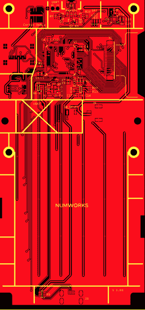
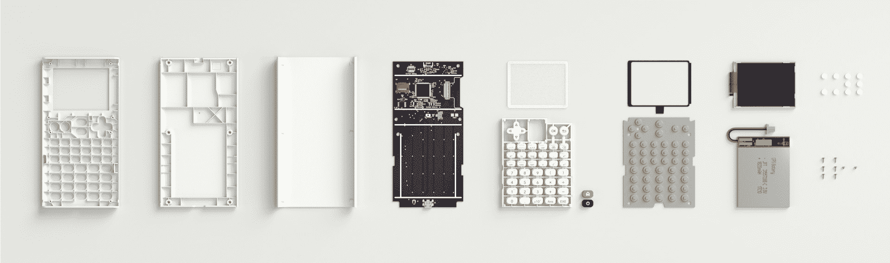

# 开源计算器教会我们质量文档

> 原文：<https://hackaday.com/2018/05/18/open-source-calculator-teaches-us-about-quality-documentation/>

图形计算器是那些似乎永远不会改变的有趣市场之一。标准化测试创造了监管俘获的原始大杂烩，古老的技术以现代的零售价格繁荣发展，而变化甚微。NumWorks 计算器当然不是第一个用更现代的界面(和这十年的设计)挑战德州仪器王朝的竞争对手，但是在它微妙的颜色流行和优雅的线条背后隐藏着真正的宝石；一个*不可思议的*有据可查的开源硬件。[上一次我们写 NumWorks](https://hackaday.com/2018/03/04/graphing-calculator-dual-boots-with-pi-zero/#more-297404) 的时候，是为了演示一个相当疯狂的嵌入了一个完整的π0 的黑客，但是它值得我们关注计算器本身。

访问 NumWorks 网站的黑客读者可能会看到页面底部题为“开发者”的部分，其中有一些诱人的链接，如“[硬件](https://www.numworks.com/resources/engineering/hardware/)、“[软件](https://www.numworks.com/resources/engineering/software/)、“ [GitHub](https://github.com/numworks) ”这些带来了关于产品如何组装的丰富知识，以及自己构建外壳和固件的资源(PCB 原理图和布局资源似乎缺失，尽管有[这个方便的 gerber viewer](https://www.numworks.com/resources/engineering/hardware/electrical/pcb/) )。然而，仅仅发布源代码是 NumWorks 远远没有做到的。

固件是怎么拼起来的？这里有一个方便的架构指南。他们为什么选择 C++呢？为了适应资源受限的嵌入式系统，他们做了哪些权衡？[这里有一个设计指南](https://www.numworks.com/resources/engineering/software/embedded/)！数学引擎如何*准确地*接受文本，理解其中包含的表达式，并对其求值？有一个[文件](https://www.numworks.com/resources/engineering/software/architecture/poincare/)给它！甚至还有一个多平台的 [SDK 安装指南](https://www.numworks.com/resources/engineering/software/sdk/)。

固件文档是旧的；我们开始期待(或者至少是希望！)为之。对我们来说，最有趣的文档实际上是机械和电气系统。EE 指南从[零件选择](https://www.numworks.com/resources/engineering/hardware/electrical/parts/)(带数据表链接)开始，然后继续浏览原理图的主要[区域](https://www.numworks.com/resources/engineering/hardware/electrical/schematics/)。在这一点上，板有完全标准的 [10 针臂调试连接器](http://www.keil.com/support/man/docs/ulink2/ulink2_hw_connectors.htm)的焊盘，以及 UART、SPI 和 SD 卡的记录测试点就不足为奇了。

[机械页面](https://www.numworks.com/resources/engineering/hardware/mechanical/)读起来像是一个快速入门的注射成型设计和减少装配错误的技巧(称为“[防差错](https://en.wikipedia.org/wiki/Poka-yoke)”)。想知道那个有趣的塑料模特叫什么吗？NumWorks [计算器的按钮是在一个](https://www.numworks.com/resources/engineering/hardware/mechanical/keys/)上制作的，它被称为“注入口”。有几页一页地描述了外壳的每一部分。

请阅读 NumWorks 的优秀文档。如果你需要一个新的计算器，也许可以考虑开源选项。

