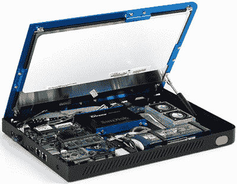

# 宣布开源硬件认证

> 原文：<https://hackaday.com/2015/09/21/open-source-hardware-certification-announced/>

上周末是费城的开放硬件峰会，与会者几乎都是构建开源硬件的人。开源硬件的定义已经有一段时间了，但是由于没有认证过程，开源硬件运动缺乏这种运动所需的社会证明；没有任何官方程序可以证明硬件是*开放*硬件，从技术上来说，也没有一个标志可以让你在丝网印刷层上显示你的项目是开放硬件。

[现在，开放硬件认证的时机已经到来](http://www.oshwa.org/2015/09/19/open-source-hardware-certification-version-1/)。在本周末的 OHSummit 上，开源硬件协会(OSHWA)宣布为开源硬件创建一个认证过程。

The Open Hardware Novena Laptop. [Source](http://novena-guide.readthedocs.org)

开放硬件[被很好地定义了](http://www.oshwa.org/definition/)，但是和任何种类的许可一样，当非开放硬件的东西被集成到一个项目中时，会发生什么问题。任何开放硬件项目*面临的最大问题是创作者控制之外的部分。[即使是[邦尼]的 Novena](http://www.kosagi.com/w/index.php?title=Novena_Main_Page) ，最著名的开源和开放硬件笔记本电脑，仍然使用闭源二进制 blobs 的 GPU。在新的开放硬件认证下，这不会受到惩罚；没有*也没有*开源 GPU，而且【Bunnie】不会因为将这种闭源软件整合到产品中而被回避。*

每一个认证过程都必须伴随着对“不良行为者”的惩罚，这些“不良行为者”使用未经注册的徽标和认证，或者根本不是开放硬件。OSHWA 的主席迈克尔·温伯格(Michael Weinberg)在对 OHSummit 的讲话中说，“外面有坏演员，需要确保我们能够惩罚他们。”这并不意味着滥用职业安全和健康认证的每个人都是坏人；“有些人做出了善意的尝试，有必要确保人们遵守 OSHWA”。为了解决这个问题，职业安全和卫生福利部将采用分层执法战略。项目最初几次违反开放硬件认证，只会向创建者发出不符合通知。如果创建者不符合许可，它将在 OSHWA 网站上被列为不合规。如果*那个*不起作用，罚款就会开始，从每月 500 美元开始，增加到每月 10，000 美元。

这一认证过程意味着创作者必须注册他们的项目，但它是免费进入。[在开放硬件认证](http://www.oshwa.org/2015/06/02/your-input-needed-for-open-source-hardware-certification/)的第一份提案中，讨论了不同级别的认证，如“开放铜牌”。“开银”和“开金”。这最终没有实现，并且只有一个级别的开放硬件认证。

虽然认证硬件为开放硬件的流程已于本周末公布，但 OSHWA 仍有许多工作要做，包括将认证转化为法律许可，以及确定使用什么标志。

这是开放硬件的一大进步；即使在今天，宣布你的项目是开放硬件也只是这样——没有强制措施，也没有人检查你的项目是否真的有所有可用的源文件。然而，开放硬件是一个卖点，通过开放硬件认证，OSHWA 正当地保护了他们为组织一个基于开放硬件的社区所做的工作。这也是一个很好的社会证明，确保您购买的所有带有即将到来的开放硬件认证标志的东西都是您真正拥有的。