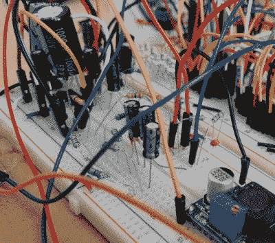

# 开源硬件视频游戏音乐播放器

> 原文：<https://hackaday.com/2018/03/12/open-source-hardware-video-game-music-player/>

[Aidan Lawrence]喜欢经典的合成视频游戏音乐，就像其他人“喜欢”呼吸和吃饭一样。他在 2017 年花了大量时间开发一系列基于世嘉创世纪(Sega Genesis)中使用的雅马哈 YM2612 的设备，以涉足游戏合成器的世界，现在准备揭开他最新最精致的创作。

One of his earlier attempts at a hardware VGM player.

YM2151 Arcade Classic 是一款用于视频游戏音乐(VGM)文件的开源硬件播放器。它不使用仿真，文件在设备的 YM2151 芯片上播放，就像它们在发布时在真正的街机橱柜上一样。有趣的是，由于一些街机非常罕见，甚至在发布前就报废了，[Aidan]认为他的播放器可能是这些歌曲第一次在真正的硬件上播放(至少在公共场合)。

YM2151 频率合成器由 STM 32“Blue Pill”板供电，选择该板不仅是因为其低成本，也是因为其高性能。STM32 从 SD 卡加载 VGM 文件，并将当前播放歌曲的曲目信息显示在 128×32 有机发光二极管显示屏上。屏幕下方的几个触觉开关允许随意播放存储在卡上的歌曲，一个用于静音的滑动开关完善了简单但实用的用户界面。

在 GitHub 资源库中，[Aidan]已经提供了源代码、原理图、物料清单，以及 KiCad 生成的 Gerber 文件；你需要的一切来创建你自己的播放器版本。休息过后，在听了几分钟摇滚音乐后，我们很想接受他的提议。

这个播放器让我们想起了一个类似的设计，[也使用了原始硬件](https://hackaday.com/2017/02/17/sega-genesis-chiptunes-player-uses-original-chips/)，我们去年讨论过。这个项目合乎逻辑的下一步将是充实用户界面，并把它放入一个外壳[，就像这个 SNES chiptune 播放器](https://hackaday.com/2017/08/30/portable-snes-chiptune-player/)。

 [https://www.youtube.com/embed/VlT8aX9DRZw?version=3&rel=1&showsearch=0&showinfo=1&iv_load_policy=1&fs=1&hl=en-US&autohide=2&wmode=transparent](https://www.youtube.com/embed/VlT8aX9DRZw?version=3&rel=1&showsearch=0&showinfo=1&iv_load_policy=1&fs=1&hl=en-US&autohide=2&wmode=transparent)

