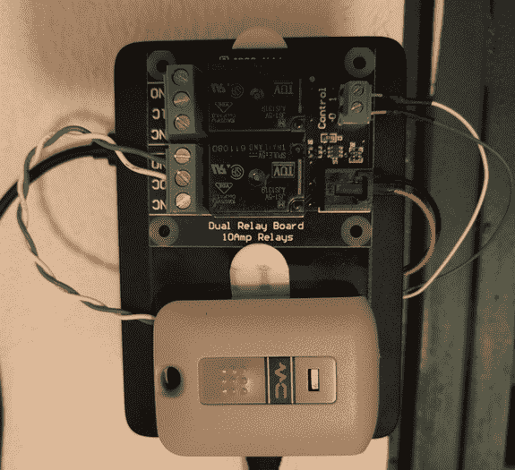

# 用你的智能手机打开车库门

> 原文：<https://hackaday.com/2017/01/31/open-your-garage-door-with-your-smartphone/>

[詹姆斯·普德勒 ]口袋里永远的敌人是任何不是他的智能手机的东西。当他居住的公寓大楼增加了一个车库门时，邪恶的力量以车库门开启器的形式获得了另一个盟友。因此，他通过装配一个[树莓皮作为开启器和他的手机之间的中继来应对这种侮辱。](http://www.jpuderer.net/2017/01/my-garage-door-is-now-part-of-internet.html)

设置的关键是 Firebase Cloud Messaging(FCM)——这是一项谷歌服务，允许将消息发送到通常具有动态 IP 地址的设备，以及向上游发送消息的能力，在这种情况下，从[Puderer]的手机到他的 Raspberry Pi。在快速制作了一个应用程序(功能上是一个按钮小工具)，通过 FCM 发送开门命令后，他在车库门附近的一个储物柜中设置了 Pi，并能够找到一条既有以太网又有电源的电缆。Pi 上运行的一个脚本在接收到 FCM 消息时触发车库门开启器，然后—很快—芝麻开门。

为什么不试试蓝牙或者简单的 WiFi 连接呢？事实证明，由于距离的原因，前者是不可能的，而后者意味着将他的树莓派留在一个开放的网络上——这不是一个舒适的选择。正如[Puderer]所指出的，这是一种替代方法，可以让你家里的一些设备接入物联网，同时避免一些安全隐患。

随着物联网设备随处可见，它们甚至可以采取垃圾桶的形状也就不足为奇了。