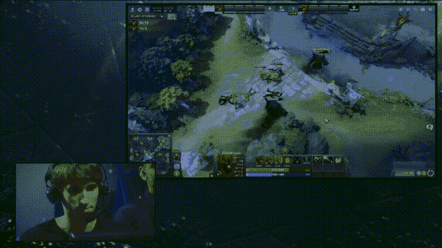
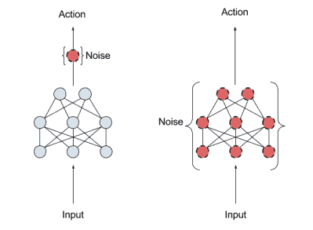

# 职业运动中的人工智能

> 原文：<https://hackaday.com/2017/10/20/openais-world-champion/>

当一名穿着丝绸长袍的精英选手穿过欢呼的人群走向擂台时，灯光变暗，音乐响起。这是一个拳击熟悉的蓝图，只是这个拳击手不会出拳。

OpenAI 创造了一个人工智能机器人，它在今年的国际锦标赛上击败了世界上最好的选手。国际是一项每年为 [Dota 2](https://dota2.gamepedia.com/Dota_2) 举办的电子竞技比赛，是最具竞争力的多人在线对战竞技场(MOBA)游戏之一。

每场国际比赛由两个 5 人队组成，每队比赛 35-45 分钟。通俗地说，就是网络版的夺旗。虽然前提可能听起来很简单，但它实际上是最复杂和详细的竞争游戏之一。顶级球队被要求每天一起练习，但这种水平的比赛对他们来说并不新鲜。为了达到专业水平，个别球员会练习到很晚，睡觉，然后重复这个过程。多年来。那么与这些经验丰富的职业选手相比，人工智能机器人为这场比赛准备了多长时间？几个月了。

## 那么，结果如何呢？

正常情况下，一场职业 Dota 2 比赛是在一个舞台上进行的，有 5v5 支队伍。这是机器人的第一场比赛，人工智能只有几个月的时间完全从头开始学习如何玩 Dota 2。从简单的 1v1 比赛开始似乎更公平。第一场比赛的对手是世界顶级球员之一的[Dendi]，他在第一场比赛中输给了下图所示的机器人，在第二场比赛中辞职，然后拒绝参加第三场比赛。

OpenAI 团队没有使用模仿学习来训练机器人。取而代之的是，从它第一次比赛开始，它就和自己的一个完全一样的复制品对抗。这种情况一直持续了几个月。机器人不断自我改进，反过来，它必须更加努力才能赢。这种高强度的训练显然得到了回报。

虽然 1v1 的结果非常出色，但机器人还没有足够的时间来学习如何以一种有凝聚力的方式与自己的其他 4 个副本合作，以组成一个真正的 Dota 2 团队。在国际上取得巨大成功后，OpenAI 的下一步是组建一个终极 5 bot 团队。我们认为明年有可能击败顶级球员，我们渴望看到这需要多长时间。

## OpenAI 不忙碾压电子游戏比赛的时候喜欢做什么？

在 Dota 2 努力之前，OpenAI 已经参与了许多项目。他们探索了参数噪声对学习算法的[影响，这已被证明是全面有利的。在用于强化学习的探索行为期间，参数噪声被用于增加代理学习速率的效率。](https://blog.openai.com/better-exploration-with-parameter-noise/)

左图表示动作空间噪声，传统上用于逐步改变每个动作的可能性。右图显示了新实现的参数空间噪声:

> “参数空间噪声将随机性直接注入到代理的参数中，改变它做出的决策类型，使它们始终完全取决于代理当前感知的内容。”

通过将这种噪声加入到参数中，它已经显示出比以前更快地教会代理任务。这是专注于优化学习算法的新方法的更广泛努力的一部分，以使训练过程不仅更快，而且更有效。

他们也没有完成 Dota 2。当他们明年带着他们的五个机器人团队回来时，这无疑需要一种在人工智能领域前所未有的团队合作水平。想想这些可能性。这会形成一个集体的蜂群思维吗？人工智能中的团队动力会和他们的人类同伴看起来一样吗？这确实是科幻小说中的东西，就在我们眼前被开发和测试。

## 现在，为什么一个价值 10 亿美元的人工智能初创公司可能会插手视频游戏比赛？

OpenAI 是一家开源公司，致力于创造安全的人工智能，并在 2015 年成立的 10 亿美元的捐赠基金中工作。在他们的网站上，他们表示 Dota 2 实验是“朝着建立人工智能系统迈出的一步，这些系统可以在涉及真实人类的混乱、复杂的情况下完成明确的目标。”国际是概念的证明，他们实际上可以实现成功处理随机情况的人工智能——甚至比人类更好。这让我们想知道人工智能统治的下一个领域是否会像电子游戏比赛一样微不足道。值得注意的是，OpenAI 的董事长埃隆·马斯克(Elon Musk)在胜利后直接发表了一份警告声明:

> “如果你不担心人工智能的安全，你应该担心。比朝鲜的风险大得多。”

这不是马斯克第一次对我们优秀的 Dota 2 玩家即将面临的危险表达犹豫。事实上，他有一段作为主要末日预言家的历史:

> “有了人工智能，我们在召唤恶魔。你知道那些有五角星和圣水的人的故事吗，他说，是的，他确定他能控制恶魔？没用的。”

很明显，为什么有人如此担心人工智能的未来，却将自己的时间和资源投入到一家致力于用这种先进技术确保人类安全的公司。但这几乎是自相矛盾的。教会一个人工智能比人类更好地竞争，似乎是向那个可怕的结果又迈进了一步。但与此同时，你不能通过拒绝参与来缓和技术的进步。该公司的方法是确保每个人都可以学习和使用他们正在取得的进步(OpenAI 中的“开放”)，从而防止未来最好的人工智能被少数公司、个人和国家行为者私人控制时出现的权力失衡。

今年早些时候，Hackaday 的卡梅隆·科沃德写了一篇关于人工智能潜在未来的深度文章。他用这个主题深入研究了一个激烈争论的话题:强人工智能的伦理。他们会心怀恶意吗？他们应该有什么权利？这些问题将在未来几年内得到解答——不管我们是否希望如此。这是我们的工作，以确保这些问题的答案在不久的将来不会为我们解答。OpenAI 在调试 AI 之前，正在调试我们。

 [https://www.youtube.com/embed/l92J1UvHf6M?version=3&rel=1&showsearch=0&showinfo=1&iv_load_policy=1&fs=1&hl=en-US&autohide=2&wmode=transparent](https://www.youtube.com/embed/l92J1UvHf6M?version=3&rel=1&showsearch=0&showinfo=1&iv_load_policy=1&fs=1&hl=en-US&autohide=2&wmode=transparent)

