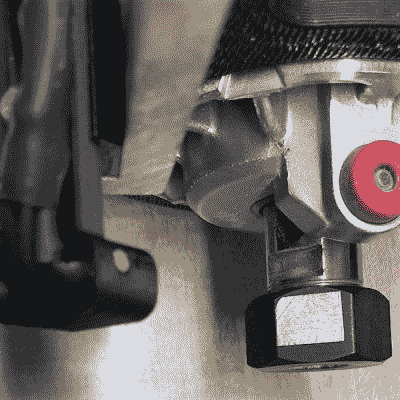

# 光学转速计解决了主轴速度控制的需要

> 原文：<https://hackaday.com/2018/01/28/optical-tach-addresses-the-need-for-spindle-speed-control/>

对于数控机床，获得最佳结果取决于了解刀具相对于工件的移动速度。但是入门级 CNC 路由器通常不包括主轴转速表，迫使操作者基本上猜测速度。这个 [DIY 光学主轴转速计](https://www.instructables.com/id/Add-an-Arduino-based-Optical-Tachometer-to-a-CNC-R/)旨在解决这个问题，并且有一些不错的构造技巧。

有问题的 CNC 路由器是流行的 Sienci，光电二极管和 LED 的 3D 打印支架在某种程度上是该机器特有的。但是[tmbarbour]在他详尽的文章中包含了 STL 文件，所以修改它们以适应另一台机器应该很容易。传感器垂下足够远，可以看到夹头螺母的一个平面上的反射器；我们担心反射器会在工具改变时幸存下来，但它只是一块容易更换的闪亮的胶带。传感器输入 Nano 上的 DIO 针，一个小的有机发光二极管显示器显示数字读数和模拟仪表。显示更新速度相当不错——不会太慢。总体来说令人印象深刻，我们喜欢用一根 PLA 细丝作为铆钉将二极管固定在传感器臂上的想法。

想要测量机器速度，但没有 3D 打印机？别担心——一个 2D 印刷的变色链也可以工作。

 [https://www.youtube.com/embed/v_ozoLcYnxE?version=3&rel=1&showsearch=0&showinfo=1&iv_load_policy=1&fs=1&hl=en-US&autohide=2&wmode=transparent](https://www.youtube.com/embed/v_ozoLcYnxE?version=3&rel=1&showsearch=0&showinfo=1&iv_load_policy=1&fs=1&hl=en-US&autohide=2&wmode=transparent)

