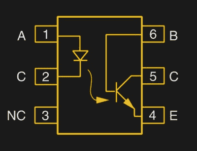

# 光耦合器:保护您的微控制器、MIDI 和速度技巧

> 原文：<https://hackaday.com/2018/05/09/optocouplers-defending-your-microcontroller-midi-and-a-hot-tip-for-speed/>

在你最新项目的心脏深处有一个小小的硅脑。就像你自己的接骨脑袋里的大脑一样，你的微控制器需要不时地受到外界的保护。当要将微控制器的敏感小引脚与高电压、接地环路或一般噪声隔离时，光耦合器是最佳选择。虽然通过光耦合器对器件进行简单的开关控制可以像连接 LED 一样简单，但它们并不是完美的数字器件。

而是先退一步。光耦合器到底是什么？原型是一个 LED 和一个光敏晶体管粘在一个不透光的盒子里。但是接收器端有许多选择:光电二极管、BJT 光电晶体管、MOSFETs、光电三端双向可控硅开关、光电达林顿晶体管等等。

因此，虽然实现细节各不相同，但关键是微控制器打开了一个 LED，而 LED 发出的光激活了电路的另一端。LED 端和晶体管端之间的唯一连接是非电连接——光线穿过一个小间隙——这提供了坚如磐石的单向隔离。

## 音乐、马达和高压

我刚刚在构建一个 MIDI 兼容设备，因为 MIDI 在一段距离内将乐器连接在一起，所以有可能出现一个[接地环路](https://hackaday.com/2017/03/09/wtf-are-ground-loops/)，它可以在所有连接在一起的设备中发出可听见的嗡嗡声。但我的小微控制器需要以 31，250 波特串行速率与合成器中的其它微控制器通信。如果没有共同点，他们怎么能这样做呢？所有带有 MIDI-in 端口的设备都通过电线将电压直接送入光耦合器。

想象一下，我的微控制器在这个电路的右侧，插入合成器的 MIDI-in 端口。它通过沿电缆发送高达 5 mA 的信号给合成器，点亮 opto 内部的 LED，并下拉左侧的“To UART”线。50 Hz(此处)时没有公共地发出嗡嗡声，但串行数据通过:电流信号→ LED →(产生的光)→光电晶体管→电流信号→隔离器件。

同样重要的是，如果光耦合器以奇数电压工作，它可以保护微控制器免受外界影响。例如，使用[无变压器电源](https://hackaday.com/2017/04/04/the-shocking-truth-about-transformerless-power-supplies/)的项目应该隔离，因为微控制器认为的“地”可能与大地相差数百伏。微控制器的任何输入或输出都需要通过光电器件的 LED 一侧，以防止触电。

This [clever H-bridge](http://mcmanis.com/chuck/Robotics/tutorial/h-bridge/bjt-circuit.html) uses the optos as logic elements as well as isolation.

光耦合器的最后一个应用实例是用 H 桥电路将逻辑电路连接到大型电机。首先，电机可能需要一个电压来烧坏你的微控制器，所以在微控制器和电机驱动晶体管之间通常至少需要一个晶体管。但特别是对于用 PWM 信号驱动的步进电机或 DC 电机，电机的电源轨可能是一个非常嘈杂的地方。随着大电流的涨落，甚至连地线都不安全。

在电机驱动器设计中使用光耦合器一举两得。在本例中，您不仅可以将低压微控制器与关断高端晶体管所需的较高电压接口，而且桥接电路中的所有电压噪声绝对不会干扰微控制器。您可以在您的小机器人上自由使用 ADC，不会受到马达噪音的影响！

在所有这些例子中，请注意光耦合器仅单向工作。信号只能从 LED 一侧传到晶体管一侧。因此，如果您想耦合 SPI 或 UART 信号之类的信号，可以这样做。但是如果你想隔离 I2C，因为信号需要双向传输，你需要买一个 I2C 开关来解开信号。

## 电路特性和 CTR

光耦合器的主要卖点是两端之间的隔离。4N25 光耦合器在 LED 和晶体管之间具有 5000V 的隔离测试电压。如果在其上施加 500 V 电压，你会看到超过 10^(12)ω的有效电阻。对于所有正常电压目的，光耦合器保持热端热，冷端冷。

在电路中使用光耦合器之前，您需要了解什么？发送端打开一个 LED，所以你只需要知道它的阈值电压和它能接受多少电流。接收端的电路更加复杂，因为它可以是光电二极管，可能需要运算放大器缓冲电路，或者是光电晶体管，有时不需要也可以。

为了弄清楚需要哪种调理电路，还有一个缺失的因素:LED 每毫安输入电流发出的光量(LED 的效率)，以及晶体管或二极管每击中一个光子将通过的输出电流毫安数(光电设备的增益)。取消中间的光，你得到*电流传输比* (CTR)，通过晶体管集电极的电流除以通过 LED 的电流。

From Vishay’s 4N25 [datasheet](https://www.vishay.com/docs/83725/4n25.pdf) (PDF)

CTR 从基于光电二极管的光耦合器的 1/100 到光电晶体管的大约 1/2，再到光电达林顿的大约 5 倍。这种收益的代价是反应速度。无论如何，你可能不应该让 CTR 太累，因为你可能会驱动另一个晶体管，或者用 opto 的输出给微控制器的高阻抗输入供电。

CTR 在 LED 驱动电流范围内变化两倍，甚至随温度和不同器件而变化。简而言之，CTR 对于粗略估计是有用的，但它不是一个硬性的设计规范。最重要的是，你肯定需要一个外部放大器，通常是带光电二极管的运算放大器，对于晶体管类型，你可能只需要一个晶体管放大器。

对于具有达林顿输出的光耦合器，甚至不需要任何其它有源元件。最简单的电路由一个电阻组成，用来限制从电源流入晶体管的电流。例如，如果您知道 LED 由 5 mA 驱动，CTR 为 1，则晶体管也应该能够将 5 mA 电流拉至地，因此，如果您选择负载电阻通过小于 5 mA 的电流，则输出的摆幅应该接近轨到轨。由于 CTR 是一个模糊参数，在本例中，您可能希望设计大约 2 mA。

最后，您还会经常看到一个反向二极管(如 MIDI 规范中所示)与 LED 并联。这是为了防止反向或交流电流烧坏 LED。这些红外发光二极管中的一些只需要反向施加两到三伏的电压就可以点亮，因此外部二极管是一便士的廉价保险。

## 对速度的需求

除了对光耦合器的抽象理解之外，我写这篇文章的主要原因是鲍勃·皮斯的一个电路，它将一个普通的软糖光隔离器变成了高速发电站。正如我上面简单提到的，我正在为一个合成器项目实现 [MIDI](https://en.wikipedia.org/wiki/MIDI) 。MIDI 基本上是一组约定的[代码](https://mitxela.com/other/midi_spec)，通过光隔离的 31250 波特 UART，8N1 传输。

当 5 mA 电流通过 LED 时，MIDI 规范要求上升和下降时间小于 2 μs，并推荐使用 Sharp PC-900 或 [6N138](https://www.vishay.com/docs/83605/6n138.pdf) (PDF 数据手册)作为光耦合器。6N138 是内置放大器的光电二极管；它有足够的速度和一个 CTR > 3。那会非常方便。我的零件箱里没有，所以我开始四处寻找替代品。

我首先使用 4N29 达林顿光耦合器，因为它具有高 CTR，我希望只使用一个负载电阻，但即使电阻经过微调，其上升时间也太慢，约为 9 μs。我拿出一个 4N25，这是一个普通的晶体管光耦合器，根据 Vishay 器件的数据手册，它的典型上升时间为 2 μs，正好在边沿，但这是在 10 mA 电流驱动 LED 时。在上面的简单电路中，我无法在 5 mA 下获得比 5 μs 更快的速度。嘘！

 解决方案是这个电路来自鲍勃·皮斯优秀的*模拟电路*故障排除。这颗宝石将我手头的 4N25 的上升和下降时间减少了至少 25 倍，从不符合规格的 5 μs 减少到远低于 200 ns。问题不仅解决了，而且彻底消失了。漂亮！

Pease 电路本质上是在 4N25 的输出之后添加另一个晶体管，提高电路整体的有效 CTR，并使输出电压摆幅达到轨到轨。无论如何，除了最简单的光电晶体管电路之外，任何电路都需要这种放大。

但它也增加了两个电阻。`R1`拉低输出晶体管的基极，这有助于缩短光电晶体管不再导通时的下降时间。`R2`向光电晶体管的基极提供正反馈，当晶体管开始导通时，通过增加光电基极电流来帮助它更快地导通。我对`R1`使用了皮斯建议的 2mω值，对`R2`使用了 1kω值。

这条赛道太棒了。如果你正在制作一个 MIDI 设备，你害怕缓慢的上升时间，你应该这样做，试一试。通过零调谐，它将一堆常见元件变成了速度快得多的光耦合器。

4N29’s Best Effort: Not Good Enough

4N25: Still a little slow

4N25: Closeup

Bob Pease’s Circuit: Beautiful!

Pease Circuit Detail

## 轮到你了

光耦合器有点奇怪。一方面，它们非常直观:一个 LED 和一个光电晶体管。另一方面，通过合适的支持电路，可以将它们推向性能极限。你最喜欢的光电路是什么？