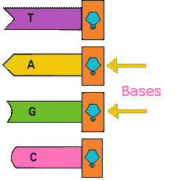
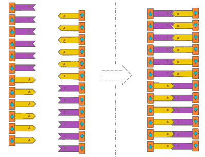
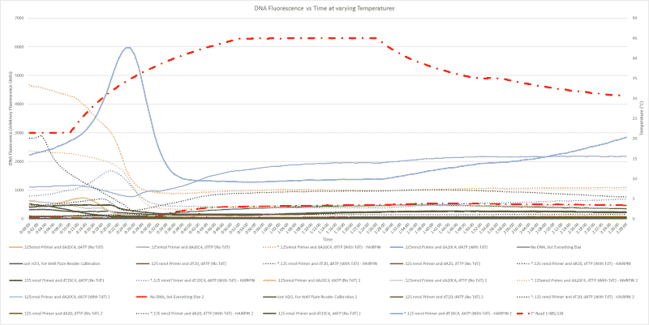
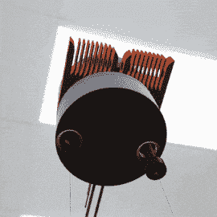
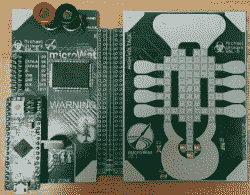

# OSM 硬件在太空制造 DNA

> 原文：<https://hackaday.com/2017/04/27/osm-pronounced-awesome/>

OSM 代表为微重力环境设计的寡核苷酸合成器，这意味着它是一种在*空间中制造任意 DNA 链(中等长度)的设备。酷吧。在过去的八个月里，作为斯坦福学生空间计划的一部分，我一直在与一个优秀的黑客团队合作这个项目，我想分享我们正在做的事情，我们已经做的事情，以及我们将要去的地方。*

 *为什么是太空？嗯，首先， ***空间凉*** 。但更严重的是，在太空中获得任意的 DNA 可以加速许多领域的研究，并且基因工程细菌生产物质的能力(比如在火星殖民地)可能意味着死亡和救命的差别。简而言之，事先很难预测研究或实际应用可能需要的确切 DNA。

首先，由于 Hackaday 倾向于使用少量生物学术语，我们需要使用一些词汇来丰富交流方式。如果你有合成生物学的博士学位，你可能想跳过这一节。否则，这里有五个快速术语会让你的大脑变得更大，所以和我在一起吧！

#### 脱氧核糖核酸

因为 DNA 是这个项目的焦点，所以在进行之前理解 DNA 是最重要的。但是，由于大多数人已经在高中生物课程中见过 DNA，我将保持简短。

首先，DNA 是由核苷酸组成的聚合物。核苷酸是 DNA 的组成部分，由四种核碱基之一组成——胞嘧啶(C)、鸟嘌呤(G)、腺嘌呤(A)或胸腺嘧啶(T)——一种称为脱氧核糖的糖和一个磷酸基团。不同的核苷酸可以分子间结合到相应的核苷酸(A 到 T；c 到 G)在不同的 DNA 链上。如果一条 DNA 链上的碱基与另一条链上的碱基互补，这两种聚合物就能结合形成双链 DNA。还有，还有一点要注意:DNA 有两个不同的末端:一个 3’端和一个 5’端。

#### 寡核苷酸(Ah-li-go-new-klee-o-tide)

寡核苷酸是短 DNA 或 RNA 分子，在一般研究、基因测试和生物工程中非常有用。在具有 30 个碱基的寡聚物的情况下，寡聚物(寡核苷酸的缩写)的长度通常表示为 30 聚体或 d30。一条 DNA 链要多短才能被认为是寡聚物？嗯，当我们……让我们说*在 DNA 合成方面不太好*的时候，寡核苷酸稳定在 2-50 的范围内。然而，随着亚磷酰胺(一种无机 DNA 合成方法)的出现，寡核苷酸的长度范围可以从 2-1000+碱基。

#### 均聚物

仅由一种碱基组成的寡核苷酸(如 AAAAAA，与 AGTCTG 相反)被称为均聚物。

#### 末端脱氧核苷酸转移酶

末端脱氧核苷酸转移酶，通常缩写为 TdT，是一种类似聚合酶的酶，当满足某些条件时，它可以在 DNA 链的 3’端添加任意核苷酸。TdT 可以附加所有四个核苷酸，但显示出对鸟嘌呤(G)和胞嘧啶(C)的偏好。TdT 可以在未成熟、前 B 淋巴细胞和前 T 淋巴细胞中自然发现，在那里它通过在我们 DNA 的 3′(三个主要部分)末端添加碱基来为我们的免疫系统执行遗传多样化。

#### SYBR Green I

SYBR(发音像 cyber)是一种与 DNA 结合形成 DNA-染料复合物的分子，该复合物吸收蓝光并发射绿光。此外，SYBR 优先结合双链 DNA，但结合单链 DNA 的程度较低。

## 在太空制造 DNA 的目标

既然我们说的是同一种语言，那就让我们再来看看用酶在空间制造任意 DNA 的目标。那到底是什么意思，为什么是太空？好吧，让我们逐字逐句地来看:

*   任意性:我们的过程不应该简单地复制 DNA ( [像 PCR](https://hackaday.com/2016/03/22/enzymes-from-the-deep-the-polymerase/) )，而是应该创建任何可以输入计算机的序列(例如 AGCTATC)(并且可以物理存在)。
*   DNA:我想你们都有这个
*   在太空:显而易见的意思:我们希望我们的最终设备能够在太空中工作，这就强加了各种各样的物理和化学限制。
*   酶法:我们想使用一种新的 DNA 合成方法，用酶来代替危险且消耗大量资源的亚磷酰胺法。

增加在微重力下制造定制 DNA 的能力可能意味着我们在远离地球的情况下生存能力的巨大飞跃。当我们支持其他星球上和周围的生命时，OSM 作为一个生物黑客的工具包，解决我们在新环境中面临的难以解决的问题。

总之，我们希望用一种新的基于酶的方法在空间的苛刻环境中创造可定义的寡核苷酸。他们说把你的目标定得高一些，对吗？

## 最低生存产品(MVP)

好吧，也许没那么高。至少最初不会。我们选择了一种迭代的方法，而不是一概而论。现在，我们正致力于推出一款“可行性最低的产品”，原因如下:

1.  来验证我们迄今为止的工作
2.  适应空间就绪设计
3.  获取真实的*空间*数据
4.  为未来的发射赢得信誉

### MVP 流程

由于这是我们最低限度可行的产品，我们从我们的总体目标中拿出一小部分。因此，我们的 MVP 将在现有寡聚物的末端合成一个均聚物，而不是创造完全任意的 DNA。我们不会完全控制它的序列(在适当的时候)，但我们会展示我们的一些工作的概念证明。

*   首先，我们将从溶液中的 DNA 腺嘌呤(A)链的均聚物开始。一旦进入太空，我们将提高温度，让 TdT 将胸腺嘧啶(T)添加到链上。
*   因为胸腺嘧啶(T)和腺嘌呤(A)是互补的，单链 DNA 应该形成双链 DNA。
*   然后，我们将使用 SYBR Green I 来检测溶液中是否存在双链 DNA，以确定我们的实验是否有效。这是因为 SYBR 优先与双链 DNA 结合，只有在与 DNA 结合时才会发出荧光。这个验证步骤非常重要，因为我们将无人驾驶，没有验证的科学不是真正的科学。
*   此外，发夹 DNA 或更正式地说，茎环分子内碱基配对，是这种设计的一个可能问题。如果 DNA 与自身结合，它就不能与其他链结合。听起来是个问题，对吧？但仔细看: ***如果 DNA 与自身结合*** 。即使我们形成发夹而不是“正确的”双链 DNA，我们仍然会有双链 DNA，我们可以检测到。

在回顾中，我们正在使用一种酶，其目的是通过 SYBR Green I 实现基因多样化，SYBR Green I 是一种常用于电泳中的染色凝胶的分子，用于在太空中合成 DNA。

虽然这在实践中听起来很简单，但合成生物学听起来总是很简单。然而，根据我的生物学经验，没有什么事情是简单的。我们需要各种各样的数据，这样我们才能确信我们的设备会工作。到目前为止我们所做的:

Hairpin Viability Data

1.  证实了我们可以用 TdT 有效和可靠地合成所有核苷酸的均聚物
2.  确定我们试剂的长期兼容性(它们可能会在一起放置 2 个多月)
3.  探索 SYBR Green I 的温度依赖性
4.  确定了我们可以用 SYBR Green I 检测单链和双链 DNA 之间差异的水平

### MVP 设计

Initial concept design visualization (click for [full animation](https://hackaday.com/wp-content/uploads/2017/04/ezgif-com-optimize-1.gif) 22mb)

在太空中研究酶很困难。TdT 特别需要受控的温度、缓冲溶液和非金属容器，所有这些都要在太空中持续一个多月。此外，我们需要船上的验证系统，这意味着我们需要易碎的过滤器和对样本的视觉访问。

我们的初始设计采用了 50μL PDMS(一种透明的生物安全硅基有机聚合物)反应室，周围环绕着由帕尔贴模块加热的铝制均热器。珀尔帖模块目前将热量转移到通用散热器或从通用散热器吸收热量，而不是更具体的应用，因为我们不知道我们的发射条件可能是什么。此外，光电二极管，过滤器和 LED 拥抱 PDMS 反应室，允许荧光测试，以验证实验的成功。

## 超越 MVP

由于我们的 MVP 只是我们最终目标的垫脚石，我们一直在努力做其他各种事情。例如，我们正在研究一种电介质上的电润湿装置(见右图),作为太空中常用的传统微流体装置的替代品。

μWet, because it’s small and it’s wet

我们还探索了[焦磷酸测序](https://en.wikipedia.org/wiki/Pyrosequencing)和[磁珠的合成](https://www.google.com/patents/US6133436)。此外，我们谈论 DNA 太多了，以至于我们制作了[裸机 DNA 可视化软件](https://github.com/biosafetylvl5/DNA-Visualizer)来促进对话。(本文中的 DNA 图片就是这个软件生成的。)

然而，到目前为止，我们仍然在冲洗我们的设计，并希望您有任何建议。具体来说，我们很难找到最小走线间距小于 1 密耳的 PCB 制造商。在下面的评论中，我们欢迎关于这方面的提示、建议和健康对话。*