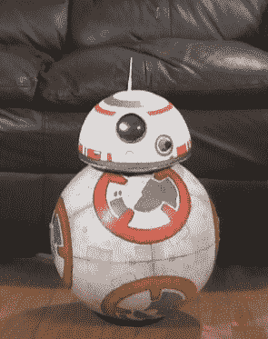
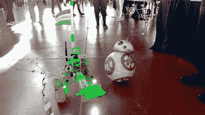
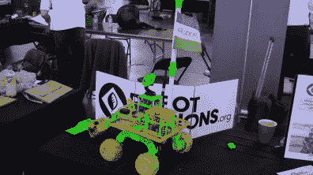
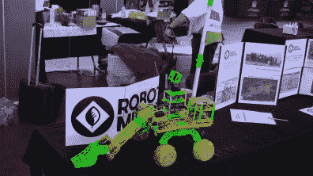
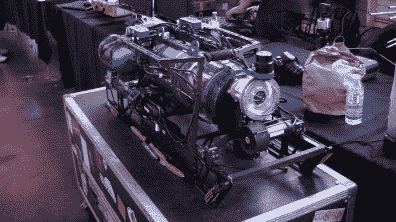
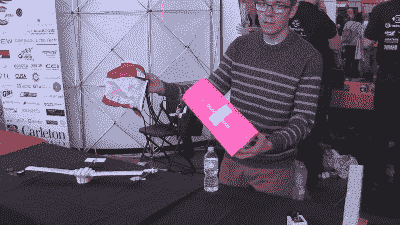
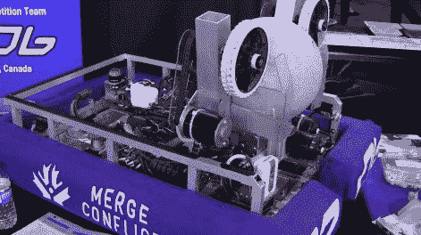
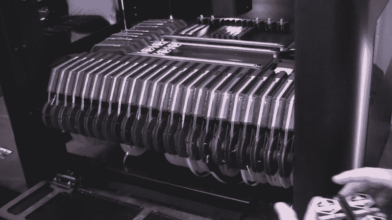

# 渥太华制造者集会:机器人和取放机器

> 原文：<https://hackaday.com/2016/10/22/ottawa-maker-faire-droids-and-pick-and-place-machines/>

我喜欢参加创客博览会的三件事是，看到人们在过去一年里做的所有令人惊叹的东西，与我所有的创客朋友在一个大房间里度过两天，以及对我所做的东西的反应。2016 年的渥太华创客节(渥太华 Maker Faire)完全具备这一切。

## b b-8–具有磁性人格的机器人

  Explaining BB-8 at the Ottawa Maker Faire (source: [Ottawa Mommy Club](http://ottawamommyclub.ca/))  My BB-8 droid

BB-8 就是有一种触动人的东西。我曾经听说过一项研究表明，当购买儿童玩具时，成年人会被圆形所吸引，这就是为什么泰迪熊通常有圆圆的脑袋和大大的圆眼睛。类似的反应似乎也发生在去年《星球大战》电影中的机器人 BB-8 身上。大人和小孩都喜欢抚摸他，和他说婴儿话，用他们的声音高兴地呼唤他。我在整个创造者大会上都有这样的反应。

但我最喜欢的反应发生在每次我移开头部，抬起球的上半球，露出里面的电子设备时。成年人的反应无疑是惊讶的。我不知道这是因为机制的复杂性，还是因为它超出了他们的预期。对那些我认为会理解的人，我做了同样的演讲:

> “这是从玩具卡车上取下的遥控接收器，它能向不同的方向输出正负电压。这是我发明的一块丑陋的电路板，它把所有的电压都转换成 Arduino 的正电压。Arduino 然后对这些 H 桥驱动板进行脉宽调制，以进行速度控制，然后与这两个钻孔电机进行对话。”

Bowie and BB-8

那些我不确定是否能理解的人会得到一个更简单的概述。我的是一个仓鼠驱动器([我们以前涵盖了所有可能的方式来驱动 BB-8](http://hackaday.com/2016/06/24/driving-bb-8-more-than-one-way-to-move-this-bot/) )，所以我展示了它如何坐在球内的两个滚轴轮上。然后我把它翻过来，展示了下面沉重的钻头电池，然后解释了驱动机构顶部的磁铁是如何吸引头部下方的磁铁的，这又是一个启示。所有人都满意地离开了。

但 BB-8 有时需要脱离人类互动，寻找自己的同类，比如 Bowie，你可以在下面阅读更多令人敬畏的 Maker Faire 展览。

## Bowie——海岸线清洁机器人

  Bowie – shoreline cleaning robot  Bowie – shoreline cleaning robot

鲍伊是 RobotMissions.org 的创造，是【艾琳】的创意，又名[机器人女孩](https://twitter.com/robotgrrl)。它一生的使命就是清理海岸线上的垃圾。RobotMissions 已经进行了将近一年，已经进行了多次实地测试，并从 kickstarter 活动中收集了[刚刚超过 1 万美元的资金。目前 Bowie 是远程控制的，但有一个用于视觉的摄像头和其他传感器的安装点，最终实现半自动操作。它是 3D 打印的，文件在网上供任何人实验。我们也很高兴](https://www.kickstarter.com/projects/1272705578/robot-missions)[机器人任务进入了今年的黑客日奖](http://hackaday.com/2016/08/17/hackaday-prize-entry-robot-shore/)。

## SONIA——自主水下机器人

  S.O.N.I.A. – underwater autonomous vehicle  S.O.N.I.A. – underwater autonomous vehicle

当谈到车辆的自主性时，位于附近展台的是由本科生建造的水下自主飞行器 S.O.N.I.A。自 1999 年以来，它经历了 8 个原型，参加了圣地亚哥的年度机器人竞赛。最大深度为 30 米，它能够自主 70 分钟，使用声纳和相机绘制和导航其环境。

如果你仔细观察上面照片中车辆的底部，你会注意到一些红色的鱼雷。这些是用压缩空气发射的，而压缩空气是在集会期间没有连接的，所以我们不确定它们是否用于比赛。但我们认为它们是必需品。

## 卡尔顿·坎萨特

Carleton CanSat deployment

来自卡尔顿大学的两个团队正在参加 CanSat 比赛,比赛包括将有效载荷发射到 700 米处，在那里释放一个装有他们项目的圆柱体(CanSat 中的“罐”)。它通过降落伞飘到 400 米的地方，在那里他们的项目被部署。然后，他们的项目必须以直径小于 1000 米的圆形图案滑下剩余的路程。在下降的过程中，他们必须采样并传回气压、温度，使用磁力计和[皮托管](https://en.wikipedia.org/wiki/Pitot_tube)，航向和速度。这些团队从零开始制作所有必要的电子板。

  Carleton CanSat electronics  Bladed Carleton CanSat

一个团队的实现是一个有翼滑翔机，电子设备位于机翼之间。另一个团队使用直升机风格的叶片，当叶片下落时，利用流经叶片的空气使叶片自动旋转，减缓下降速度。但这将导致叶片下方的所有东西反转，并干扰一些传感器。为了防止这种情况，他们增加了一个更低的马达，使一切相对于叶片反向旋转。

## 合并冲突小组 2706-机器人战士

  A Merge Conflict robot throwing a ball  One of Merge Conflict’s robots

[Merge Conflict 是一个社区组织](https://owcr.myshopify.com/)由 25 名高中八年级学生和行业导师组成，他们在 6 周内制造出一个机器人，参加首届机器人大赛。FIRST 是由 Segway fame 的 Dean Kamon 创立的国际组织。在比赛中，机器人在一场具有挑战性的场地比赛中竞争。

2016 年的游戏名为“第一据点”,涉及突破城堡防御(克服障碍),向城堡扔石头(球),阻挡其他机器人，甚至爬上城堡，其中机器人实际上将自己提升到城堡墙壁上的特定高度。在最初的 15 秒内，机器人是自主的，在剩下的 2 分 15 秒内是遥控的。

Merge Conflict 的机器人是一个突破城堡防御的机器人，有时你可以在下面的视频(21 秒)中看到，它几乎飞过城堡，并将球扔进城堡。它可以在大约 85%的时间里自动完成所有这些，这是一个令人印象深刻的成就。

 [https://www.youtube.com/embed/8WWwB077_J0?version=3&rel=1&showsearch=0&showinfo=1&iv_load_policy=1&fs=1&hl=en-US&autohide=2&wmode=transparent](https://www.youtube.com/embed/8WWwB077_J0?version=3&rel=1&showsearch=0&showinfo=1&iv_load_policy=1&fs=1&hl=en-US&autohide=2&wmode=transparent)

## chip setter–经济实惠的拾取和放置机器

Chipsetter pick and place machine

[Chipsetter 是为黑客空间、设计实验室和工程部门设计和定价的拾取和放置机器](http://www.chipsetter.com/)。[【Brian bench off】最近报道了这个](https://hackaday.com/2016/10/01/maker-faire-ny-chipsetter-the-pick-and-place-for-your-production/)，当时他们在纽约的 Maker Faire，这次轮到我看它的运行了。

我观看了整个过程的演示，在一张桌子上，他们首先使用从制造电路板的同一制造商处购买的模板将浆料涂到电路板上。他们将电路板放置在芯片安装机中，芯片安装机从进料器中拾取发光二极管和电阻，并将其精确地放置在电路板的浆料上。由于机器依靠视觉来与电路板对齐，因此在这个过程中降低了盖子 a，不仅阻挡了大多数入射光，还防止了机器运行时的拍摄(事后想来，我可能会将相机留在机器内部)。之后，电路板被返回到另一个工作台，以便回流和焊接电池夹。

老实说，这是我唯一一次使用拾放机的经历，但我们镇上有很多人定期为活动制作电子徽章和其他大量可穿戴电子产品，他们将从我们的黑客空间中受益。

## R2D2 建筑者俱乐部

  BB-8 visiting R2-D2 (credit: [Capital City Garrison](https://twitter.com/ccg501st) and [@jrock1905](https://twitter.com/jrock1905) of the [@501stlegion](https://twitter.com/501stlegion))  R2-D2 Builders Club

在展会结束前，我的 BB-8 忍不住参观了由 R2-D2 建造者俱乐部成员建造的 R2-D2 机器人。俱乐部成员带着三个 R2 单元，一个完整的带抽屉面板的静态 BB-8 和一个仍在开发中的 BB-8 大规模出动。如果你想建造一个 R2 单位，或者其他宇航技工机器人，那么没有比在 Astromech.net 更好的地方了，在那里你可以找到蓝图，电子设备的细节和一个有用的论坛。

## 直到明年

集会就这样结束了。BB-8 和我收拾好我们的桌子，一直滚到明年。