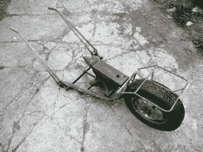
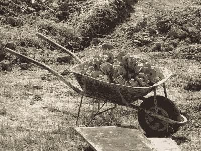
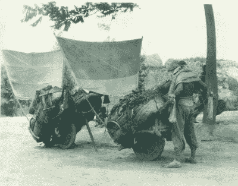

# 我们的火药和茶叶来自中国，为什么我们不复制他们的手推车？

> 原文：<https://hackaday.com/2017/06/13/our-gunpowder-and-tea-came-from-china-why-didnt-we-copy-their-wheelbarrows/>

My dad’s low-loader barrow. You would not believe how useful it is.

每个人都必须拥有一些童年时的情感，也许是一个景象，一个声音，或者一种气味。对我来说，上世纪 70 年代，我是在一个小型英国有机农场长大的，我最容易激动的事情是雨水击打干燥土地的味道，或者是破旧的福特森梅杰拖拉机发出的略带硫磺的柴油废气。奇怪的是，还有手推车。你知道，我的父亲既是一个铁匠，也是手推车和手推车领域的一个根深蒂固的实验者。一个自给自足的小农场会产生大量需要搬运的不同负载，为此他发明了各种各样的装置。最常用的是他的超大建筑手推车，前部有全尺寸的货车轮，能够穿过最崎岖的地面，但其他亮点包括用于移动最重单件货物的低负载手推车，或用于运送非常长的物体的两轮手推车。

如你所料，我对手推车很有眼光，因为我曾经推过几辆手推车。因此，当我读到中国传统的手推车是如何建造的时，它们引起了我的注意，我不得不问:我们为什么不这样做呢？

A typical wheelbarrow, as a European or American might know it. Hyena (Public domain).

如果你看一个典型的独轮车，就像我们在欧洲或美国建筑工地上看到的那样，你会看到前面有一个单独的轮子，作为杠杆的支点，承载着形成手推车装载空间的箱子或料斗，并向后延伸形成把手。操作者提起把手并获得杠杆的优势，因为与他们提起全部负载相比，他们处理的力更小。所涉及的工作减少了，更多的东西被转移，减少了用户的疲劳，每个人都高兴地回家了。

Sail-assisted centre-wheel Chinese wheelbarrows. ([Public domain](https://upload.wikimedia.org/wikipedia/commons/thumb/5/5d/Sail_assisted_wheelbarrows_%282%29.jpg/981px-Sail_assisted_wheelbarrows_%282%29.jpg))

除非你考虑到中国人制造手推车的方式。他们拿了一个大得多的轮子，把它放在货物的中心，有时货物挂在两边，和车轴一样高。这种设计的缺点是操作员需要做更多的工作来保持负载平衡，但另一方面，这种设计的巨大优点是负载的所有重量都落在车轮上。操作员不承担任何负载，这意味着可以承载更大的负载，并且他们可以将所有的精力用于移动负载而不是搬运负载。虽然前轮驱动的手推车可以用来在建筑工地附近短距离移动货物，但中国的手推车被用作长距离的轻型运输工具。当欧洲人在未修建的中世纪道路上艰难地用马拉车达到罗马的尺寸时，在世界的另一边，有一列独轮车提供运输，有时甚至装有帆来抓住风的帮助。我们的中国读者无疑会在这一点上点头，并喃喃自语一些关于[活字](https://en.wikipedia.org/wiki/Movable_type)的事情。

当然，没有人认为在 21 世纪回归手推车作为主要交通工具有任何意义。但仍有一些更有效的手动手推车可以派上用场。我首先要说的是，一个小的有机农场可以使用，但更有可能的应用可能是当地城市送货。将现代技术应用于保持平衡的问题会很有趣，也许可以用加速度计和微控制器来控制飞轮。如果我的父亲五十年后出生，他现在可能正在建造一个，并把它发布在 [hackaday.io](https://hackaday.io/) 上，但遗憾的是，Arduino 现在可能超出了他的能力范围。然而，如果这个作品引起了你们的兴趣，这并不应该阻止你们中的任何人去尝试。

像手推车这样的实用工具不会随着时间的推移演变成最有效的形式，这种情况并不常见。很难相信当旅行者从中国带回其他故事到欧洲时，他们没有看到中心轮手推车，所以这背后一定有其他原因，只有历史学家才能解释。也许他们也简单地掌握了维护道路的艺术，而我们泥泞的道路把任何轮式车辆都吸进了粘稠的深处。