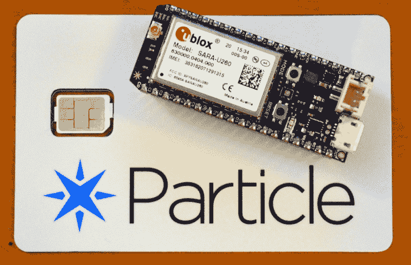
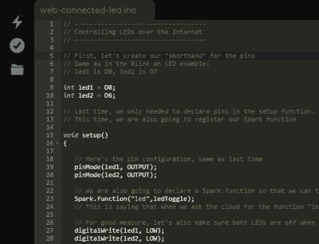
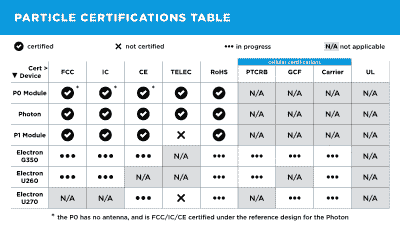

# 粒子电子——细胞事物的解决方案

> 原文：<https://hackaday.com/2016/02/10/particle-electron-the-solution-to-cellular-things/>

就在一年前，非常受欢迎的 Core 和 Particle Photon WiFi 开发套件的制造商 Particle(以前的 Spark)发布了第一批有趣的硬件珍闻。这是电子，一个便宜的，多合一的手机开发套件，有一个更有趣的数据计划。Particle 将提供自己的蜂窝服务，允许他们的微型板以每月 3 美元的价格发送或接收 1 兆字节的数据，无需任何合同。

成千上万的人发现这是一个有趣的提议，电子众筹运动像火箭一样起飞。现在，经过一年的开发和制造，这些微小的蜂窝板终于出货给支持者，今天电子正式推出。

Particle 很友好地为 Hackaday 提供了一个电子工具包以供审查。这篇评论的简短版本是电子是一个伟大的开发平台，但粒子在蜂窝通信和物联网方面实现了一场小革命

### 机器对机器蜂窝的当前状态

小型微控制器开发板并不新鲜。将帽子、皮带扣或自行车变成可以从手机信号塔接收数据的东西的技术已经存在了十多年，archive.org 上保留的一些非常古老的博客和论坛反映了这一事实。一部旧的西门子、诺基亚或摩托罗拉手机，如果有合适的串行电缆，可以作为微控制器与外界的连接。

SparkFun’s Cellular Shield (above) and Adafruit’s FONA 3G Cellular Breakout (above) Image source [1](https://www.sparkfun.com/products/13120), [2](https://www.adafruit.com/products/2687)

最近，Sparkfun 和 Adafruit 一直在为 Arduinos 和其他类似的电路板组装他们自己的蜂窝模块。这些模块，像 [SparkFun 的蜂窝盾](https://www.sparkfun.com/products/13120)、 [Adafruit 的 FONA](https://www.adafruit.com/products/2687) 和 [Seeed 的 RePhone](http://www.seeedstudio.com/wiki/Rephone) 都提供了易于使用的蜂窝模块，可以插入 Arduino。问题是电话公司历史上不想通过他们的网络处理一堆 Arduinos 闪烁的 led。

虽然人们会认为蜂窝网络上的更多设备对运营商来说是一件好事，但 Particle 首席执行官扎克苏帕拉(Zach Supalla)在创造电子时并没有发现这一点。在股东眼中，运营商的成功取决于 ARPU、每用户平均收入或总收入除以用户数量。

虽然当美国电话电报公司、斯普林特和威瑞森向智能手机用户出售数千兆字节的计划时，ARPU 是很好的，但如果一家公司出售大量廉价的一兆字节计划，这是一个可怕的措施。蜂窝运营商的经济性是我们没有蜂窝物联网的原因；运营商这么做没有意义。

电子用户将直接通过 Particle 获得服务，而不是通过通常的手机运营商。这是一个名为[移动虚拟网络运营商](https://en.wikipedia.org/wiki/Mobile_virtual_network_operator)或 MVNO 的设置，它允许运营商通过 Particle 提供没有太多数据但价格非常低的计划。

这种设置非常适合口香糖大小的手机。如果你走进你的旧收音机小屋，你会得到茫然的目光(再次！)如果你问一个只提供几兆数据的低成本计划。使用 Particle 设置 SIM 卡非常简单，只需在网页上输入几个数字，输入你的信用卡信息，就可以享受微型微控制器板上每月一兆字节的数据。

### 硬件和开发工具包

粒子公司已经有了一些硬件产品，比如粒子光子 T2 和 Core，这是一款非常受欢迎的 ARM 和 WiFi 开发板。对于不想摆弄裸露的 ESP8266 模块的人来说，这非常有用。对于任何曾经使用过光子或核心的人来说，电子会很快变得非常熟悉。

藏在电子设备底部的是 STM32F205 微控制器，向外界展示总共 36 个引脚。这些引脚提供的功能包括 UART、SPI、I2C 和 CAN 总线。总共有 12 个 ADC 通道、3 个 UARTs、2 个 SPI、1 个 I2C、2 个 CAN、2 个 DAC 和 13 个 PWM 通道。包括 1 MB 的闪存和 128k 的可用内存。如果与几年前的 Arduinos 相比，这是一款非常强大的主板，可以与稍微更现代的主板(如 Teensy 3.2)相抗衡。

电子[的整个硬件设计是开源的](https://github.com/spark/electron)。顺便说一下，Particle 使用 Eagle 来设计电路板。

Particle’s web-based Arduino-ish IDE, allowing code to be flashed to the device over the cellular network.

至于电子的发展，选择很多。到目前为止最简单的是一个基于 web 的类似 Arduino 的开发环境，[粒子构建](https://build.particle.io)。就像 Arduino IDE 一样，Build 将为您提供足够的空间来编写一些代码并将其刷新到您的设备上。GPS 模块、LCD、开关、温度传感器和其他通常在一次性互联网连接项目中使用的所有东西的库比比皆是。虽然它不是一个成熟的 IDE，但它足够好，并允许电子在空中闪烁。

基于智能手机的开发环境 Particle 的 Tinker 应用程序也可用于电子设备。这个应用程序将允许你以一种奇怪的方式读写个人密码，你知道什么是酷吗？可视化编程的方式。

[Javascript 在所有的粒子设备上都是可能的](https://github.com/spark/sparkjs)，[CLI 很容易](https://github.com/spark/particle-cli)，如果你正在为 iDevices，[你的 SDK 就在这里](https://cocoapods.org/pods/Spark-SDK)。

有不少人认为基于 web 的 IDE，尤其是托管在不属于自己的服务器上的 IDE，是一个糟糕的想法。幸运的是， [Particle 已经开源了他们所有的开发工具](https://docs.particle.io/guide/tools-and-features/dev/)，允许任何人使用他们自己的云。对于任何关心五年或十年后粒子板有用性的人来说，这是一个必要的特性。

此幻灯片需要 JavaScript。

### 电子和粒子细胞的未来

Particle’s certification matrix. They’re working on getting the Electron certified for use in products. [Image source](https://docs.particle.io/guide/how-to-build-a-product/certification/)

与任何其他物联网公司相比，Particle 看到他们的许多模块成为真正产品的基础。这是有原因的:他们是少数几个在认证上投钱的硬件开发商之一。如果你想建造一个内部装有粒子光子的设备，认证已经搞定了。电子模块的 FCC 和蜂窝认证正在进行中，但[Zach]说这将会发生。

当然，任何用粒子板构建硬件的开发者可能都不会使用光子或电子。无论如何，当一个板被塞进一个黑盒子里时，就不需要 USB 端口或插针了。对于产品中的智能，Particle 已经有了一个 WiFi 模块，P0 和 P1，扎克·苏帕拉说，Particle 正在考虑一个蜂窝模块，也将通过 FCC 和 CE 认证。

电子是一个很棒的硬件，但它不是手机硬件领域最大的发展。这将是粒子的 MVNO 和无合同，每月只需几美元的一兆蜂窝计划。每个人心中最迫切的问题是，“粒子会把模拟人生卖给那些想自己开发硬件的人吗？”。至少目前来看，答案是肯定的。即使你对电子本身不感兴趣，廉价的蜂窝计划无疑是有趣的。它比其他 MVNOs(如 Ting )更便宜，被设计成一个纯粹的机器对机器计划，它将很快推出。

### 必要的 2G 警告

粒子提供了电子的三个版本。两个用于 3G 网络——基于 U260 的主板用于北美，U270 用于欧洲。电子的第三个版本是针对 2G 网络的。2G 版本便宜 20 美元，但这可能是一种虚假的经济。在美国，美国电话电报公司将“很快”开始关闭 2G 网络——要么从 2017 年 1 月 1 日开始，要么在保持 2G 网络运行没有经济意义的任何时候。

### 结论

Particle 在构建物联网方面已经有了很多经验。Core 和 Photon 是优秀的 WiFi 开发板，拥有强大的开发平台和非常强大的云后端。电子是这一点的延续，将物联网扩展到使用时移动数百米以上的设备，或在 WiFi 网络不可用的地方运行的设备。

虽然硬件是好的，但这里的大故事是粒子成为蜂窝网络。正如我们今天所知，智能手机已经存在了近十年，直到现在，没有人——至少在一家大型运营商——意识到每月向小型电池供电设备提供几千字节数据的价值。不知何故，粒子解决了这个问题，他们不仅仅局限于他们的设备。

从今天开始，Particle 将向 Kickstarter 的支持者发送奖励，电子版(和 SIM)将在适当的时候在 Particle 网站上发布。