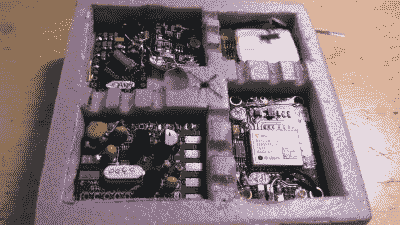

# 派对气球穿越大西洋，游览欧洲，给家里打电话

> 原文：<https://hackaday.com/2015/10/02/party-balloon-crosses-atlantic-tours-europe-phones-home/>

在过去的几个月里，[David VE3KCL]一直在他的加拿大家中发射装有无线电发射器的气球。没什么不寻常的:相当多的人这样做，包括学校、黑客空间和个人。值得注意的是他已经走了多远。今年八月，他的 [S-4 飞行穿越大西洋，到达法国，并在最后降落在挪威海](http://qrp-labs.com/ultimate3/ve3kcl-balloons/ve3kcl-s4.html)之前，游览了德国、丹麦、瑞典、芬兰和挪威。超过 10，000 公里(6200 英里):对于一对串在一起的派对气球来说，这已经不错了。

The flight payload of one of the balloon flights.

尽管这些气球已经飞行了相当长的距离，但有趣的是[大卫]是如何追踪这些气球的。手机显然无法在大西洋上空工作，卫星发射机也很昂贵，所以他使用了一种低成本的发射机，这种发射机被编程为使用各种业余无线电信号进行广播。最有效的似乎是 [WSPRnet](http://wsprnet.org/drupal/) (弱信号传播网络)，这是一个由 Hams 用来观察低强度信号能走多远的系统。这种系统依赖于 ham 让他们的接收器开着，并运行将接收到的信号上传到中央服务器的软件。

通过巧妙地将高度和位置等信息编码到这个信号中，他能够将这个全球网络变成一个跟踪网络，可以报告气球在地球上几乎任何地方的位置。[大卫]还在继续发射气球:他最近的一次发射是在 9 月 24 日，在信号消失在大西洋上空之前，[飞行了 4300 公里(2600 英里)](http://qrp-labs.com/ultimate3/ve3kcl-balloons/ve3kcl-s6.html)。