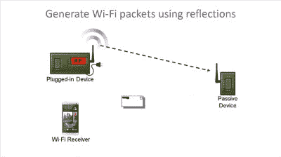

# 微瓦无源 WiFi

> 原文：<https://hackaday.com/2016/02/26/passive-wifi-on-microwatts/>

你们中的许多人在物联网设备上使用 WiFi，但这几乎排除了电池供电的部署，因为 WiFi 设备使用大量电力。直到现在。华盛顿大学的研究人员开发了一种被动 WiFi 实现，每台设备仅使用微瓦。

基本上像反向散射 RFID 标签一样工作，每个节点都有一个 WiFi 天线，可以转换为反射或吸收 2.4 GHz 辐射。你的手机，或任何其他无线设备，会对这个反向散射信号做出反应。所缺少的是一个好的稳定的信号来反映。

 单个插入式单元为多个 WiFi 传感器节点提供该载波。这项研究非常聪明的部分是:为了防止载波淹没来自设备的微小调制信号，插入式单元发射所需的频率，电池供电单元以恰到好处的差频进行调制，以便产生的(混合)频率在所需的 WiFi 频段内。

如果你是一个无线电迷，你会发现 WiFi 节点的行为就像一个混频器。这就是研究人员(有点神秘地)所说的模拟传输阶段与数字传输阶段的分离。插入式单元传输载波，低功率节点进行混频。这就像一个传统的无线电发射机，但分布式。非常酷。

正如你所想象的，让这个系统与消费者 WiFi 一起工作还有很多细节。例如，发电站负责确保不发生碰撞。所有这些细节都在本文中做了很好的解释。如果你有兴趣做类似的事情，你绝对需要读一读。这个想法肯定会在较低的频率下工作，我们正试图想出一个理由来为我们自己的目的使用这种分布式发射机的想法。

如果你认为所有这些 RFID 东西都“不是黑客”，我们会提醒你，(近场)RFID 标签已经由 ATtiny 或 T2 的分立逻辑芯片[制成。远程供电反向散射的想法扩大了应用领域。](http://hackaday.com/2011/05/20/using-an-avr-as-an-rfid-tag/)

谢谢[Ivan]的提示！

 [https://www.youtube.com/embed/AZ-tISX-7Cw?version=3&rel=1&showsearch=0&showinfo=1&iv_load_policy=1&fs=1&hl=en-US&autohide=2&wmode=transparent](https://www.youtube.com/embed/AZ-tISX-7Cw?version=3&rel=1&showsearch=0&showinfo=1&iv_load_policy=1&fs=1&hl=en-US&autohide=2&wmode=transparent)

