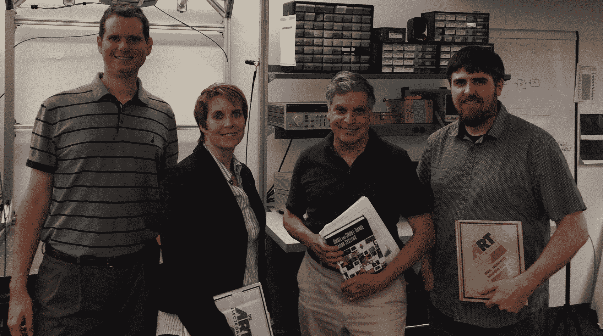

# 保罗·霍洛维茨和对外星智慧的探索

> 原文：<https://hackaday.com/2017/07/19/paul-horowitz-and-the-search-for-extra-terrestrial-intelligence/>

我最近有机会听了哈佛大学教授保罗·霍洛维茨的讲座。这是一个你可能认识的名字。他最为人所知的是他的标志性著作《电子艺术》,这本书通常不是用名字，而是用作者的姓氏来称呼:“霍洛维茨和希尔”。

除此之外，你对保罗·霍洛维茨了解多少？保罗是一名电气工程师和物理学家，他在传奇的职业生涯中花了很多时间学习和实践电子学，目的是寻找外星智慧生命。

## 链接预算:我们能听到多安静？

霍洛维茨教授教给我们的第一件事是，在两端各有一个相当于阿雷西博天线的 1000 光年范围内，信噪比(SNR)比宇宙背景辐射高出 4 个数量级。这对通信来说是非常好的。如果外星智慧文明存在的话，在它们之间传输信号是完全可能的，这种可能性激发了对外星智慧的探索( [SETI](https://en.wikipedia.org/wiki/Search_for_extraterrestrial_intelligence) )。

保罗的参与由来已久。他对 SETI 的早期贡献之一是使用传统的碟形射电望远镜，监听 1425 MHz，寻找强窄带发射。一个例子是他的用绕线板和其他 80 年代早期的技术建造的“手提箱 SETI”系统。许多这样的排放被探测到并记录下来，但不幸的是，观测的占空比太低，以至于他们永远无法确认。

## 占空比:我们可以多长时间听一次？

SETI 的关键是占空比。“笔形波束”射电望远镜被证明是受限的，因为它们在任何给定的时间只能观察一个信号/方向。在检测到窄带信号的情况下，软件可以在几分钟内快速重新访问，但许多窄带外星信号都没有得到确认(观察到不止一次)。保罗将此归因于占空比，即搜索的时间和天空面积的百分比。换句话说，你能搜索的天空区域越大，搜索的频率越高，你被 SETI 探测到的机会就越大。

考虑到这一点，保罗正在领导一种新的光学传感器阵列的开发，假设 ET 可能试图通过相干光脉冲到达其他智能文明。这项工作将使用两个独立的阵列，可以同时看到他们所在位置上方的整个天空。使用两个阵列，使得符合检测可以滤除伪信号，其中两个阵列上的相同像素必须同时触发检测，以便记录任何检测。

点击此处观看讲座:

 [https://www.youtube.com/embed/sImBlq542TQ?version=3&rel=1&showsearch=0&showinfo=1&iv_load_policy=1&fs=1&hl=en-US&autohide=2&wmode=transparent](https://www.youtube.com/embed/sImBlq542TQ?version=3&rel=1&showsearch=0&showinfo=1&iv_load_policy=1&fs=1&hl=en-US&autohide=2&wmode=transparent)

## 只有我们吗？我们在自己的星系中是孤独的吗？

我们几乎肯定不是孤独的。在我们自己的星系中，我们*可能*并不孤单。但是根据[德雷克方程](https://www.space.com/25219-drake-equation.html)，这取决于一个智慧文明在毁灭它自己、它的星球或者被一个天体事件消灭之前能持续多久。一个大的 L 因子增加了重叠的高级文明的数量，从而增加了传输被交换的可能性。让我们只希望 L 的平均值非常高！

Paul Horowitz paid a visit to our Radar lab and presented a lecture on his latest efforts in the Search for Extra Terrestrial Intelligence, from left to right Greg Charvat, [Amanda Wozniak](https://blog.adafruit.com/2012/10/03/amanda-wozniak-hands-on-design-for-hardware-a-primer-on-manufacturing-and-ethnography-of-use/), Paul Horowitz, and [Devon Clark](http://www.newhaven.edu/engineering/academic-programs/graduate/computer-science/student-spotlights/devon-clark.php).

见到 Paul Horowitz 并听到他的第一手经验是一种怎样的体验。在我的工程旅程的早期，我就是 SETI 的粉丝，我甚至在高中制作了一个射电望远镜接收器。仍然有许多前沿领域有待探索，构建定制硬件以与未知来源通信，使用未知技术和协议是让您的技能漫游的好地方。