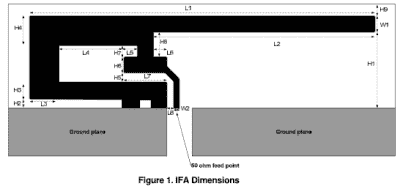
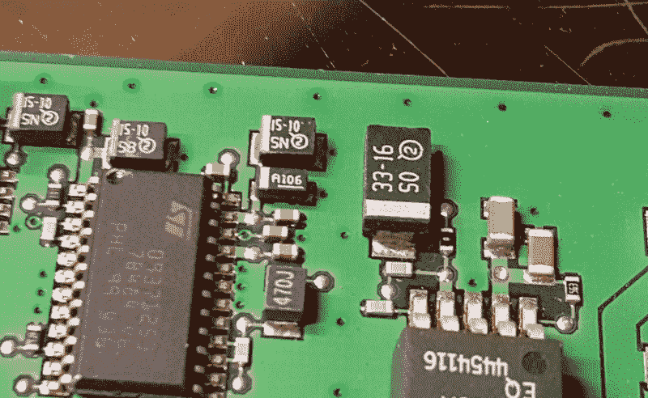
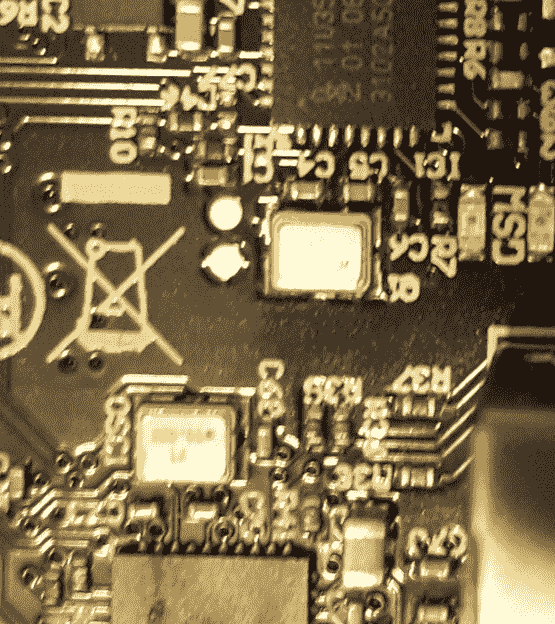

# 最大限度降低 RF 传输的 PCB 设计指南

> 原文：<https://hackaday.com/2017/01/26/pcb-design-guidelines-to-minimize-rf-transmissions/>

有一些 PCB 的设计指南没有太大的意义，一些做法看起来有些过分和不必要。通常这些都是由射频传输的魔力所激发的。这要么是电子电路的不幸和意外后果，要么是它们神奇而有用的特性，许多设计时间都花在减少或消除这些影响或调整它们上。

您想知道这对您的项目有多重要，以及您是否应该担心无意辐射。在巴德利的重要性等级上:

*   **Pffffft**–您正在构建一个一次性项目，该项目使用电池电源和一个带几个 GPIO 的微控制器。基本上你所有的 Arduino 项目和室内娱乐。
*   **Meh**——你正在建造一个插在墙上或在船上有一个故意无线电的一次性设备——一个普通的物联网东西。或者你卖的是电池供电的产品，但不打算传输任何东西。
*   **yeeeaaaaaaahhhhhhhh**–你正在销售一款墙壁供电的产品。
*   **是的**–你销售的产品是一种有意的发射器，或者有许多快速信号，或者是大量生产的。
*   **SMH**——你是霓虹灯的[制造商，这种霓虹灯可以接收几个街区内的所有无线信号](http://hackaday.com/2016/08/26/police-baffled-send-for-the-radio-amateurs/)。

## 基础知识

当信号沿着导线传输时，它周围的空间就会产生一个电场。如果这是一个 DC 信号，那么磁场不会改变，所以在射频世界里没有什么令人兴奋的事情发生，一切都是恒定的。纯 DC 非常罕见。电池可以做到这一点，除非你正在进行任何开关电压调节，但任何插入墙壁电源的东西都将有 50 或 60 赫兹的正弦波，然后经过整流、转换、平滑和刺激，变成类似 DC 电压的东西。实际上(取决于电源的质量)，该电源会产生纹波，并在 DC 电压中产生微小的变化，从而有效地产生一个微小的变化电场。其他东西，如晶体振荡器、芯片之间的信号线和内存总线，都有变化的电压信号沿着导线从一个地方传输到另一个地方。因此，电子学充斥着信号和不断变化的电场。正是这些变化的电场，通过大量的数学计算，主要是由麦克斯韦、法拉第和高斯计算出来的，导致电场变成电磁辐射。

辐射的频率是电场变化的频率，有很多因素会影响它。一个是电场通过的导线的形状。如果你有一个叫做差分对的东西，沿着导线的电场相互抵消，导致几乎没有传输。如果你有一根线没有连接到另一端，那么信号可以沿着长度方向传播并反射回来。如果调整导线的长度，使其反射时放大而不是抵消电波，那么你就有了一个好的天线。回到频率，它从来都不是一个完美的正弦波；它是不同频率的波的组合。天线接收器具有电子设备，可以分解一定范围内的频率以提取信号。现代的东西大多是调频的，所以有一个主要的载波频率，它会随着数据信号而稍微改变。

## 意外天线

Inverted F from [TI’s Design Note 007](http://r.duckduckgo.com/l/?kh=-1&uddg=http%3A%2F%2Fwww.ti.com%2Flit%2Fan%2Fswru120b%2Fswru120b.pdf)

跟踪天线是一种由 PCB 上的一小片铜线制成的天线，它恰好在特定频率下谐振。这可能是有意的，比如 2.4 GHz 收发器的 F 天线设计，也可能是偶然的，比如导致细长条的接地电流。为了避免这种情况，仔细检查你的地面倾倒任何痕迹，不会去任何地方。要么消除它们，要么放一个过孔进去，让走线不能共振。尽可能保持你的地面松软。你的手指越多，你切的越多，拉伸的越多，分离的越多，你就会受到更多的无意辐射。一般来说，不要有任何两端没有连接的电线，除非你是有意创建一个天线。这可能适用于未连接的板 IO。毕竟，如果没有任何东西插入那个 IO 连接器，那么它只是一条通向任何地方的轨迹。如果您的微控制器足够智能，能够检测到电缆何时被拔掉，请不要通过那根电缆发送任何信号。把你所有不用的 io 都绑在地上。

## 通过缝合

靠近电路板边缘且离接地层较远的走线会辐射更多的电磁干扰。过孔拼接指的是将一圈过孔连接到接地层，环绕 PCB 边缘(或尽可能环绕)。您也可以在信号走线两侧布设过孔，以降低走线的电磁干扰。此外，适当数量的过孔应将接地层连接到接地层(如果 4 层电路板上有单独的接地层，或者 2 层电路板大部分在底部接地)。这样既防止了意外天线，也保证了整个地始终保持同一电位。

Vias at regular intervals around the outside of the board (and some in random places within the board) are called via stitching.

## 使用去耦电容和铁氧体磁珠

微控制器和电源调节器的数据手册将去耦或旁路电容连接到电源引脚。这些芯片并不总是使用相同的电量；当芯片工作时，它们略有不同，有时需要短暂的电源浪涌。这看起来像电源引脚上快速变化的信号。去耦电容的目的是在这些电源引脚旁边有一个小的电源库，以便当芯片剧烈快速波动时，电容可以平滑这些电源需求，而不会将这种快速变化传播到所有电源走线。将开关电源连接到电源层时，通常会使用铁氧体磁珠，因为它可以将噪声与电源隔离，因此它(与去耦电容一起)被放置在电源输出端附近。

## 保持痕迹短

为什么你要把电线做得比需要的还要长？有时你需要强迫一个跟踪采取一个非常迂回的路线(嘻嘻)从一个联系人到另一个联系人。这条规则更多的是关于优先考虑哪些路线变得更短，哪些路线可以变得更长。一般来说，信号在线路上传输得越快，优先级越高，理想走线长度越短。晶振应尽可能靠近微控制器，导线应直接连接在两者之间。每多一毫米就是更多变化的电场和更多的辐射。UART 可以有更长的导线，因为信号变化不快，而且正电压轨可能会蜿蜒曲折。这也是一个很好的做法，因为更快的信号意味着您希望元件之间的距离更短，以最大限度地减少延迟，但射频防护也很重要。

This PCB has two microcontrollers, and both have clocks as close as possible to the controller to minimize trace length.

## 添加 IO 过滤

由于 PCB 会有一些电缆连接、板对板连接或芯片对芯片连接，每个连接都可能有长走线，因此可以在走线中增加一些滤波，通过串联电阻和旁路电容来降低噪声，使其尽可能靠近噪声源(通常是微控制器)。

## 不要吝啬电力供应

这些都超级吵，越便宜越走捷径。它们不仅会发射 50/60 Hz 谐波的射频辐射，而且通常以数百 KHz 频率工作的开关电源也会产生大量噪声。输出可能不太稳定，因此会有大量噪声沿着导线传播并辐射出去，直到到达您的项目，然后它将与噪声功率一起工作。更不用说廉价电源的[安全顾虑了。](http://hackaday.com/2016/04/27/searching-for-usb-power-supplies-that-wont-explode/)

## 一个神话

有一点没有区别，那就是痕迹的角度。事实证明，即使速度超过 1 GHz，走线中的 90 度角与辐射 EMI 中的其他角度相比也没有可测量的差异。

如果您想要更全面的关于 [PCB 布局以降低辐射的应用笔记，请查看 TI 关于主题](http://www.ti.com/lit/an/szza009/szza009.pdf)的白皮书。此外，请参阅我们的[指南，了解如何为 FCC](http://hackaday.com/2016/09/19/preparing-your-product-for-the-fcc/) 准备您的产品。