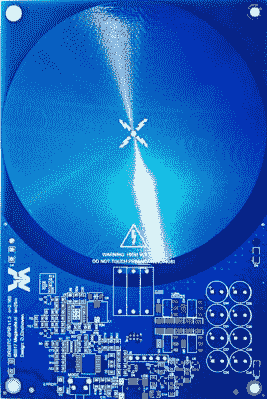

# PCB 特斯拉线圈是完美的桌面玩具

> 原文：<https://hackaday.com/2017/10/30/pcb-tesla-coil-is-perfect-desk-toy/>

特斯拉线圈轻而易举地成为我们实验室想要的“疯狂科学家”设备清单上的第一名，仅次于*也许*雅各布的梯子。即便如此，这也是一种不公平的优势，因为你知道人们只想要雅格布梯子发出的那种令人敬畏的声音。音效不可抗拒，这是特斯拉线圈的所有方式，毫无疑问。

不幸的是，自己缠绕特斯拉线圈有点麻烦。即使是相对较小的建筑，你通常也需要设置一些缠绕夹具来做次级线圈，这本身就是一个项目。因此，当[丹尼尔·埃因霍温] [将他的无风特斯拉线圈送入 tip 线](http://www.megavolts.nl/en/projects/tesla-coils/201-pcb-spiral-teslacoil-en)时，它立即引起了我们的注意。

 他设计的天才之处在于，线圈实际上是蚀刻在 PCB 上的，完全不需要人力。PCB 线圈由间距为 6 密耳的 6 密耳走线组成，能够将一个 25 米长、160 匝的线圈装入一个极其紧凑的封装中。正如你所料，这样一个微小的特斯拉线圈并不完全是一个发电站，事实上[丹尼尔]已经设法让它完全在标准 USB 2.0 端口的 500 mA 输出上运行。

在这样的低功耗设置中，[Daniel]还能够用 PIC18F14K50 微控制器取代传统的火花隙脉冲发生器，进一步简化设计。将微控制器用于脉冲发生器的一个优点是，它非常容易调整线圈的工作频率，允许一些巧妙的技巧，如通过将其频率带入可听范围来使线圈“唱歌”。

对于那些希望构建自己版本的人，[Daniel]已经在他的网站上提供了 PCB 原理图和固件供下载。他还提到，与《Elektor》杂志合作，他将在不久的将来制作一套工具。这肯定是我们会密切关注的事情。

顺便说一句，这不是[丹尼尔]第一次展示他对高电压的掌握。早在 2010 年[，他那 11344 焦耳的电容器组](https://hackaday.com/2010/07/18/my-what-a-large-capacitor-bank-you-have/)就给我们留下了深刻的印象，非常适合你一直想造的[摧毁笔记本电脑的轨道炮](https://hackaday.com/2017/10/14/semi-automatic-rail-gun-is-a-laptop-killer/)。

 [https://www.youtube.com/embed/Kt1_TZUHkbA?version=3&rel=1&showsearch=0&showinfo=1&iv_load_policy=1&fs=1&hl=en-US&autohide=2&wmode=transparent](https://www.youtube.com/embed/Kt1_TZUHkbA?version=3&rel=1&showsearch=0&showinfo=1&iv_load_policy=1&fs=1&hl=en-US&autohide=2&wmode=transparent)

