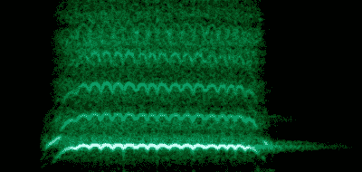

# 豌豆哨隐写术

> 原文：<https://hackaday.com/2015/11/16/pea-whistle-steganography/>

你看到你周围的模式了吗？没有吗？靠近点看。还是没有？再看看。好吧，也许那里什么都没有。

听到信号然后把它们分开。即使那里什么都没有，她也会想“如果有呢？”一个很好的例子:[人们可以在足球比赛开始时，在裁判的哨声中传输编码信息吗？](http://www.windytan.com/2015/10/pea-whistle-steganography.html)

 对你来说，裁判哨子里的小球发出的快速音高变化听起来像是“颤音”或“颤音”之类的。对[Oona]来说，这听起来像是[频移键控(FSK)调制](https://en.wikipedia.org/wiki/Frequency-shift_keying)。那么，你能不能发出一种非随机的颤音，听起来像普通的哨声？

她的 perl 脚本说是的。它接收你想要发送的数据，将其编码为 100 波特的 FSK，将其平滑，添加一些噪声和额外的谐波，并将其打包成音频文件。甚至在前面有几个同步字节，然后一个字节表示包的大小。当然是标准的豌豆哨协议(PWP)。如果你仔细听样本，你可以分辨出哪个包含数据，但它是一个非常好的匹配。酷！

很自然,[Oona]曾经给我们的页面增光添彩。从这张描绘拨号调制解调器握手的漂亮信息图到她的工作[反转她当地的公共汽车站信息标志](http://hackaday.com/2013/11/25/sniffing-data-from-radio-controlled-bus-stop-displays/)或者[解码新闻直升机发出的奇怪声音](http://hackaday.com/2014/02/02/decoding-news-helicopter-signals-on-youtube/)，她充满了好奇和好想法——一个黑客的黑客。她在公交车站工作的谈话很鼓舞人心。。她是我们的秘密英雄之一！