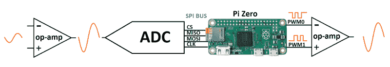

# 踏板-Pi，简单的可编程吉他踏板

> 原文：<https://hackaday.com/2017/09/12/pedal-pi-simple-programmable-guitar-pedal/>

几年来，ElectroSmash 背后的团队[Ray]和[Anna]一直在粉碎音频电子产品，并大量生产一些可爱的 DIY 音频设备。这一次，他们建立了[Pedal-Pi——一个简单的可编程吉他踏板](https://www.electrosmash.com/pedal-pi),基于树莓 Pi Zero。它的目标是黑客、程序员和音乐家，他们想尝试声音和学习数字音频。为了记录整个项目，已经投入了大量的精力。电路分析、详细的 BoM、编程、组装以及相关主题的背景信息都在他们的[论坛](https://www.electrosmash.com/forum/pedal-pi/229-pedal-pi-best-forum-topics)上有所涉及。

硬件分为三个部分。在输入端，MCP6002 轨到轨运算放大器放大并滤波模拟波形，然后 MCP3202 ADC 将其数字化为 12 位信号。然后，Pi-Zero 执行所有 DSP 操作，创建失真、模糊、延迟、回声和颤音等效果。Pi-Zero 产生一个双 PWM 信号，该信号在输出端出现之前经过合并和滤波。该设计是全通孔的，并且[方便的装配导向器](http://www.electrosmash.com/forum/pedal-pi/201-how-to-build-pedal-pi-in-4-steps?lang=en)在装配过程中对新手是有用的。代码示例包括大量的踏板效果，如果您熟悉 C，那么有足够的信息可以帮助您编写自己的效果。

即使你不打算建立一个，技术背景，如 C 中的音频 DSP 基础知识树莓 Pi Zero，[使用 MCP3202 ADC](http://www.electrosmash.com/forum/pedal-pi/212-using-mcp3202-adc-with-raspberry-pi-zero?lang=en) 与树莓 Pi Zero 和[在树莓 Pi Zero 上的 PWM 音频](http://www.electrosmash.com/forum/pedal-pi/210-pwm-audio-on-raspberry-pi-zero?lang=en)应该会产生有趣的阅读。休息之后，请观看详细介绍构建的视频。

如果你想看看他们早期的作品，可以看看 [1WAMP，一个开放的硬件吉他放大器](https://hackaday.com/2015/11/30/1wamp-an-open-hardware-guitar-amplifier/)和 [pedalSHIELD，一个开源的 Arduino 吉他踏板](https://hackaday.com/2013/12/21/an-opensource-arduino-guitar-pedal/)。

 [https://www.youtube.com/embed/ZVz1N0BdTkc?version=3&rel=1&showsearch=0&showinfo=1&iv_load_policy=1&fs=1&hl=en-US&autohide=2&wmode=transparent](https://www.youtube.com/embed/ZVz1N0BdTkc?version=3&rel=1&showsearch=0&showinfo=1&iv_load_policy=1&fs=1&hl=en-US&autohide=2&wmode=transparent)

