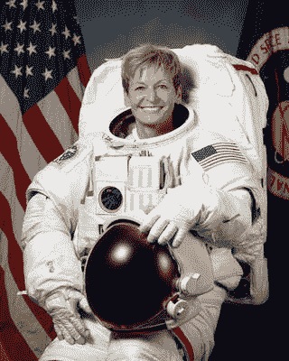

# 佩吉·惠特森，太空科学家

> 原文：<https://hackaday.com/2017/11/07/peggy-whitson-space-scientist/>

当宇航员佩吉·惠特森博士今年早些时候从太空返回时，这是作为一名科学家、探险家和领导者的终身职业的胜利结束。惠特森是一名生物化学家，他成为有史以来最有经验和最杰出的宇航员之一。她在太空停留的时间比任何一个美国人都多。她被称为[太空忍者](http://www.npr.org/sections/thetwo-way/2017/09/03/548295156/-american-space-ninja-peggy-whitson-back-on-earth-after-record-breaking-flight)是有原因的。

## 教育和早期生活

有些人到了晚年才发现自己的天职，但佩吉·惠特森在高中最后一年发现了这一点。那是 1979 年，美国国家航空航天局刚刚接受了第一批女宇航员，包括最终死在挑战者号上的克丽斯塔·麦考利夫和朱迪思·雷斯尼克。

惠特森 1960 年出生在爱荷华州的一个家庭农场，她开始实施自己的计划，典型的中西部职业道德似乎为她未来的艰难跋涉做好了准备。她在 1985 年从莱斯大学获得生物化学博士学位之前，在爱荷华州卫斯理大学获得了生物/化学学士学位。一个人可以用一句话来描述惠特森获得博士学位的过程，但事实是，这只是许多艰苦的工作，这是她职业生涯中突出的一个方面:她不知疲倦地工作。

## 科学家职业

获得博士学位后，惠特森作为博士后研究员在约翰逊航天中心工作。她花了几年时间做研究生物化学家，研究生化有效载荷，如 STS-47 中的骨细胞研究实验，该实验由另一位坏蛋博士梅·贾米森在太空中进行。惠特森并没有放弃自己成为宇航员的梦想，她在约翰逊工作的所有时间里都在申请美国国家航空航天局的职位。她花了十年时间和五次申请才成功。

然而，与此同时，惠特森得到了许多非常酷的项目，也开始建立她作为领导者的资格，从 1992 年到 1995 年担任航天飞机-和平号计划的项目科学家。三年来，她帮助领导约翰逊医学院。两年后，她共同主持了美国宇航局美俄关系委员会。因为她仍然有更多的时间来粉碎它，她还在德克萨斯大学医学分院和莱斯大学担任兼职教授。

然后，在 1996 年 4 月，她得知她的努力得到了回报，她被宇航员学校录取了。佩吉·惠特森要去太空了。

## Ad Astra

然而，八年后她才能到达太空。两年的高强度训练之后是地面技术任务，包括在俄罗斯为美国宇航局的工作人员提供支持的两年时间。然而，在 2002 年，她得到了机会，作为远征 5 的一部分，乘坐联盟号飞往国际空间站。在那里，她进行科学实验，并帮助在空间站安装新的组件，在太空中记录了 164 天。

回到地球后，惠特森作为科学家、宇航员和领导者继续表现出色。2003 年，她指挥了一次为期 10 天的水下任务，帮助训练宇航员在太空中长时间停留，为她标志性的成就做准备:两次她指挥国际空间站。

2008 年，她领导了远征 16，其中三个额外的模块被添加到国际空间站。由于新的结构，尽管她专注于科学，惠特森还是成为了美国宇航局最多产的太空行走者之一，在她的职业生涯中进行了 10 次出舱活动，仅次于宇航员阿纳托利·索洛维耶夫的 16 次，她的累计出舱时间 60 小时是世界第三好。

接下来的三年，她担任首席宇航员，然后在 2016 年 11 月作为 50 号远征队的指挥官返回太空。与 16 相比，它要醇厚得多，尽管进行了数百次生物化学实验。2017 年 4 月，惠特森超越了美国太空耐力纪录，赢得了总统的电话。她在太空中度过了 665 天，于 9 月 2 日作为英雄返回。

佩吉·惠特森博士的才华和孜孜不倦的努力为她赢得了无数的奖项和赞扬。她的小学有一个以她名字命名的科学实验室。今年，《魅力》杂志将她评为年度女性之一。她对任何渴望从事科学、数学或太空探索的人来说都是一种激励:这并不容易，而且需要很长时间，但这种工作会让世界变得更加美好。

图片来源:美国宇航局