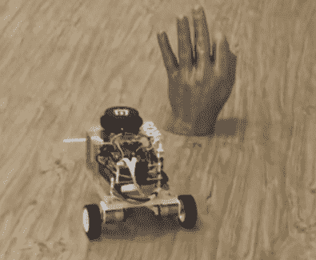
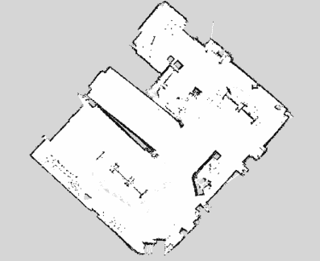

# 娇小的包裹提供强大的机器人

> 原文：<https://hackaday.com/2016/03/13/petite-package-provides-powerful-robot/>

机器人操作系统(ROS)通常与大型机器人联系在一起，但[Grassjelly]决定通过创造 Linorobot 来证明[的不同。这种小型差动驱动机器人在外观上类似于许多基于 Arduino 的小型机器人，通常用于循线。Linorobot 的 Teensy 3.1 连接到 Radxa Rock Pro，具有更强的计算能力。Teensy 处理电机，读取它们的编码器，并采集 IMU 数据。](https://hackaday.io/project/10022-linorobot)

Radxa 是我们在 Hackaday 的新品，是一款基于四核 ARM Cortex-A9 1.6 GHz CPU 的单板计算机。它可能没有在我们的页面上出现过，但是如果你在贝尔格莱德的[hack aday](http://hackaday.com/2016/02/29/announcing-hackaday-belgrades-talks-and-speakers/)上，你可以参加一个关于使用它构建集群的会议。运行 Linux 的能力是[使用 ROS](http://wiki.ros.org/) 的关键，ROS 是一个用于控制机器人的开源系统。Radxa 运行 ROS，它直接与 [Neato XV-11 激光雷达的专用](http://hackaday.com/2016/01/22/how-to-use-lidar-with-the-raspberry-pi/)控制板接口。

  Avoiding the hand.  Mapping with lidar.

Linorobot 将通常在更大和更昂贵的机器人中看到的功能打包到一个小机器人中，如 [Turtlebot 2](http://www.turtlebot.com/) 。有了这个小巧的机器人，黑客可以学习 SLAM(同步定位和地图绘制)和自主导航，以及 ROS 的其他功能。

[Grassjelly]有一个关于建造机器人的教程，这也是对 ROS 的一个很好的介绍。他将[软件作为开源软件](http://github.com/grassjelly/linorobot)提供。这是一个令人印象深刻的项目，它提供了一个相对便宜的小型机器人来学习和与 ROS 一起工作。休息之后是 Linorobot 猛击和导航[Grassjelly 的]实验室的视频。

 [https://www.youtube.com/embed/aqzMq-jMd-c?version=3&rel=1&showsearch=0&showinfo=1&iv_load_policy=1&fs=1&hl=en-US&autohide=2&wmode=transparent](https://www.youtube.com/embed/aqzMq-jMd-c?version=3&rel=1&showsearch=0&showinfo=1&iv_load_policy=1&fs=1&hl=en-US&autohide=2&wmode=transparent)

