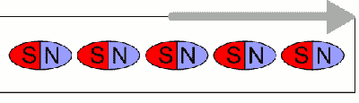
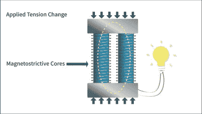

# 你从未听说过的物理学从波中提供能量

> 原文：<https://hackaday.com/2015/11/27/physics-youve-never-heard-of-providing-power-from-waves/>

“在未来，我们将利用海浪发电！”人们已经说了几十年了，海浪发电并不是蚂蚁粪便的一个重要部分。如果这能改变就太好了。

如果你相信 Oscilla Power T1 的所有者，传统波浪能发电机的主要缺点是它们有太多的活动部件。字面上。随着时间的推移，金属机械部件及其密封件等会受到阳光、盐和海浪的侵蚀，因此维护大多数发电机设计非常昂贵，而且不值得。

另一方面，Oscilla 的发电机基本上没有移动部件，因为它基于[磁致伸缩](https://en.wikipedia.org/wiki/Magnetostriction)，或者更确切地说，基于[逆磁致伸缩，即维拉里效应](https://en.wikipedia.org/wiki/Inverse_magnetostrictive_effect)。这就把我们带到了物理学上。

 磁致伸缩是磁性材料放在磁场中能收缩或膨胀一点点的性质。维拉里效应(听起来比“逆磁致伸缩”酷得多)则相反:磁性材料受到挤压时会变得或多或少有些磁性。

 所以，要制造一台发电机，你在两端各放两块永久磁铁，并在永久磁铁磁场内的磁致伸缩金属棒上缠绕线圈。反复挤压和拉伸磁棒，线圈内部的净磁场就会发生变化，你就开始发电了。谁知道呢？

目前，根据《经济学人》杂志关于 Oscilla 的文章，每瓦特的价格与其他可再生能源相比没有竞争力，但看起来很接近。随着更多的研究，也许我们会从挤压铁棒中获得一些可再生能源。

既然我们谈到了这个话题，就来看看最近这篇关于[磁铁以及它们如何工作](http://hackaday.com/2015/11/20/back-to-basics-whats-the-deal-with-magnets/)的文章。