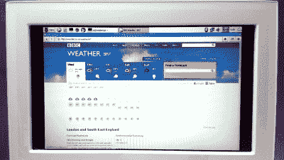

# Pi 零数码相框亭使用 OTG 权利

> 原文：<https://hackaday.com/2016/06/03/pi-zero-digital-frame-kiosk-uses-otg-right/>

USB On-The-Go (OTG)是 USB 标准的一个有趣的方面。其他方面有感觉，但是那个还好。不管怎样，[弗朗西斯科]有一天意识到他在慈善义卖中购买的 3 数码相框真的不在乎 u 盘上的文件是否一直在神秘地改变。它会一直以每秒 0.2 帧的速度拉动和显示最新的文件。没错，[Francesco]追求的概念是显示不断变化的数据，甚至是动画，每五秒钟更新一帧！

 他的[初始测试](http://garagetech.tips/pizero-on-digital-frame/)显示了这个概念的好处——Pi 可以很容易地模拟大容量存储设备，每当相框寻找它时就输入数据。除了 Pi Zero 板，他还添加了一个以太网屏蔽、一个稳压器、一个摄像头，甚至一些红外 LEDS。我们假设对未来有梦想。

他通过 VNC 登录，一直在为这个平台开发脚本。cron 作业定期运行其脚本，获取有用的数据并将其作为图像提供。例如，一个脚本在 Epiphany(一个 web 浏览器)中打开天气，截取一个屏幕截图，并使用 USB OTG 将该截图保存到正在模拟的大容量存储中。数码相框快乐地更新，没有意识到它奇怪的附属物。现在真正的限制因素是你能用你的疯狂猛击技能完成多少。