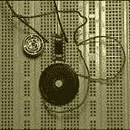
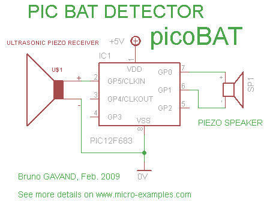

# PIC 供电的微微蝙蝠拾取脉冲功率

> 原文：<https://hackaday.com/2018/06/26/pic-powered-picobat-picks-up-pulsed-power/>

2012 年，[布鲁诺]想探测一些蝙蝠。探测蝙蝠？一些种类的蝙蝠(主要是描述性命名的“微蝙蝠”)利用回声定位在空间中定位自己和它们的猎物，就像你的第一个机器人可能做的一样。蝙蝠从它们可爱的小喉中发出啁啾声，就像人类使用声带发出声音一样。然后，蝙蝠会倾听声音的回声，并能推断出它周围的假定猎物的位置。蝙蝠探测器是一种能够探测到这些超声波并将它们转换到人类可以听到的范围的设备。那么你将如何建造这样一个设备呢？[Bruno]的 [PicoBat](http://www.micro-examples.com/articles/index.php/PicoBat) 可能创造了组件数量和代码简单性的记录。【T2

在没有领域专业知识的情况下，构建[蝙蝠探测器](https://en.wikipedia.org/wiki/Bat_detector)最明显的方式可能是将大量高性能微控制器与类似的高性能模数转换器相结合。根据维基百科，利用一点点[信号处理知识](https://en.wikipedia.org/wiki/Nyquist_rate)，你以声音的自然频率对其进行采样，对其进行快速傅立叶变换，并在超声波频率范围内寻找能量，可能约为 [20 千赫至 100 千赫](https://en.wikipedia.org/wiki/Animal_echolocation#Bats)。随着对信号干扰的了解越来越多，事实证明构建这种设备的方法多得惊人，包括一些纯粹的模拟方法。(说真的，去维基百科页面看看有多少种方法可以做到这一点。)

 【布鲁诺】*是否使用了微控制器来建造他的蝙蝠探测器，但不是以我们预期的方式。PicoBat 没有使用非常高性能的 A/D 和同样庞大的微控制器，而是使用相对温和的 PIC12 和标准的超声波传感器，以及用于输出的压电蜂鸣器。加上供电轨，这就是整个电路。他运行的代码也很简单。它配置一对 GPIOs 并切换它们，没有其他逻辑。就是这样。*

 *那么这是如何工作的呢？超声换能器被机械地设计成仅接收期望频率范围内的声音。由于是压电材料，当施加足够的声压时，压力会产生小电压。该电压不是作为 GPIO 而是作为时钟输入馈入 PIC。所以 CPU 只有在足够强度的超声波撞击换能器时才执行指令。GPIO 切换例程需要四个时钟周期来执行，产生 1:4 的时钟分频器。当 GPIOs 触发时，它们翻转蜂鸣器上的电位，使其发出人类可听见的声音。太棒了。

休息过后，看看[Bruno]的视频演示，感受一下这款设备的工作原理。你也许可以用其他组件做同样的事情，但是我们希望你不会超过部件数。

 [https://www.youtube.com/embed/EjEkXlET0CM?version=3&rel=1&showsearch=0&showinfo=1&iv_load_policy=1&fs=1&hl=en-US&autohide=2&wmode=transparent](https://www.youtube.com/embed/EjEkXlET0CM?version=3&rel=1&showsearch=0&showinfo=1&iv_load_policy=1&fs=1&hl=en-US&autohide=2&wmode=transparent)

*