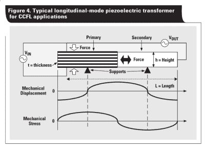

# 压电变压器是个东西，你用过吗？

> 原文：<https://hackaday.com/2015/12/12/piezoelectric-transformers-are-a-thing-have-you-used-one/>

廉价的压电蜂鸣器随处可见。它们非常便宜，可以用在新奇的生日贺卡上。在压电晶体上施加交流电压会使其膨胀和收缩，将该晶体固定在金属盘上会使压电扬声器产生独特的微弱声音，但这种声音并不令人愉快。

压电效应也以另一种方式工作，压电元件作为振动传感器非常有用。只需将电压表的一根引线放在压电元件的每根导线上，用手触摸该元件，或在工作台上敲打它。您应该会在电压表上看到一个电压尖峰，它的大小会随着您触摸该元件时所用的力的大小而变化。

这种在施加电压时改变形状并在变形时产生电压的能力是压电变压器(PZT)的基础。在寻找高电压/低电流变压器时，Hackaday reader [Josh]惊讶地发现了压电解决方案。他没有说他是否决定在他的项目中使用 PZT，但是他确实给我们链接了一个关于这个主题的 PDF。

 在 PZT 中，两个压电元件相邻放置。初级压电元件由多个薄层组成，这些薄层水平扩展并压在单个次级压电元件上。初级线圈越多越薄，施加在次级线圈上的力就越大，产生的电压就越大。如果你对此感兴趣的话，你可以在上面链接的 PDF 中找到一些公式，这些公式详细地解释了这个概念。

如果您从未玩过压电元件，您应该在下一个零件订单中添加一个。它们既便宜又容易实验。我们已经看到在 DIY 扬声器、[声纳项目](http://hackaday.com/2015/01/26/sonar-built-from-piezo-and-microphone/)中使用的[压电元件，甚至作为原子力显微镜](http://hackaday.com/2012/09/15/how-to-make-your-own-piezoelectric-speaker/)的[传感器，但我们还没有看到一个压电变压器被黑客攻击。肯定有人在他们工作的项目中使用过，如果你是我们正在谈论的人，请在评论中给我们留下链接。](http://hackaday.com/2015/08/22/building-an-atomic-force-microscope-on-the-cheap/)