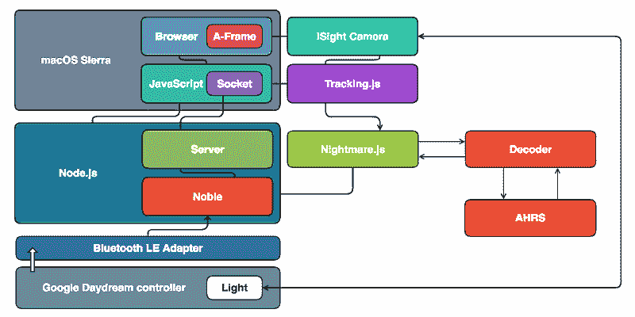

# 乒乓球改进了谷歌白日梦控制器

> 原文：<https://hackaday.com/2017/02/11/ping-pong-ball-improves-the-google-daydream-controller/>

[Matteo]刚刚发布了他的谷歌 Daydream VR 控制器黑客的新版本[，我们去年首次报道了这个版本(当](https://hackernoon.com/how-i-hacked-google-daydream-controller-part-v-a0ada411271e#.y6pln6qeh)[让它与 iOS](http://hackaday.com/2016/12/20/hacking-google-daydream-to-work-with-ios/)一起工作时)。这一次，他成功打造了一个半白日梦半 PlayStation Move 控制器的混合体。

最初的控制器仅使用内部加速度计管理仅仅 3 DOF(自由度);尽管这传达了围绕 3 轴的旋转运动，但是完全缺乏过渡信息。[Matteo]通过用封装在标准乒乓球中的白色 LED 形成一个简单的位置标记解决了这个问题；他使用 iSight 摄像机跟踪这个设置。

为了将一切整合在一起，他在已经广泛开发的软件堆栈中添加了运动跟踪，这使他能够从 Android 中解放 Daydream 控制器。他破译蓝牙数据包，并通过网络套接字连接将传感信息直接传输到网络浏览器。

结果相当可观，跟踪也很流畅。这不仅增加了他黑进独立于平台的虚拟现实运动控制器的最终目标，他还恰当地从索尼获得了一些灵感，扩展了谷歌的硬件，甚至设法使用了苹果的网络摄像头。这对于在消费电子产品的围墙花园之间开辟通道来说如何？

 [https://www.youtube.com/embed/h5H-P-FVGuA?version=3&rel=1&showsearch=0&showinfo=1&iv_load_policy=1&fs=1&hl=en-US&autohide=2&wmode=transparent](https://www.youtube.com/embed/h5H-P-FVGuA?version=3&rel=1&showsearch=0&showinfo=1&iv_load_policy=1&fs=1&hl=en-US&autohide=2&wmode=transparent)

