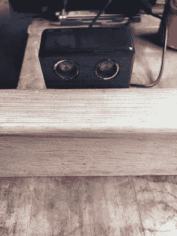

# 敲打着雨水桶的深处

> 原文：<https://hackaday.com/2018/03/01/pinging-the-depths-of-a-rain-barrel/>

雨水桶是一种环保的好方法，只要你的邻居不反对它们。[NikonUser]的桶坐得很高，以至于他不得不爬上一个旧的烧烤架，半吊在管子上检查水位，同时冒着遇到澳大利亚蜘蛛的风险。

 事实证明，蜘蛛恐惧症是一种巨大的动力。起初，[NikonUser]设想了一个太阳能物联网装置，可以检查水位并在网页上报告结果。他与这种特征的蔓延进行了斗争，并决定制造一种手持设备[，这种设备通过超声波传感器检测水位，并在 7 段式](https://www.instructables.com/id/Ultrasonic-Rainwater-Tank-Capacity-Meter/)上显示出来。

所有东西都装在一个防水的盒子里，由 Arduino Pro 驱动。盒子安装在横跨桶顶部的一块废木料上。这使得 HC-SR04 的眼睛可以越过边缘，向底部发出脉冲。这也有助于保持读数的一致性，防止电子设备发生故障。

操作很简单:[NikonUser]伸出手，将木板横放在桶上，然后按下瞬间按钮。这将激活 Arduino，从而提示 HC-SR04 读取几个读数。代码对这些读数进行平均，做一些数学运算，并显示桶中剩余水的百分比。

对收集雨水感兴趣，但不确定如何处理它？你可以用它来洗衣服，倒在马桶水箱里代替冲水，或者为你的花园制作一个自动浇水系统。