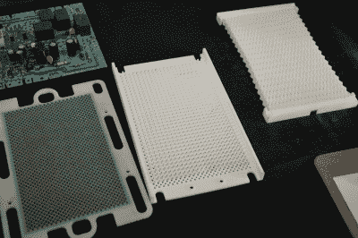

# 针夹具焊接夹具有针被机场安全扣押

> 原文：<https://hackaday.com/2016/06/27/pinjig-soldering-clamp-has-pins-seized-by-airport-security/>

有一句古老的谚语说，当进行现场演示时，以前工作的黑客会神秘地出错。在这种情况下，硬件演示在到达会议之前就注定要失败。

引脚夹具是一种有趣的通孔焊接方式。顾名思义，它是一个夹具，当电路板翻转时(甚至颠倒过来)，它将通孔元件固定在适当的位置。这是通过 2000 个钢销来实现的，这些钢销在被安置在板的所有组件周围之后被锁定在适当的位置。不幸的是，将这个原型带上国际航班并没有成功。[Niall Barrett]告诉我们，在他从爱尔兰去湾区制造商博览会的路上，他被要求扔掉组成夹具的 3 英寸钢钉，否则就不要上飞机。

 [https://www.youtube.com/embed/o-9gB3QkQTs?version=3&rel=1&showsearch=0&showinfo=1&iv_load_policy=1&fs=1&hl=en-US&autohide=2&wmode=transparent](https://www.youtube.com/embed/o-9gB3QkQTs?version=3&rel=1&showsearch=0&showinfo=1&iv_load_policy=1&fs=1&hl=en-US&autohide=2&wmode=transparent)

我仍然很喜欢在他的摊位上和他交谈，他在那里展示了导致这个原型的各种机制。焊接时固定通孔元件是一件痛苦的事情——毫不夸张。当我试图用剩下的手指和另一只手来烙铁和焊料时，我用一只手指将组件(如引脚头)固定在适当的位置，多次轻微烧伤了我的指尖。我使用了蓝色大头钉、各种类型的胶带、第三手工具，将电路板和组件堆放在工作台上的随机物品上，以及许多其他的半解决方案。这并不是一个有商业解决方案的问题，因为在生产中，波峰焊会将熔化的焊料带到电路板的下面，重力会夹紧。

这款设备的灵感来自大头针艺术——一种由数百根大头针排列成紧密网格的玩具。从下面举起你的手，大头针的头部形成了它或任何其他物体的轮廓图。PinJig 的工作方式大致相同。把它放在通孔组件上，你会得到引脚形状的映射。然后将引脚锁定到位，您可以将整个组件翻转过来，以接触电路板的底部进行焊接。

诀窍在于锁定机制。在上面的视频中，[Niall]展示了几种不同的锁原型。首先是一个有泪滴形孔网格的盘子，在裂口的尖端涂上橡胶。第二个尝试是让一个塑料齿平行于每个针(像一个毛刷)，当板滑动到一边时，它会接触针。第三次尝试是一组塑料鳍片，它们在引脚之间呈之字形排列，并在拉伸时与引脚接触。

Locking mechanism prototypes (click for huge image)

这些早期的尝试都不可靠，但第三次迭代帮助[Niall]认识到什么可行，在所有的针之间穿上钓鱼线。当线处于张紧状态时，这就起到了足够的锁定作用。

不幸的是，我们可以看到这个原型，因为缺少引脚。Indiegogo 活动似乎也不成功，因为我收到一条消息，说该活动“目前正在更新”。尽管如此，这种机制还是很有趣的，我可以看到这种机制在黑客空间或其他社区研讨会上很受欢迎，在那里许多人可能会从事通孔项目。