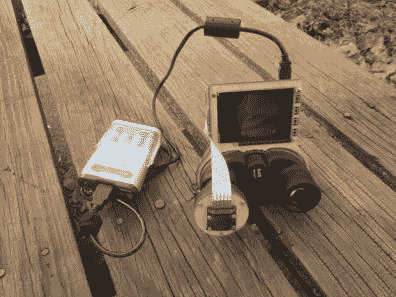

# 双筒望远镜——远视 pi 相机

> 原文：<https://hackaday.com/2016/01/11/pinoculars-a-farseeing-pi-camera/>

Raspberry Pi 相机提供 500 万像素的分辨率，静态图像高达 2592 x 1944，多种视频模式，包括每秒 15 帧的 2592 x 1944。它被安装在一个小板上，非常适合在黑客中使用。[乔希·威廉姆斯]将[相机安装在双筒望远镜](http://www.instructables.com/id/PiNoculars-Raspberry-Pi-Binoculars/)的镜头上，捕捉了一些令人吃惊的图像，包括这只松鼠。

    

相机安装在一个定制的激光切割底座上，固定在双筒望远镜的一个目镜上。Pi 本身安装在双筒望远镜的上方。Adafruit 的 LCD 触摸屏允许[Josh]选择图像和调整焦距。使用触摸屏或屏幕自带的开关来拍摄照片。

Josh 写的说明书非常详细，包括两种不同的在望远镜上安装圆周率的方法。这种又快又脏的方法就是用胶带绑起来。这种高度工程化的方法钻研 Inkscape 来设计激光切割的胶合板支架。对于便携式操作，[Josh]使用一种无处不在的 USB 充电电池组。

休息后的视频中有 Pi 和摄像机的基本设置。

 [https://www.youtube.com/embed/luS9pmlhzCk?version=3&rel=1&showsearch=0&showinfo=1&iv_load_policy=1&fs=1&hl=en-US&autohide=2&wmode=transparent](https://www.youtube.com/embed/luS9pmlhzCk?version=3&rel=1&showsearch=0&showinfo=1&iv_load_policy=1&fs=1&hl=en-US&autohide=2&wmode=transparent)

