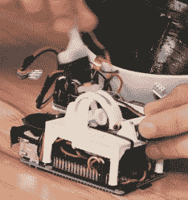

# 皮克斯风格的机器人是建筑技巧的宝库

> 原文：<https://hackaday.com/2017/06/28/pixar-style-robots-are-treasure-trove-of-building-tricks/>

[阿隆索·马丁内斯]是一名在皮克斯制作虚拟角色的艺术家，所以难怪他的现实生活中的机器人米拉和葛蒂的个性让他们看起来像是直接从皮克斯电影中跳出来的。但我们真正喜欢的是他在里面使用的技巧，这些技巧将它们带入生活，肯定会在相同或其他事情上重复使用。

Mira’s head rotation mechanism

例如，Mira 的头部可以在偏航、俯仰和滚动中旋转。为了弄清楚如何做到这一点，他回忆起有一个名为[微软 Sidewinder Pro](https://en.wikipedia.org/wiki/Microsoft_SideWinder#Force_Feedback_Pro) 的操纵杆，它有力反馈。这意味着它可能有符合运动的马达，很像他想要的。为了看看它是如何工作的，他在易贝上买了一个，把它拆开，并对它进行改进，提出了自己的设计。但是除了利用操纵杆和头部的设计，我们可以想象它也可以用来让机器人的眼球在眼窝里转动。顺便说一句，他用树莓圆木来运行机器人，但是请注意他将整个机械装置安装到圆木的四个安装孔中的巧妙、节省空间的方式。

同样引起我们兴趣的是头部机构中使用的两个微型伺服系统，两个 [HD-DSM44](http://alofthobbies.com/power-hd-dsm44-slim-digital-metal-gear-servo-1-2-kg-16-7-oz-in-09-sec.html) 数字伺服系统。这些甚至比 [Tower Pro SG90](http://www.towerpro.com.tw/product/sg90-7/) s 更小，并且具有金属齿轮传动的额外优势。

Gertie’s delta jumping legs

为了使眼睛眨眼，他必须克服这样一个事实，即头部是一个在身体上滑动的薄壁球体，眼睛必须在不接触身体的情况下适应薄壁。他的解决方案是用丙烯酸半球做有机发光二极管屏幕，突出眼球。电路板通过每英寸大约 32 个连接的带状电缆与屏幕通信，这有利于一些仔细的焊接。为了进一步形成薄的外形，他甚至用砂纸将焊点打磨平。

他的另一个机器人，黄色和绿色的格蒂，跳来跳去，检查它的内部机制也是一种乐趣。为了旋转和跳跃，它使用了与 delta 3D 打印机几乎相同的设计，有三条腿，可以向任何方向移动上身，并在跳跃前像弹簧一样压缩。我们喜欢他的方法，即利用 3D 打印机可能实现的快速原型制作，确定 3D 打印 PLA 部件的适当厚度，使它们不会破裂，这只是一种试错法。虽然他确实在每条腿的一个主要部分作弊，那就是在每条腿的下半部分配 RC 汽车拉杆——但如果你不告发他，我们就不会告发他。

这只是你将在下面的视频中发现的巧妙技巧和窍门的一小部分(他们在 7:35 开始观察机器人的内部)。

这不是 Hackaday 上唯一一个受皮克斯启发的机器人。你不会相信这款皮克斯风格的灯融入了多少个性。除了面部跟踪之外，当你试图关闭它时，它甚至会重新打开开关。

 [https://www.youtube.com/embed/0vfuOW1tsX0?version=3&rel=1&showsearch=0&showinfo=1&iv_load_policy=1&fs=1&hl=en-US&autohide=2&wmode=transparent](https://www.youtube.com/embed/0vfuOW1tsX0?version=3&rel=1&showsearch=0&showinfo=1&iv_load_policy=1&fs=1&hl=en-US&autohide=2&wmode=transparent)

[通过[测试](https://www.youtube.com/watch?v=0vfuOW1tsX0)