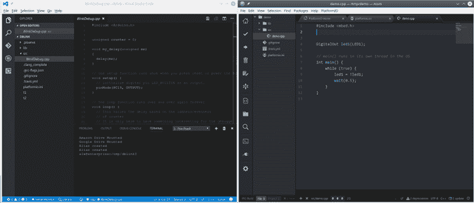

# PlatformIO 和 Visual Studio 接管世界

> 原文：<https://hackaday.com/2017/04/07/platformio-and-visual-studio-take-over-the-world/>

在最近的一篇文章中，我谈到了在 Arduino IDE 中使用“蓝色药丸”STM32 模块。我不是 Arduino IDE 的忠实粉丝，但是我承认它使用起来很简单，这使得它适合简单的事情。

总的来说，我不太喜欢集成开发环境(IDE)。我用过很多，尤其是当它们和我当时想用的工具紧密相连的时候。但是当我没有做什么特别的事情时，我倾向于用 emacs 写代码。仔细想想，我想我真的不介意一个 IDE，如果它有真正帮助我的工具的话。但是如果它只是一个文本编辑器并启动几个命令，我可以从 emacs 或我选择的另一个编辑器中完成。您最喜欢的 IDE 拥有和 emacs 一样多的编辑能力和定制能力的可能性几乎为零。即使你不喜欢 emacs，如果没有明显的好处，为什么还要学习另一个编辑器呢？

当然，有很多方法可以在 Arduino 和其他框架中使用其他工具，我决定开始研究它们。毕竟构建 Arduino 代码能有多难？如果你想直接跳到笑点，你可以看看下面的视频。

## 原来…

事实证明，Arduino IDE 不仅仅是提供一个基本的编辑器和启动一些命令行工具。它还管理[一个非常复杂的构建过程](https://www.arduino.cc/en/Hacking/BuildProcess)。构建过程将你的许多文件连接在一起，根据它认为你正在做的事情添加文件头，并且通常编译一个大文件，除非你已经明确地包括。cpp 或者。构建中的 c 文件。

这意味着仅仅复制你的普通 Arduino 代码(我讨厌说草图)并不能给你任何你可以用普通编译器构建的东西。虽然有很多基于 makefile 的解决方案，但还有一个名为 [PlatformIO](http://platformio.org/) 的工具，据称是一个通用的解决方案，可以在许多嵌入式平台上构建，包括 Arduino。

## 关于平台视频

虽然 PlatformIO 声称是一个 IDE，但它实际上是开源 Atom 编辑器的一个插件。然而，它也有很多其他 ide 的插件。有趣的是，它甚至支持 [emacs](http://docs.platformio.org/en/stable/ide/emacs.html) 。我知道不是每个人[都喜欢 emacs](https://hackaday.com/2016/08/08/editor-wars-the-revenge-of-vim/) ，所以我决定研究一些其他的选择。我也不是在说 [VIM](http://docs.platformio.org/en/latest/ide/vim.html) 。

我最终尝试了两种 ide:Atom 和 Microsoft Visual Studio 代码。由于 PlatformIO 在预览版中有他们的 2.0 版本，所以我决定尝试一下。你可能会惊讶我用的是微软的代码工具。令人惊讶的是，它运行在 Linux 上，并通过插件支持许多东西，包括一个 Arduino 模块，当然还有 PlatformIO。在麻省理工学院的许可下，它甚至可以作为[源](https://github.com/Microsoft/vscode)使用。正如你所看到的，这两个编辑看起来很像。

PlatformIO 支持数量惊人的[板](http://docs.platformio.org/en/latest/platforms/embedded_boards.html)，从 Arduino 到 ESP82666，从 mBed 板到 Raspberry Pi。它还支持不同的[框架](http://docs.platformio.org/en/latest/frameworks/index.html)和[ide](http://docs.platformio.org/en/latest/ide.html)。如果你像我一样，只是喜欢在命令行，你可以使用命令行驱动的 PlatformIO Core。

事实上，关于 PlatformIO，你首先注意到的事情之一是，它不能决定它是 GUI 工具还是命令行工具。我怀疑其中一些也包含在 IDE 选择中。例如，对于代码，您必须在 shell 提示符下运行投影初始化工具。当然，您可以在代码中打开 shell，但它仍然是一个命令行。即使在 PlatformIO IDE(实际上是 Atom)上，将 Blue Pill 框架从 Arduino 更改为 mBed 也需要打开一个 INI 文件并进行更改。为 FRDM-KL46 设置上传路径也需要同样的改变。

## 容易吗？

不要误解我。我个人不介意编辑一个文件或者从提示符下发出一个命令。然而，这种工具似乎更吸引那些喜欢它的人。我喜欢命令行工具的存在。但是当一些更改是在 GUI 中完成的，而另一些是在命令行中完成的，这确实让人觉得很奇怪。

当然，这是可以解决的。然而，我确实有另一个抱怨，我觉得不好表达，因为我没有更好的解决方案。PlatformIO 做的太多了。理论上，这就是它的优势。我可以编写自己的代码，而不关心 mBed 库是如何编写的，或者 Arduino 工具篡改了我的源代码。我甚至不需要建立工具链，因为 PlatformIO 会在我第一次使用它时下载我需要的所有东西。

当它起作用时，那真的很棒。问题是当它不。例如，在 PlatformIO 的旧版本上，我很难让 mBed 库为不同的目标构建。我四处挖掘，找到了问题所在，但这并不容易。如果我构建了工具链并控制了流程，我会更好地了解如何进行故障排除。

最后，你也必须排除故障。PlatformIO 瞄准移动目标。每次 Arduino IDE 或 mBed 框架或其他任何东西发生变化，都有可能会破坏某些东西。当它出现时，你必须努力修复它，直到开发人员为你修复它。如果你能做到这一点，这是一个时间成本。但我怀疑对 PlatformIO 最感兴趣的人在它崩溃时最没有能力修复它。

 [https://www.youtube.com/embed/Vn0Mip00je0?version=3&rel=1&showsearch=0&showinfo=1&iv_load_policy=1&fs=1&hl=en-US&autohide=2&wmode=transparent](https://www.youtube.com/embed/Vn0Mip00je0?version=3&rel=1&showsearch=0&showinfo=1&iv_load_policy=1&fs=1&hl=en-US&autohide=2&wmode=transparent)

## 结果

如果你想尝试一种不同的构建程序的方式——更重要的是，一种创建和构建程序的方式——你应该试试 PlatformIO。当它工作的时候，它工作得很好。以下是一些帮助您入门的链接:

*   [平台界面](http://platformio.org/platformio-ide)(需要[原子](https://atom.io/)
*   [PlatformIO Core](http://docs.platformio.org/en/latest/installation.html) (如果安装了 IDE 包，则不需要)
*   [Visual Studio 代码](https://code.visualstudio.com/)(从 IDE 内部安装 PlatformIO)

底线是，当它起作用时，它就很好。如果没有，那就很痛苦。该不该用？它很方便，这是毫无疑问的。与代码的集成非常少。Atom 集成——虽然不完美——更加无缝。但是，如果你学会了使用命令行工具，这几乎没有关系。使用任何你喜欢的编辑器，我很喜欢。如果你真的要用它，只希望它不会坏，如果坏了，也许要有一个备用计划。